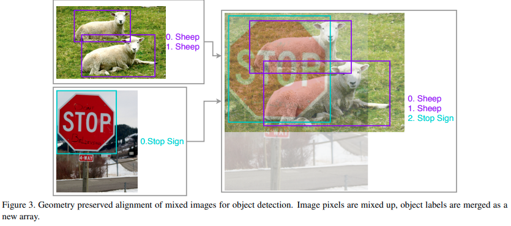

time: 20191204
pdf_source: https://arxiv.org/pdf/1902.04103.pdf
code_source: https://github.com/dmlc/gluon-cv
short_title: BoF for object detection (tricks)

# Bag of Freebies for Training Object Detection Neural Networks

这篇论文系统性地总结或提出了一系列的提升目标检测任务的一些训练技巧，不更改网络、更改inference时间的前提下，能显著提升训练结果。本综述在review这篇论文的同时搜集了各个模块典型的pytorch实现.

##　Image Mixup

将两张图只crop不改变aspect ratio地融合，目标序列则concat在一起

其中融合的参数$\alpha, \beta$由一个$\Beta$分布进行抽样。

关于Mixup, 其前置论文有对应的很简洁的[代码实现](https://github.com/facebookresearch/mixup-cifar10)

## Classification Head Label Smoothing

这个idea源自于[Inception-V3]

也就是弱化CrossEntropy中的target
$$
q_{i}=\left\{\begin{array}{ll}{1-\varepsilon} & {\text { if } i=y} \\ {\varepsilon /(K-1)} & {\text { otherwise }}\end{array}\right.
$$

[一个典型的pytorch实现在这里](https://github.com/eladhoffer/utils.pytorch/blob/master/cross_entropy.py)

## 数据增强

数据增强主要包括两种

1. 随机几何变换，包括随机裁切，随机扩大，水平翻转以及随机resize
2. 随机色彩抖动，包括亮度、色相、饱和度和对比度。
   
作者发现one-stage检测受随机几何变换比较敏感，因而需要使用随机几何变换来进行数据增强，而two-stage检测由于RoIAlign或Pooling的性质，对随机几何变换的敏感度不大，因而几何变换数据增强对其影响不大。

## 学习率调整

经过大量实验作者发现cosine变化很好，同时要注意的是warmup learning rate对YoLO的训练至关重要。

stack-overflow上面有对这个warmup在机器学习方面的一个直觉性的[解答](https://stackoverflow.com/questions/55933867/what-does-learning-rate-warm-up-mean)

读懂上述解答之后，我们可以直接使用github上对Warm-up learning rate的[pytorch复现](https://github.com/ildoonet/pytorch-gradual-warmup-lr)
## Synchronized Batch Normalization

由于batch-size比较小，我们需要synchronized batch-norm来跨GPU训练.本质上来说就是强制在batchnorm的时候等待所有的GPU一起计算，并且共用同一个当前的均值与方差。

[一个典型的pytorch实现在这里](https://github.com/vacancy/Synchronized-BatchNorm-PyTorch)

## 随机形状训练

对于one-stage的网络，作者提出修改输入图片的形状，随机输入来训练

以上所有tricks都在基于MXNET的gluon-CV上有复现，

[Inception-V3]:https://arxiv.org/abs/1512.00567

