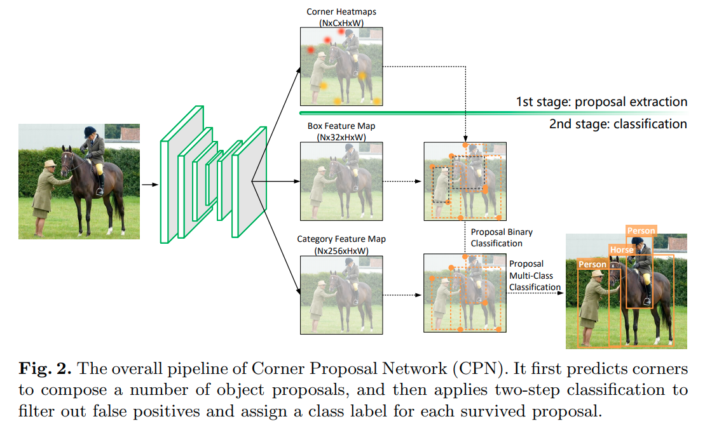

time: 20200731
pdf_source: https://arxiv.org/pdf/2007.13816v1.pdf
code_source: https://github.com/Duankaiwen/CPNDet
short_title: Cornet Proposal Network
# Corner Proposal Network for Anchor-free, Two-stage Object Detection

本文的作者是基于[CornetNet](CornerNet_Detecting_Objects_as_Paired_Keypoints.md)写出[CenterNet](CenterNet:_Keypoint_Triplets_for_Object_Detection.md)的Kaiwen Duan.

## Main Motivation

作者给出一些例子并且从直觉上指出

- Anchor-based 算法对于形状复杂的物体或者长宽比比较极端的物体召回率比较低。
- Anchor-free 算法容易产生假阳样本，尤其是容易错误地将不相关的keypoints分在一起。

作者想出了一个two-stage的方案融合两者的思路。

## Architecture

第一阶段使用CornerNet预测角点，将同类的左上点和右下点匹配，产生大量的proposals。

第二阶段首先将每一个匹配得到的detector, RoIAlign提取框内的特征，先使用[Focal Loss](GFocalLoss.md)监督一个轻量的二分类分类器。 然后filter掉 objectness比较低的物体之后，再使用一个更大的分类器，重新确定这个框的分类。

注意本文(or reviewers)觉得这篇paper的思路和DeNet很像，但是本文在消除负样本的效率上做的更好，[文章](https://arxiv.org/pdf/1703.10295.pdf)与[代码](https://github.com/lachlants/denet)皆开放，不过是基于theano的。