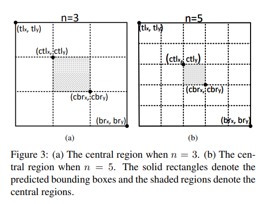
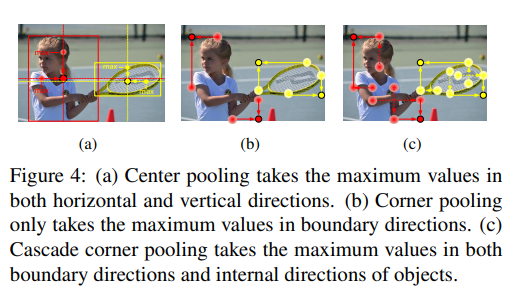
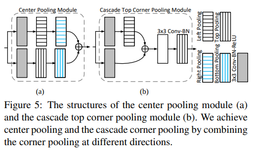

time: 20191024
pdf_source: https://arxiv.org/pdf/1904.08189.pdf
code_source: https://github.com/Duankaiwen/CenterNet
short_title: CenterNet
# CenterNet: Keypoint Triplets for Object Detection

CenterNet也就是通过输出每一个object为左上角、右上角与中心点的一个triplet,这个思路源自于[CornerNet](CornerNet_Detecting_Objects_as_Paired_Keypoints.md)。

## 总体结构与pipeline

与CornerNet相似的，backbone的选择也是[stacked hourglass](../../Building_Blocks/Stacked_Hourglass_Networks_for_Human_Pose_Estimation.md)

第一分支经过新的Cascade Corner Pooling(新的操作)得到Corner Heatmaps并通过[associative embedding](Associative_Embedding:End-to-End_Learning_for_Joint_Detection_and_Grouping.md)得到初始2D框。

第二分支经过Center Pooling得到Center Heatmap。

最后拼在一起得到输出。

## 融合检测keypoints

算法
1. 选择top-k个中心keypoints
2. 使用对应offset投影到输入图片中
3. 对每一个corner heatmap输出的2D box，查找有中心点是否在中心区域
4. 如果有中心点在中心区域，保留这个框

对中心区域的定义：

满足:
$$
\left\{\begin{array}{l}{\operatorname{ct} 1_{x}=\frac{(n+1) \operatorname{tl}_{x}+(n-1) \operatorname{br}_{x}}{2 n}} \\ {\operatorname{ct} l_{y}=\frac{(n+1) \operatorname{tl}_{y}+(n-1) \operatorname{br}_{y}}{2 n}} \\ {\operatorname{cbr}_{x}=\frac{\left.(n-1) \operatorname{tl}\right|_{x}+(n+1) \operatorname{br}_{x}}{2 n}} \\ {\operatorname{cbr}_{y}=\frac{(n-1) \operatorname{tl}_{y}+(n+1) \operatorname{br}_{y}}{2 n}}\end{array}\right.
$$

本文主要指代$n$为3和5,分别对应scale小于和大于150的2Dbox。

## Center Pooling 与 Cascade Corner Pooling

简单来说，Center Pooling的算法就是取同行、同列的最大值并累加。Cascade Corner Pooling的算法是，取同行、同列的最大值，再在对应的取最值的点寻找同列、同行(错开)的最大值，输出为4个点的累加。

可视化显示如图

都可以用[Corner Pooling实现](CornerNet_Detecting_Objects_as_Paired_Keypoints.md)。如图

