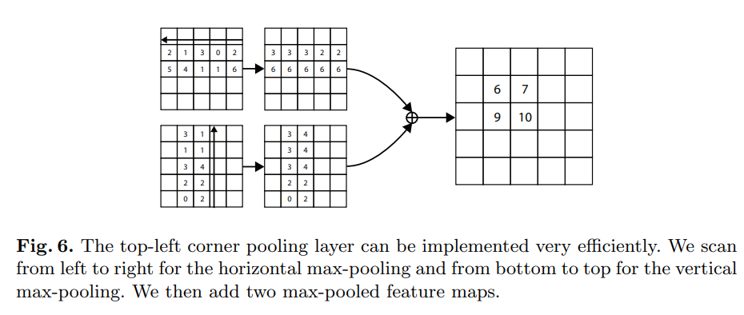

time: 20201018
pdf_source: https://eccv2018.org/openaccess/content_ECCV_2018/papers/Hei_Law_CornerNet_Detecting_Objects_ECCV_2018_paper.pdf
code_source:  https://github.com/princeton-vl/CornerNet
short_title: CornetNet
# CornerNet: Detecting Objects as Paired Keypoints

这篇文章是[这篇文章](CornerNet-Lite_Efficient_Keypoint_Based_Object_Detection.md)的前置,实际上也确实有更多的内容,在具体实现上有区别。

这篇文章给出的思路是，让神经网络分别给出某一类别左上角与右下角的heatmap，然后通过embedding vector的相似性进行两个角落的匹配。另外为了提高性能，还给出了corner pooling以及它的GPU实现。整个网络流程基本是one-stage

## 结构overview


backbone网络使用的是[hourglass](../../Building_Blocks/Stacked_Hourglass_Networks_for_Human_Pose_Estimation.md)

之后跟随的是两个预测模块，一个预测输出是左上角，另一个给出的是右下角。这两个模块有各自的corner pooling。

## 预测角点

网络最终输出的是两组heatmap，一个给左上角一个给右下角，每一组热图有$C$个特征，与类别数一致(每一类一个channel的热图)，feature map形状是$H\times W$.不像yolo或者SSD一样带有background channel。

在训练的时候，直觉与经验表示不应该简单地惩罚不正确的角点位置。这里根据物体的体积的设定不同的radius cost.

radius 虽然表达的是一个圆的概念，但是实际实现的时候是一个正方形的半边长, 其长度的设定是说一对ground truth点的正方形区域内，任选两点，两点构成的bbox与gt的bbox的IoU下限不低于某一个设定值(本文取0.3).
$$
\forall p_i\in{LeftTop}, \forall p_j \in {RightBottom} \quad IoU(bbox_{p_i, p_j}, bbox_{gt})
$$

原版code有错误，经过一些修正后正确的实现应当是。
```python
def compute_radius(det_size, min_overlap=0.7):
    """ Compute radius from ground truth bbox.

    original equation: (w - 2r) (h - 2r) / (wh) = min_overlap
    Take the solution with a smaller magnitude.
    """
    height, width = det_size

    a2 = 4
    b2 = 2 * (height + width)
    c2 = (1 - min_overlap) * width * height
    sq2 = np.sqrt(b2 ** 2 - 4 * a2 * c2)
    r2 = (b2 - sq2) / (2 * a2)
    
    return r2
```

这个idea热点图的idea以及official code(尽管不一定正确)被多个后续的文章使用, 包括 [Object as point](Object_as_points.md), [RTM3D Unofficial Implementation](https://github.com/maudzung/RTM3D)

最终设计出一个focal loss,原版focal loss源自与[这篇文章](https://arxiv.org/pdf/1708.02002.pdf),在[这里](../../3dDetection/Disentangling_Monocular_3D_Object_Detection.md)有简介。这里的定义是

$$
L_{det}=\frac{-1}{N} \sum_{c=1}^{C} \sum_{i=1}^{H} \sum_{j=1}^{W}\left\{\begin{array}{c}{\left(1-p_{c i j}\right)^{\alpha} \log \left(p_{c i j}\right)}   if (y_{cij} == 1) \\ {\left(1-y_{c i j}\right)^{\beta}\left(p_{c i j}\right)^{\alpha} \log \left(1-p_{c i j}\right) \text { otherwise }}\end{array}\right.
$$

其中$p_{cij}$为$(i,j)$位置上的score，$e^{-\frac{x^2+y^2}{2\sigma^2}}$,其中$\sigma$是radius是$1/3$, $N$是图片中物体的数目。$\alpha, \beta$是可调节的超参数。

由于卷积网络里面我们需要对图片下采样，$(x,y) \rightarrow (\frac{x}{n}, \frac{y}{n})$,需要额外学习一个offsets去补偿
$$
\boldsymbol{o}_{k}=\left(\frac{x_{k}}{n}-\left\lfloor\frac{x_{k}}{n}\right\rfloor, \frac{y_{k}}{n}-\left\lfloor\frac{y_{k}}{n}\right\rfloor\right)
$$
这个cost可以用
$$
L_{o f f}=\frac{1}{N} \sum_{k=1}^{N} \operatorname{SmoothL} 1 \operatorname{Loss}\left(\boldsymbol{o}_{k}, \hat{\boldsymbol{o}}_{k}\right)
$$

## 将角点聚团

因为一张图如果有多个物体，一个图会有不止一对的左上角点和右下点。本文的做法提到了[这篇论文](https://arxiv.org/pdf/1611.05424.pdf),[简介](Associative_Embedding:End-to-End_Learning_for_Joint_Detection_and_Grouping.md)

网络给每一个左上角与右下角角预测一个embedding vector，本文这里模仿前一篇论文的做法，维度仅为1。如果代表的是同一个bounding box，那么两者距离就会比较小。分为两个loss，一个是pull一个push。
$$
L_{p u l l}=\frac{1}{N} \sum_{k=1}^{N}\left[\left(e_{t_{k}}-e_{k}\right)^{2}+\left(e_{b_{k}}-e_{k}\right)^{2}\right]
$$

$$
L_{p u s h}=\frac{1}{N(N-1)} \sum_{k=1}^{N} \sum_{j=1 \atop j \neq k}^{N} \max \left(0, \Delta-\left|e_{k}-e_{j}\right|\right)
$$

$e_{t_k}$作为第$k$个物体，左上角的embedding,$e_{b_k}$作为右下角的。$e_k$是$e_{t_k}, e_{b_k}$的均值，然后设定$\Delta=1$，与offset一样，这个loss只执行在gt的角落位置上.

## Corner Pooling

用来允许每一个，计算方式如图



$$
t_{i j}=\left\{\begin{array}{cl}{\max \left(f_{t_{i j}}, t_{(i+1) j}\right)} & {\text { if } i<H} \\ {f_{t_{H j}}} & {\text { otherwise }}\end{array}\right.
$$

$$
l_{i j}=\left\{\begin{array}{cl}{\max \left(f_{l_{i j}}, l_{i(j+1)}\right)} & {\text { if } j<W} \\ {f_{l_{i W}}} & {\text { otherwise }}\end{array}\right.
$$

然后对$t_{ij}, l_{ij}$相加得到结果。为右下角的pooling layer取max的方向相反。


先将基础的resblock的第一个$3\times 3$卷积改为corner pooling.