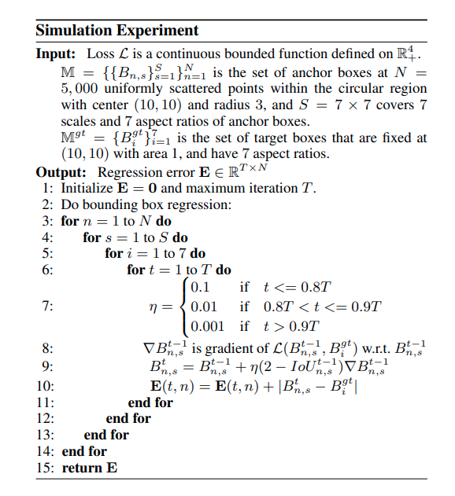
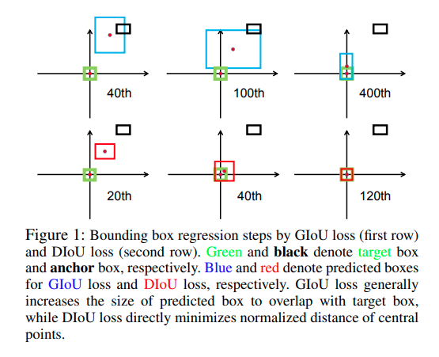
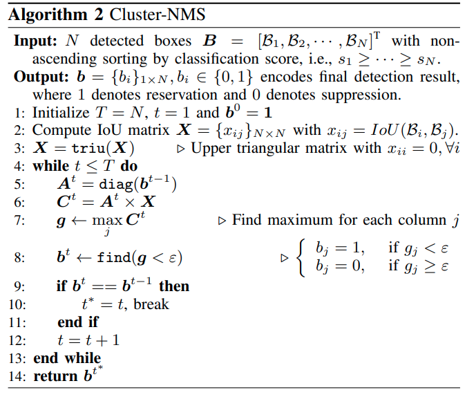

time: 20200509
pdf_source: https://arxiv.org/pdf/1911.08287.pdf
code_source: https://github.com/Zzh-tju/DIoU-SSD-pytorch
short_title: Distance-IoU Loss
# Distance-IoU Loss: Faster and Better Learning for Bounding Box Regression

This paper introduce distance-IoU based on the basic IoU metric and the [GIoU](../../3dDetection/GeneralizedIoU.md). [GIoU]的引出本来是为了解决两个bounding box 不重合时损失函数可导性的问题。但是作者通过一个非常有启发性的仿真实验，说明了 GIoU的收敛性问题。 然后提出了尺度上invariant且收敛性更好的DIoU。 作者之后进一步考虑了aspect ratio长宽比的regularization 问题，提出了CIoU.

Update 2020.05.09:
    CIoU and Cluster-NMS: [pdf](https://arxiv.org/pdf/2005.03572v1.pdf) [code](https://github.com/Zzh-tju/CIoU)

## Simulation on the convergence of IoU losses

作者仿真了不同起始条件下，使用不同的IoU函数进行梯度下降，观察收敛性。
算法如下

这个算法有几个值得注意的地方，首先是目标框以及起始相关数据的选择，其次是梯度下降的模拟退火，最后要关注的是梯度下降更新(第9行)前面的因子.

最后的收敛效果如图

文章指出，使用GIoU作训练的时候,会先使prediction面积增大，尽可能实现相交，再进行拟合，优化过程比较扭曲，不太好，实验结果也证明其收敛很慢。

仿真实验代码在[额外的仓库](https://github.com/Zzh-tju/DIoU)

##  DIoU与CIoU

$$
\mathcal{L}_{D I o U}=1-\operatorname{IoU}+\frac{\rho^{2}\left(\mathbf{b}, \mathbf{b}^{g t}\right)}{c^{2}}
$$

其中分子上为两个bounding box 中心点的直线距离，$c$为两个bounding box最小包络框的对角线长度。

CIoU则是:

$$
\mathcal{L}_{C I o U}=1-I o U+\frac{\rho^{2}\left(\mathbf{b}, \mathbf{b}^{g t}\right)}{c^{2}}+\alpha v
$$
$$
v=\frac{4}{\pi^{2}}\left(\arctan \frac{w^{g t}}{h^{g t}}-\arctan \frac{w}{h}\right)^{2}
$$
$$
\alpha=\frac{v}{(1-I o U)+v}
$$

这里一个个分析，首先$v$指代的是两个bounding box之间由于aspect ratio不同产生的误差，这里用 $arctan$的差值描述。$\alpha$是一个参数，如果IoU 接近于1，则$\alpha$接近1，权重为最大，如果$IoU$接近于0，则长宽比对应的权重下调。

作者对CIoU的反向传播也做了一个近似优化来提升稳定性，具体看原文以及源码。

## Cluster NMS (update on 2020.05.09)

翻译:
1. 假设所有bounding box都保留下来，也都对其他比它score低的boxes有抑制可能性
2. 省略上一个循环中被抑制的boxes，迭代[FastNMS](../Segmentation/YOLACT.md)

几个小结论：
1. 若迭代次数为1，算法就等同于FastNMS
2. 若迭代次数为N，算法结果一定等同于原始NMS(作者有证明)
3. 一般情况下迭代次数显著地小于N
4. torchVision的NMS是原版NMS，但是通过硬件加速比这个还要快...???
