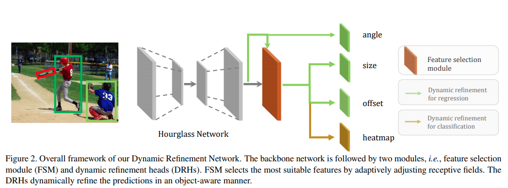
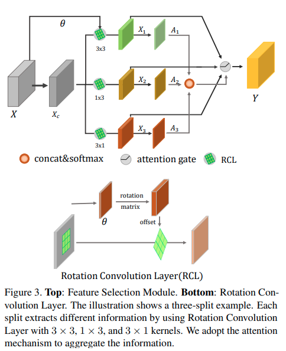
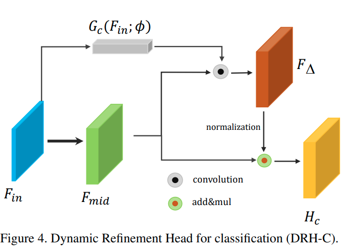
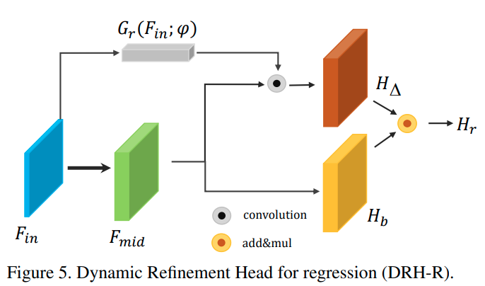
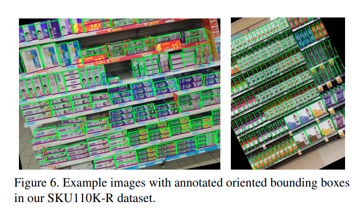

time: 20200524
pdf_source: https://arxiv.org/pdf/2005.09973v1.pdf
code_source: https://github.com/Anymake/DRN_CVPR2020
short_title: Dynamic Refinement Network
# Dynamic Refinement Network for Oriented and Densely Packed Object Detection

这篇paper处理的是SKU数据集，特点是物体数量很大，很密集，且作者进一步提出SKU110K-R数据集，bounding box带有旋转量，这个数据集来自于SKU110K直接选择，提出这个数据集的意义在于促进densely oriented bounding box的研究。网络结构上提出了几个新的模块，适应不同的物体形状与类别特定的信息。

## 网络结构

网络思路基于 [Object as Point](Object_as_points.md).

网络会预测$\theta$角，bounding box由旋转得来

$$\begin{array}{l}
P_{l t}=M_{r}[-w / 2,-h / 2]^{T}+\left[c_{x}+\delta_{x}, c_{y}+\delta_{y}\right]^{T} \\
P_{r t}=M_{r}[+w / 2,-h / 2]^{T}+\left[c_{x}+\delta_{x}, c_{y}+\delta_{y}\right]^{T} \\
P_{l b}=M_{r}[-w / 2,+h / 2]^{T}+\left[c_{x}+\delta_{x}, c_{y}+\delta_{y}\right]^{T} \\
P_{r b}=M_{r}[+w / 2,+h / 2]^{T}+\left[c_{x}+\delta_{x}, c_{y}+\delta_{y}\right]^{T}
\end{array}$$

值得注意的地方在于由于object as point的 NMS只是对heatmap进行简单的maxpooling计算，因而不需要计算rotated IoU，速度快而不容易有错误，而且object as point的输出点比较密集，因而很适合这个密集的数据集。

## 额外的网络模块

### Feature Selection Module & Rotation Convolution

这里是借助了deformable convolution的思路与代码

使用网络输出一个转角$\theta$，修改原始convolution对应的offset，
$$\delta p_{i}=M_{r}(\theta) \cdot p_{i}-p_{i}$$
$$X_{i}\left(p_{0}\right)=\sum_{p_{n} \in \mathcal{R}} w\left(p_{n}\right) \cdot X_{c}\left(p_{0}+p_{n}+\delta p_{n}\right)$$

特征选择使用的是简单的attention block.

$$A_{i}^{\prime}=\operatorname{SoftMax}\left(\left[A_{1}, A_{2}, A_{3}\right]\right)$$
$$Y=\sum_{i} A_{i}^{\prime} \cdot X_{i}$$

### Dynamic Refinement Head

$$H_{c}=C\left(\left(1+\varepsilon \cdot F_{\Delta} /\left\|F_{\Delta}\right\|\right) \cdot F_{m i d} ; \Phi\right)$$

$$\begin{array}{l}
H_{b}=R\left(F_{m i d} ; \Psi\right) \\
H_{r}=\left(1+\epsilon \cdot \tanh \left(H_{\Delta}\right)\right) \cdot H_{b}
\end{array}$$

### Dataset

