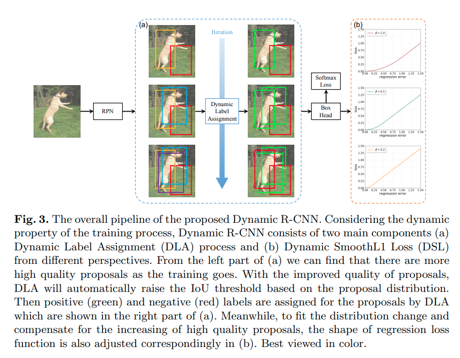
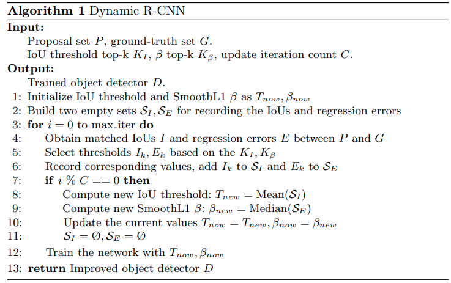

time: 20200707
pdf_source: https://arxiv.org/pdf/2004.06002v1.pdf
code_source: https://github.com/hkzhang95/DynamicRCNN
short_title: Dynamic RCNN
# Dynamic R-CNN: Towards High Quality Object Detection via Dynamic Training

本文提供一个基于mmdetection的config实现，已经加入mmdetection [master分支](https://github.com/open-mmlab/mmdetection/tree/master/configs/dynamic_rcnn).

本文的想法是在训练过程中动态调整Label Assignment的方式以及 SmoothL1 Loss的参数，使得随着训练的进步.训练出来的网络定位精度较大幅度提升(IoU threshold 0.9时AP提升5.5%).且不增加推理消费。

## Dynamic Label Assignment

作者指出anchor-based 方法在分配anchor的时候使用的IoU threshold尽管与总体的mAP没有线性相关性，但是随着IoU threshold增大，网络在高IoU threshold下的AP就越高(低IoU threshold下的AP越低)。

作者因而指出，如果object detector想得到更高的定位精度，在训练网络都时候应该需要比较达到IoU Threshold. 但是直接这样做会使得正样本都没了，

作者指出，随着训练过程的推进，回归效果也都在提升。因而直觉来看，在训练开始的时候，使用较低的IoU threshold,后面逐渐加大(指得是第二阶段的Gt assignment)

## Dynamic Loss 

