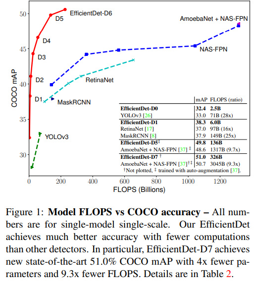
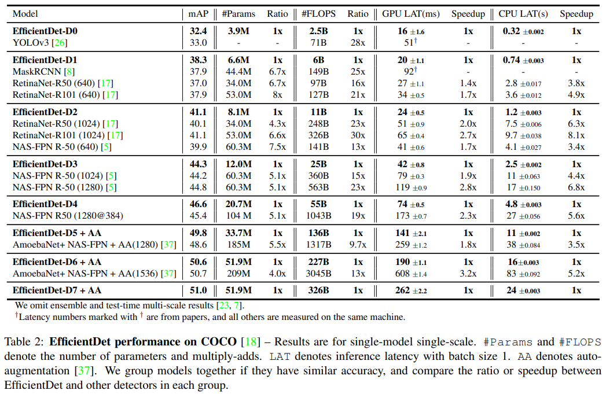
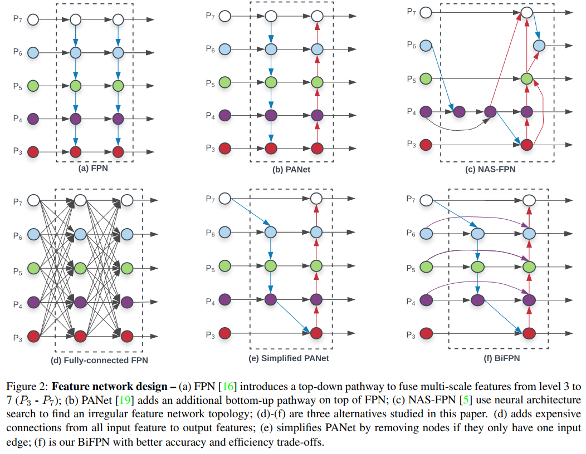
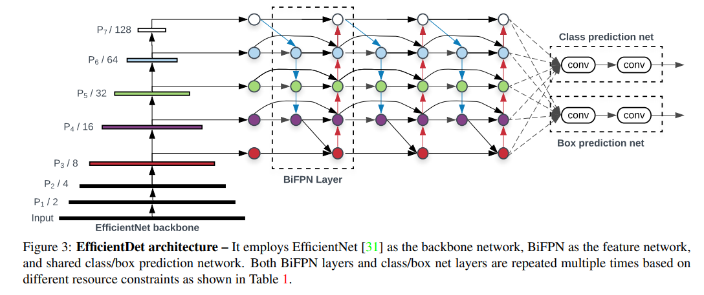

time: 20191202
pdf_source:https://arxiv.org/pdf/1911.09070v1.pdf
code_source: https://github.com/xuannianz/EfficientDet
short_title: EfficientDet
# EfficientDet: Scalable and Efficient Object Detection

这篇文章系统地提出了 BiFPN(weighted bidirectional feature pyramid network),并提出了一套scale up的方法，最终提出了EfficientDet,根据paper的说法相较于现有的benchmark可以显著地提升速度，减少参数，提升精度.菜单上的代码超链接为官方的Tensorflow implementation, 而非官方的[Pytorch implementation]也已经有链接了.这篇文章本质上是[EfficientNet]这一SOAT模型在检测领域的接续。

## BiFPN Block

传统来说FPN可以用如下的方程式表达:

$$
\begin{array}{l}{P_{7}^{o u t}=\operatorname{Conv}\left(P_{7}^{i n}\right)} \\ {P_{6}^{o u t}=\operatorname{Conv}\left(P_{6}^{i n}+\operatorname{Resize}\left(P_{7}^{o u t}\right)\right)} \\ {\cdots} \\ {P_{3}^{o u t}=\operatorname{Conv}\left(P_{3}^{i n}+\operatorname{Resize}\left(P_{4}^{o u t}\right)\right)}\end{array}
$$
其中$Resize$ 指代上下采样以达到相同的分辨率。不同分辨率的特征在融合的时候是等权地求和的。但是，可以猜测 and 观测到不同scale的特征对当前scale的输出的贡献应该是不同的，因此，作者提出了三种加权融合特征的方式
1. Unbounded Fusion: $O = \sum_i w_iI_i $也就是直接求和，作者发现这种做法会使得训练结果不稳定。因为是Unbounded的融合
2. Softmax Fusion: $O = \sum_i \frac{e^{w_i}}{\sum_j e^{w_j}} I_i$,作者发现这种做法的计算速度太慢了。
3. Fast-normalized Fusion: $O = \sum_i \frac{w_i}{\epsilon + \sum_j w_j} I_j$其中每一个权重$w_i$都是ReLU的结果，而$\epsilon$是一个很小的值用于稳定计算。计算速度较快，性能与softmax相近。

## EfficientDet

Backbone为同一组作者的[EfficientNet]

## Scaling Up
正如[EfficientNet]的做法，作者同样坚持随着输入图片的像素增大，模型也需要变大、变深、变宽。在Detection中，Backbone的Scale Up与[EfficientNet]中的一致。

[BiFPN]的channel数,深度与预测网络的深度变化如下
$$
W_{b i f p n}=64 \cdot\left(1.35^{\phi}\right), \quad D_{b i f p n}=2+\phi
$$

$$
D_{b o x}=D_{c l a s s}=3+\lfloor\phi / 3\rfloor
$$
输入的变化为
$$
R_{input} = 512+ \phi * 128
$$

作者的实验很完整，值得一读

[Pytorch implementation]:https://github.com/toandaominh1997/EfficientDet.Pytorch
[EfficientNet]:../../Building_Blocks/EfficientNet:_Rethinking_Model_Scaling_for_Convolutional_Neural_Network.md
[BiFPN]:#BiFPN&#32;Block