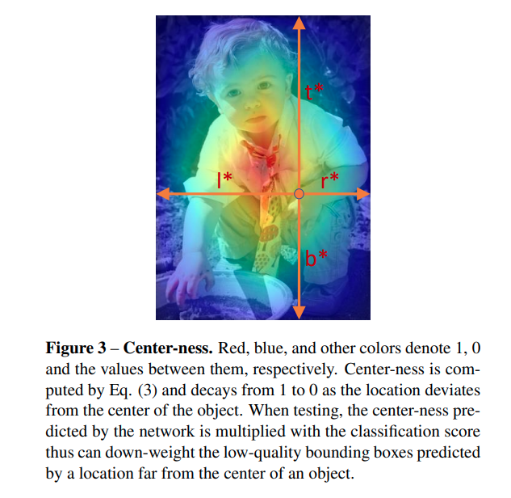
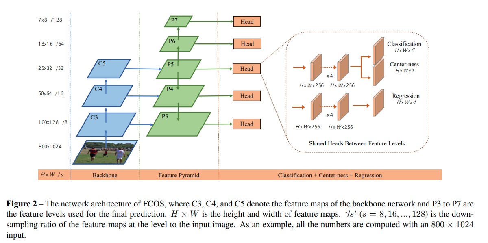

pdf_source:https://arxiv.org/pdf/1904.01355.pdf
code_source:https://github.com/tianzhi0549/FCOS
time: 20200114
short_title: FCOS, anchorless one-stage object detection
# FCOS: Fully Convolutional One-Stage Object Detection

本文是anchor-free object detection的又一代表作品，其有效性应该是显著，因为在后来的其他object detection论文中进行了使用，包括[DSGN].
本文在[mmdetection]中也有复现，比利用maskrcnn-benchmark的官方代码要容易读,其在[mmdetection]中的主要代码在[fcos_head.py](https://github.com/open-mmlab/mmdetection/blob/master/mmdet/models/dense_heads/fcos_head.py)

## FCOS - Output definition

对于图片中的每一个点，如果它是正样本，那么直接回归它到四个边界的距离。这个是FCOS主要的回归形式，以此来替代anchor box

## FCOS - Ground Truth seperation

这一段再补充说明基于retinanet的FCOS在无anchors的情况下如何分配ground truth，由于Retinanet的结构性质，不同层被分配不同的感受野任务，作者hardcode了，对于第$i$层的网络，只负责
$$
    m_{i-1}< max(l*, r*, t*, b*) < m_i
$$
的object,其中$m_i$为根据FPN感受野的hardcode值，具体看论文。

每一个点，只要它在对应object的框内，它就是正样本，如果同一个scale内一个点仍对应多个gt object，就以面积最小的为target.

## FCOS - centerness

由于分配了大量的正样本，这样直接训练的结果是有大量的边缘点给出错误的bbox，作者进一步补充，要求网络对每一个点给出一个"centerness"的估计，其目标值为：

$$
\text { centerness }^{*}=\sqrt{\frac{\min \left(l^{*}, r^{*}\right)}{\max \left(l^{*}, r^{*}\right)} \times \frac{\min \left(t^{*}, b^{*}\right)}{\max \left(t^{*}, b^{*}\right)}}
$$

在inference的时候，根据centerness进行NMS而非分类置信度，最终能显著的提升结果。

[mmdetection]:https://github.com/open-mmlab/mmdetection
[DSGN]:https://github.com/chenyilun95/DSGN