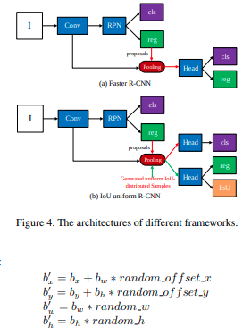

time: 20191216
pdf_source: https://arxiv.org/pdf/1912.05190.pdf
code_source: https://github.com/zl1994/IoU-Uniform-R-CNN
short_title: IoU-uniform R-CNN
# IoU-uniform R-CNN: Breaking Through the Limitations of RPN

这篇论文是一系列针对NMS或者region proposal训练提升的论文之一，其中涉及了多一个有意义的概念与思路。本文核心贡献是在RCNN(pooling 或 align后的网络)训练过程中.

## RPN 与 rCNN 两大问题

第一，在训练的时候，相当部分的提供给RCNN训练用的正样本都是来自与ground truth的proposal，但是测试推理的时候，我们要求RCNN的输入是RPN给出的proposal，与GT相比会有一定的误差，这其中的misalignment就会使得RCNN在test的时候性能变差，训练的时候也容易过拟合。

第二，NMS supress了分类任务中确定度不是最高的框，但是这完全可能压制了事实上定位最准确的分类框，因而[IoU-Net.pdf](https://arxiv.org/pdf/1807.11590.pdf),要求神经网络输出当前框的IoU估计，NMS以这个IoU估计为基准.值得注意的是[gaussian Yolov3(简介)](Gaussian_YOLOv3:_An_Accurate_and_Fast_Object_Detector_Using_Localization_Uncertainty_for_Autonomous_Driving.md),同样使用定位不确定度来控制NMS，只不过它要求每一定位维度的不确定度的总合，而IoU-Net要求网络直接输出IoU估计.

## IoU-uniform sampling

这篇论文提出的想法是如上图，在给RCNN提供正样本时，随机扰动ground truth的ROI，以此得到多个带有噪声正样本用作training。作者认为这样可以使得training phase与inference phase中RCNN的输入分布更相近。

在NMS的时候依据为IoU估计值与probs的乘积。