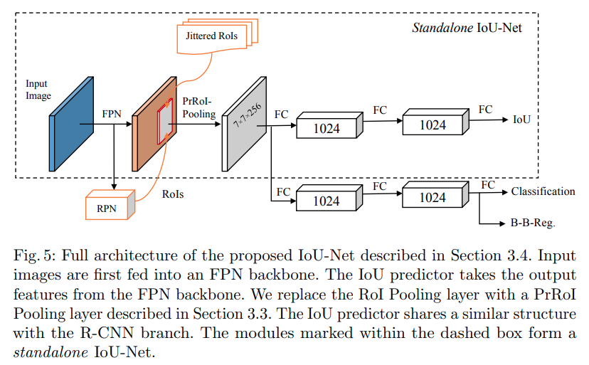
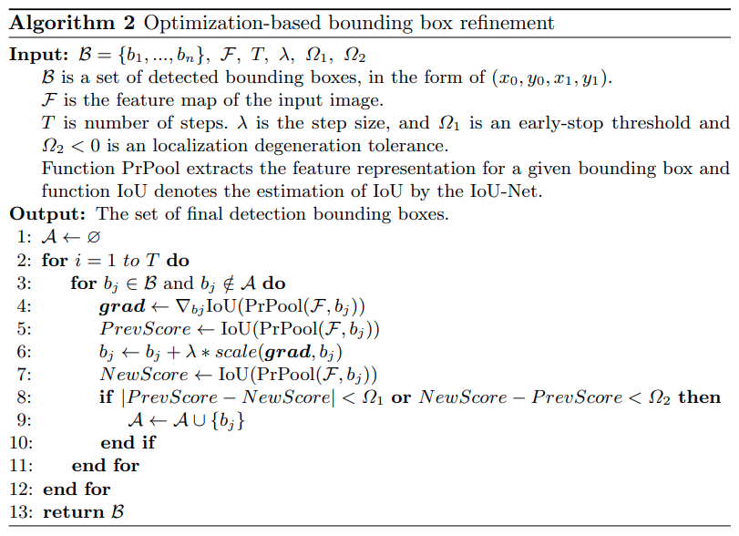
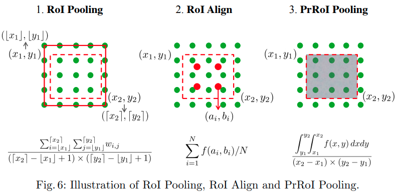
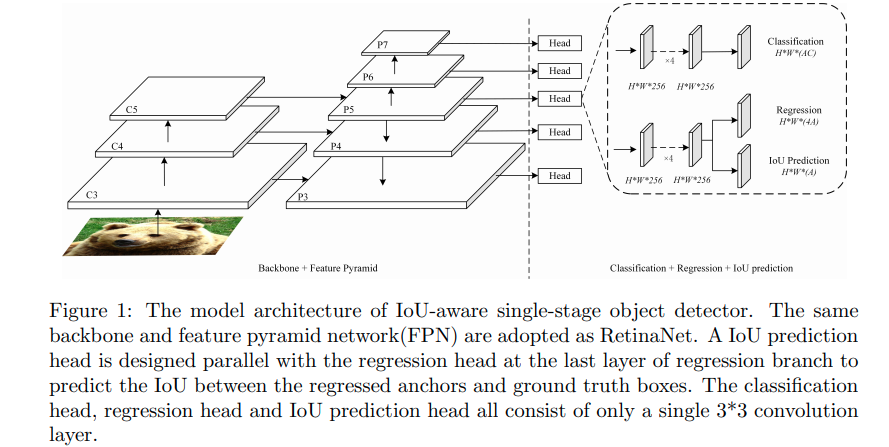

time: 20191217
pdf_source: https://arxiv.org/pdf/1807.11590.pdf
short_title: IoU Net(s) - A summary
# IoU Nets

本文会尝试同时融合两篇idea相似的论文的想法，第一为 [Acquisition of Localization Confidence for Accurate Object Detection](https://arxiv.org/pdf/1807.11590.pdf)。第二篇为 [IoU-aware Single-stage Object Detector for Accurate Localization](https://arxiv.org/pdf/1912.05992.pdf)

其中第一篇论文由[Iou-uniform-rcnn](IoU-uniform_R-CNN.md)提及，两篇论文的核心idea都是涉及在NMS中使用IoU预测值替代classification score

## Acquisition of Localization Confidence for Accurate Object Detection

这篇论文的内容比较多，首先是IoU-guided NMS,其次是IoU-guided optimization,最后是PrROI pooling.

第一部分是在RoI后增加一个分支预测IoU值,在NMS时以IoU替代分类分数

### IoU-guided optimization

这里做的是在提供proposal给RCNN提供输入时，用梯度优化微调FPN输出的bounding box，目标函数是RCNN输出的IoU,直觉意思是微调FPN的bounding box，最优化RCNN预测的IoU。在IoU预测准确的前提下，这样可以优化FPN的proposal。

### PrROI pooling

PrROI已经[开源](https://github.com/vacancy/PreciseRoIPooling)

这个称为Precise RoI Pooling

$$
\begin{aligned}
    f(x, y) &= \sum_{i,j}IC(x,y,i,j) \times w_{i,j} \\
    IC(x,y,i,j) &= max(0, 1-|x-i|) \times max(0, 1-|y-j|) \\
\end{aligned}
$$

$$
\operatorname{PrPool}(b i n, \mathcal{F})=\frac{\int_{y 1}^{y 2} \int_{x 1}^{x 2} f(x, y) d x d y}{\left(x_{2}-x_{1}\right) \times\left(y_{2}-y_{1}\right)}
$$

## IoU-aware Single-stage Object Detector for Accurate Localization

这篇稍微简单将IoU NMS用在one-stage的retina net中。如图

损失函数如下
$$
\begin{aligned}
L_{c l s}=& \frac{1}{N_{P o s}}\left(\sum_{i \in P o s}^{N} \mathrm{FL}\left(p_{i}, \hat{p}_{i}\right)+\sum_{i \in N e g}^{M} \mathrm{FL}\left(p_{i}, \hat{p}_{i}\right)\right) \\
L_{l o c}=& \frac{1}{N_{P o s}} \sum_{i \in P o s}^{N} \sum_{m \in c x, c y, w, h} \mathrm{smooth}_{\mathrm{L} 1}\left(l_{i}^{m}-\hat{g}_{i}^{m}\right) \\
& L_{I o U}=\frac{1}{N_{P o s}} \sum_{i \in P o s}^{N} \mathrm{CE}\left(I o U_{i}, I \hat{o} U_{i}\right) \\
& L_{t o t a l}=L_{c l s}+L_{l o c}+L_{I o U}
\end{aligned}
$$

主要在于IoU的训练方式用的是Binary Cross Entropy(应当假设原IoU为sigmoid)