time: 20210216
pdf_source: https://arxiv.org/pdf/1906.07155.pdf
code_source: https://github.com/open-mmlab/mmdetection

# Some Collections around MMDetection

这一页面主要为了收集mmdetection中提供实现的论文。这里收集或者提供链接的主要是相对冷门的paper，主流的如Faster-RCNN以及Retinanet不会再重复。

其余有实现，并记录在本网站其他地方的有[FCOS](FCOS.md), [FreeAnchor](../../The_theory/FreeAnchor_Learning_to_Match_Anchors_for_Visual_Object_Detection.md), [ATSS](../Summaries/Summary_of_serveral_cvpr2020.md), [RepPoints](Reppoints.md) 

Update:

2020/06/04: Updates [HTC](#htc), [DetectoRS](#detectors)

# Single Stage Methods

## GHM: Gradient Harmonized Single-stage Detector
[pdf](https://arxiv.org/pdf/1811.05181.pdf)

这篇paper主要idea是loss function应该平衡不同样本之间的gradient norm. 过于困难的instance gradient norm较大而过于简单的的instance gradient理应会很小，
一个well trained detector的gradient norm分布如图

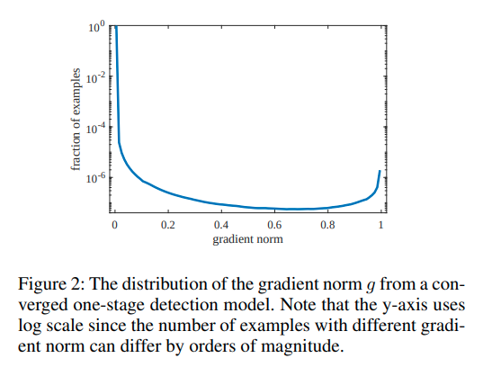
作者的想法是应该提升中间层，或者说gradient密度比较小的部分的梯度贡献。

定义梯度密度函数:
$$
G D(g)=\frac{1}{l_{\epsilon}(g)} \sum_{k=1}^{N} \delta_{\epsilon}\left(g_{k}, g\right)
$$

$$
\begin{aligned}
&\delta_{\epsilon}(x, y)=\left\{\begin{array}{ll}
1 & \text { if } y-\frac{\epsilon}{2}<=x<y+\frac{\epsilon}{2} \\
0 & \text { otherwise }
\end{array}\right.\\
&l_{\epsilon}(g)=\min \left(g+\frac{\epsilon}{2}, 1\right)-\max \left(g-\frac{\epsilon}{2}, 0\right)
\end{aligned}
$$

简单而言就是 $GD(g)$为与梯度g临近的区间内，有相近梯度norm的example的个数/梯度区间长度。

$$
\beta_{i}=\frac{N}{G D\left(g_{i}\right)}
$$

$$
\begin{aligned}
L_{G H M-C} &=\frac{1}{N} \sum_{i=1}^{N} \beta_{i} L_{C E}\left(p_{i}, p_{i}^{*}\right) \\
&=\sum_{i=1}^{N} \frac{L_{C E}\left(p_{i}, p_{i}^{*}\right)}{G D\left(g_{i}\right)}
\end{aligned}
$$

也即是给loss加上与梯度example密度成反比的对应的权重。

## FSAF: Feature Selective Anchor-Free Module for Single-Shot Object Detection
[pdf](https://arxiv.org/pdf/1903.00621.pdf)

这篇paper的idea是让RetinaNet同时维护一个anchor free一个anchor based的分支，anchor_free的分支在每一个scale上都会受训练。
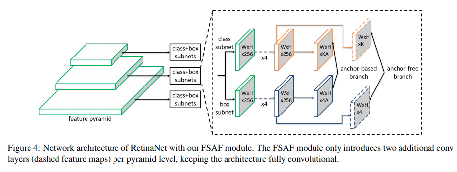

作者的online selection思路是让每一个scale上的anchor free分支都预测一次，然后得到对应的loss，寻找anchor free loss最小的scale，train对应scale的anchor-based分支。

Inference的时候则让所有6个分支各自输出，直接merge
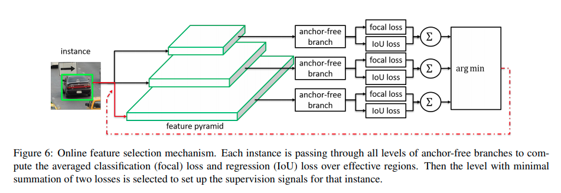

## FoveaBox: Beyond Anchor-based Object Detector
[pdf](https://arxiv.org/pdf/1904.03797.pdf) [code](https://github.com/open-mmlab/mmdetection/blob/master/mmdet/models/anchor_heads/fovea_head.py)

这篇paper的思路是取Retinanet所有之精华，指出在FPN的multi-scale支持下，已经不需要anchor了，其实也就是每一个scale有一个anchor就够了。

## Grid R-CNN
[pdf](https://arxiv.org/pdf/1811.12030.pdf) [code](https://github.com/open-mmlab/mmdetection/blob/master/mmdet/models/detectors/grid_rcnn.py)

这篇paper从今日的角度来说可以理解为RoIPooling后的[keypointNet](CenterNet:_Keypoint_Triplets_for_Object_Detection.md)，在grid point选择上有点不同，但是思路是相似的。

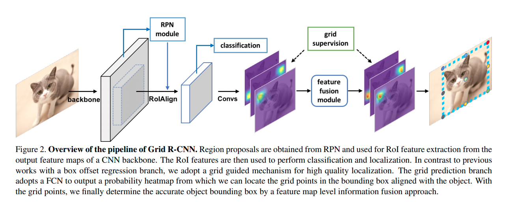

## VarifocalNet: An IoU-aware Dense Object Detector
[pdf](https://arxiv.org/pdf/2008.13367.pdf)

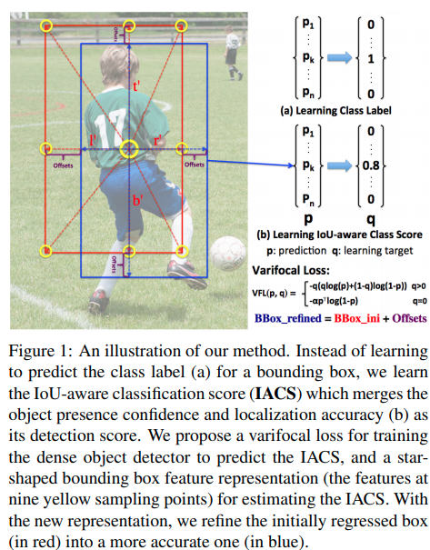

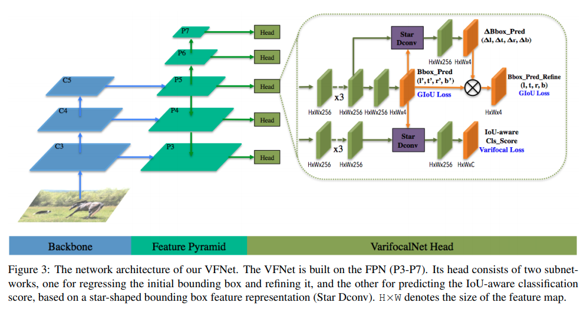

这篇paper的主要工作:

- Star Conv: 在第一次bounding box预测的基础上多跑一个deform conv, offset正是bounding box的各个角落.(让各个角落的feature融合到中心来的思路), 后面再输出一个比例修正项.
- varifocal loss: 

$$
\operatorname{VFL}(\mathrm{p}, \mathrm{q})=\left\{\begin{array}{ll}
-\mathrm{q}(\mathrm{q} \log (\mathrm{p})+(1-\mathrm{q}) \log (1-\mathrm{p})) & \mathrm{q}>0 \\
-\alpha \mathrm{p}^{\gamma} \log (1-\mathrm{p}) & \mathrm{q}=0
\end{array}\right.
$$

# Two Stage Methods

## HTC
[pdf](https://arxiv.org/pdf/1901.07518.pdf) [code](https://github.com/open-mmlab/mmdetection/tree/master/configs/htc)

motivation:
1. instance segmentation, detection甚至pixel-wise segmentation之间是互相补充的。但是单纯的让网络同时训练这几个任务并不足够。
2. cascade RCNN提出了bounding box的迭代优化

本篇paper就提出让网络同时迭代的学习这三个任务(迭代主要发生在bounding box和instance seg里面)，在每次迭代的时候通过其他任务当前的预测进度进行信息补充。

信息流图:
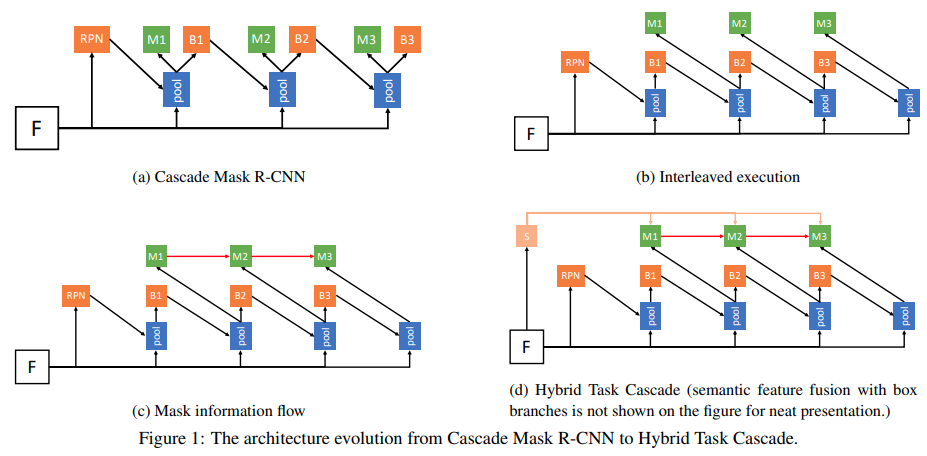

将Mask RCNN的预测分支放到cascade RCNN上，得到(a)流图:

$$\begin{aligned}
\mathbf{x}_{t}^{b o x} &=\mathcal{P}\left(\mathbf{x}, \mathbf{r}_{t-1}\right), \quad \mathbf{r}_{t}=B_{t}\left(\mathbf{x}_{t}^{b o x}\right) \\
\mathbf{x}_{t}^{\operatorname{mask}} &=\mathcal{P}\left(\mathbf{x}, \mathbf{r}_{t-1}\right), \quad \mathbf{m}_{t}=M_{t}\left(\mathbf{x}_{t}^{\operatorname{mask} }\right)
\end{aligned}$$

其中$\mathcal{P}$是pooling操作，$B, M$分别是bbox_head以及mask_head.

这种设置的一个提升方向是bbox以及mask还是并行的。作者让最新的bbox预测值用于mask head的输出，得到(b)
$$\begin{array}{ll}
\mathbf{x}_{t}^{b o x}=\mathcal{P}\left(\mathbf{x}, \mathbf{r}_{t-1}\right), & \mathbf{r}_{t}=B_{t}\left(\mathbf{x}_{t}^{b o x}\right) \\
\mathbf{x}_{t}^{\operatorname{mask}}=\mathcal{P}\left(\mathbf{x}, \mathbf{r}_{t}\right), & \mathbf{m}_{t}=M_{t}\left(\mathbf{x}_{t}^{\operatorname{mask} }\right)
\end{array}$$

作者进一步考虑将前一次迭代的mask的信息来补充新mask的信息:
$$\begin{array}{ll}
\mathbf{x}_{t}^{b o x}=\mathcal{P}\left(\mathbf{x}, \mathbf{r}_{t-1}\right), & \mathbf{r}_{t}=B_{t}\left(\mathbf{x}_{t}^{b o x}\right) \\
\mathbf{x}_{t}^{\operatorname{mask}}=\mathcal{P}\left(\mathbf{x}, \mathbf{r}_{t}\right), & \mathbf{m}_{t}=M_{t}\left(\mathcal{F}\left(\mathbf{x}_{t}^{\operatorname{mask}}, \mathbf{m}_{t-1}^{-}\right)\right)
\end{array}$$
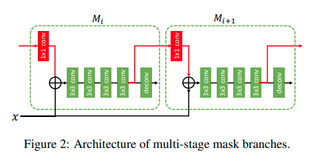
$$\mathcal{F}\left(\mathbf{x}_{t}^{\operatorname{mask}}, \mathbf{m}_{t-1}\right)=\mathbf{x}_{t}^{\operatorname{mask}}+\mathcal{G}_{t}\left(\mathbf{m}_{t-1}^{-}\right)$$

作者进一步考虑将semantic segmentation的信息加进来，得到:
$$\begin{aligned}
\mathbf{x}_{t}^{b o x} &=\mathcal{P}\left(\mathbf{x}, \mathbf{r}_{t-1}\right)+\mathcal{P}\left(S(\mathbf{x}), \mathbf{r}_{t-1}\right) \\
\mathbf{r}_{t} &=B_{t}\left(\mathbf{x}_{t}^{b o x}\right) \\
\mathbf{x}_{t}^{m a s k} &=\mathcal{P}\left(\mathbf{x}, \mathbf{r}_{t}\right)+\mathcal{P}\left(S(\mathbf{x}), \mathbf{r}_{t}\right) \\
\mathbf{m}_{t} &=M_{t}\left(\mathcal{F}\left(\mathbf{x}_{t}^{m a s k}, \mathbf{m}_{t-1}^{-}\right)\right)
\end{aligned}$$
其中$S(x)$为语义分割输出

## DetectoRS
[pdf](https://128.84.21.199/pdf/2006.02334.pdf) [code](https://github.com/joe-siyuan-qiao/DetectoRS/tree/master)

本文在更新的时候还没有放到mmdetection主分支上，是基于mmdetection 1.0版本设计的代码。同时更改了backbone,代码基于HTC.

主要提出的点是Recursive Feature Pyramid以及 Switchable Atrous Convolution

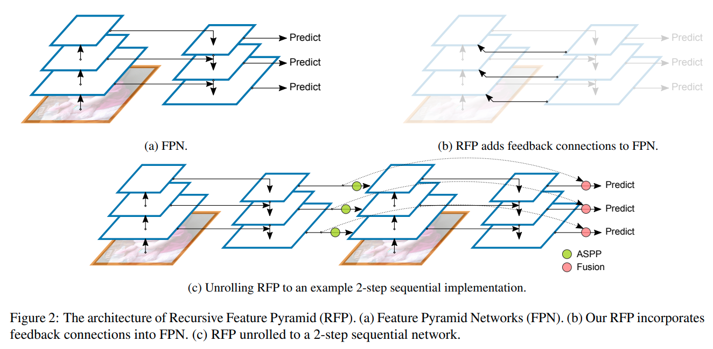

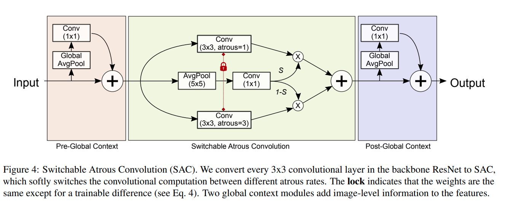

点数提升较为惊人，模型大小以及内存占用比较大(注意由于backbone的改变，其ResNet-50模型的大小近乎于HTC ResNeXt-101-64x4d的大小，且由于RFP的迭代原因，占用显存可能更大)。

## CentripetalNet: Pursuing High-quality Keypoint Pairs for Object Detection

[pdf](https://arxiv.org/pdf/2003.09119.pdf)

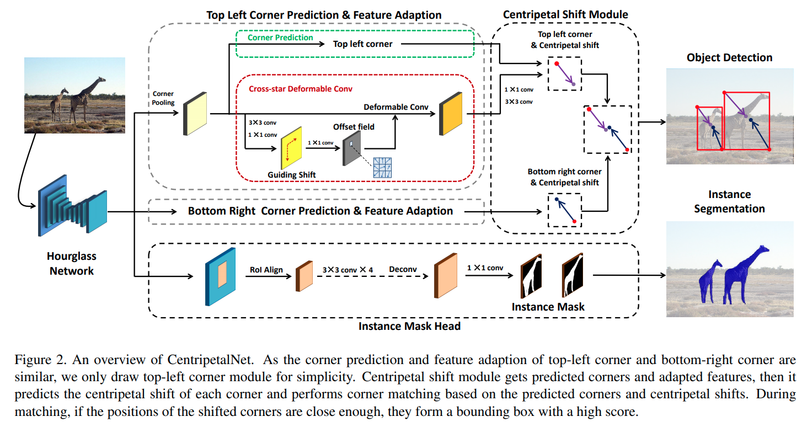

这个paper延续的是 [CornerNet](CornerNet_Detecting_Objects_as_Paired_Keypoints.md)和[CenterNet](CenterNet:_Keypoint_Triplets_for_Object_Detection.md)的思路.

- 用heatmap分别预测左上角以及右下角
- 预测一个左上角/右下角到中心点的偏移，作为guiding， 这个guiding可以被监督
- 以此偏移为基准跑deformable conv, 输出更精确的 centripetal shift
- 基于对中心点的预测将左上角与右下角进行匹配聚类
- 以预测出来的2D bounding box为基础预测 instance mask.

热点预测中角点的偏移(用于finetuning corner) / Guiding shift / 基于中心点预测的匹配中心区:
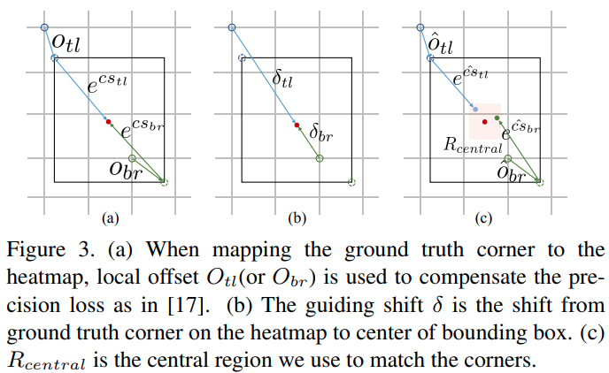

使用guiding deform conv的 intuition

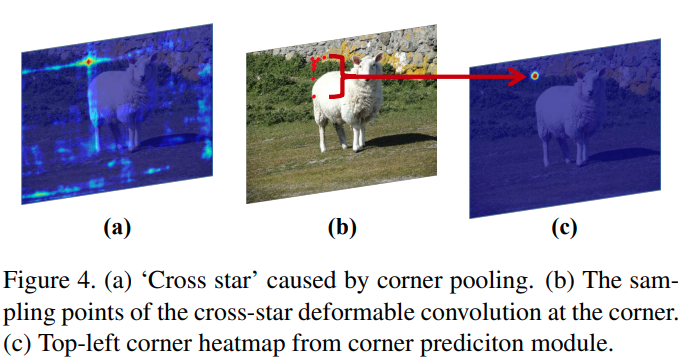

代码上本文的代码有点混乱，head与corner head代码有点重叠混杂.

## SCNet: Training Inference Sample Consistency for Instance Segmentation

[pdf](https://arxiv.org/pdf/2012.10150.pdf) [code](https://github.com/open-mmlab/mmdetection/tree/master/configs/scnet)

这篇paper基于 cascade mask RCNN 以及 HTC的串级思路。

主要提出的一个idea是克服训练时的RoI 准确率和推理时不同这个问题。

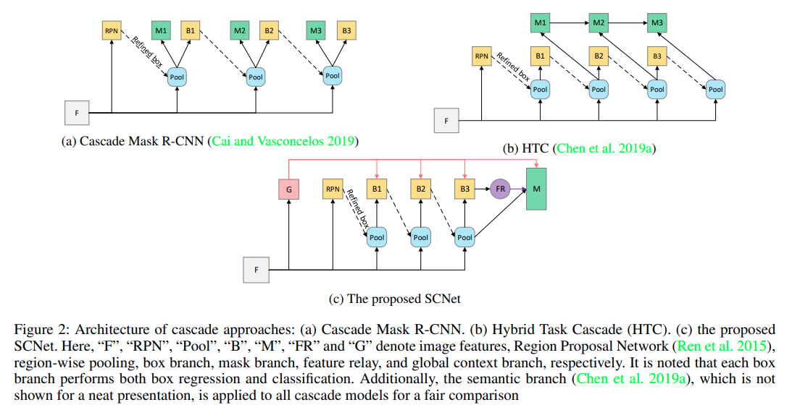

作者发现使用cascade训练的时候，提供给segmentation的bounding box有很多是基于没有那么准确的前方分支，而inferece的时候则只使用最后的分支。这里存在错配。因而提出mask只应该在最后一个分支出现。

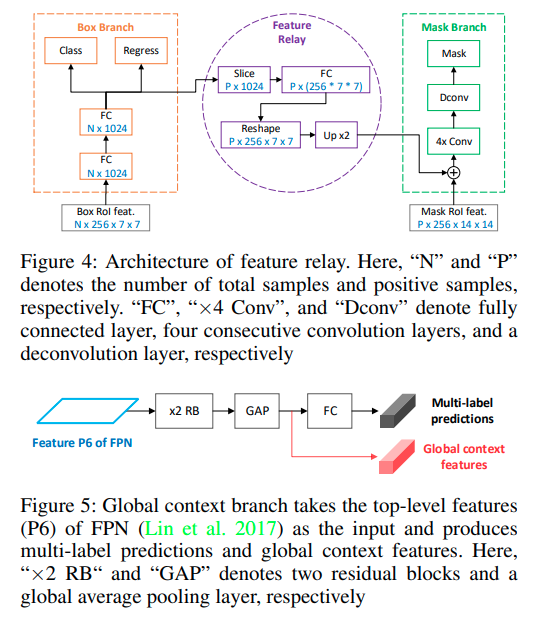