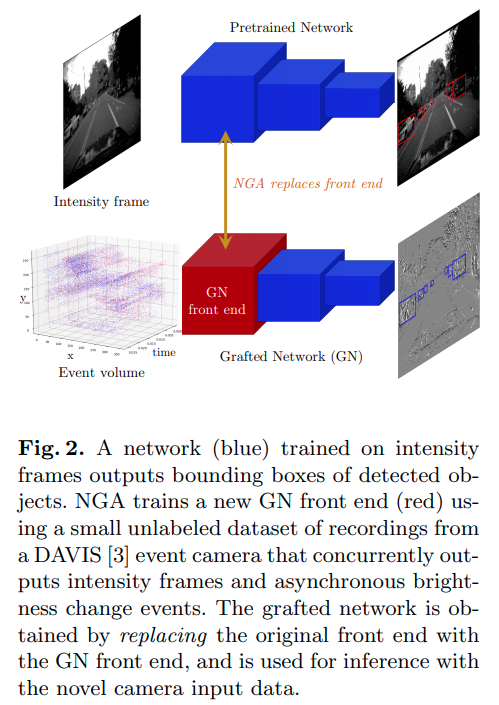
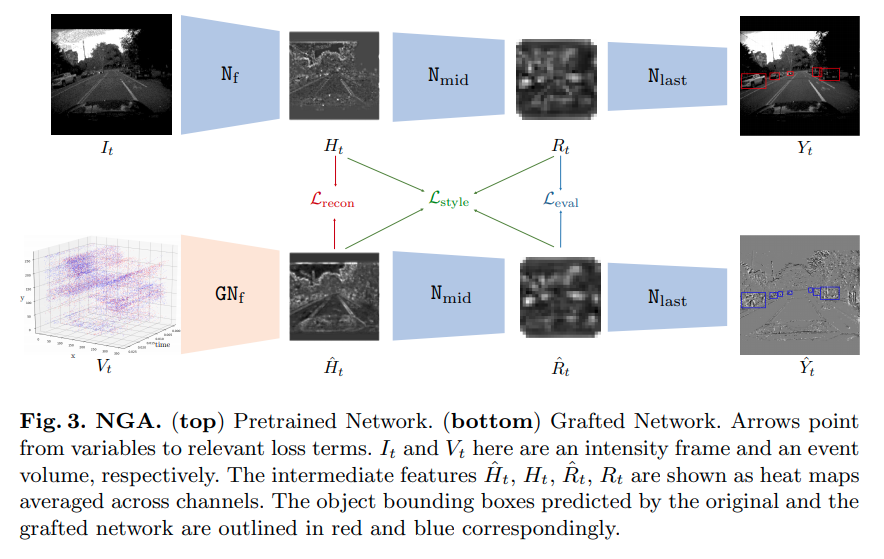

pdf_source: https://arxiv.org/pdf/2003.10959v1.pdf
time:20200327
# Exploiting Event Cameras by Using a Network Grafting Algorithm

这篇paper使用知识蒸馏的概念将RGB图中的目标检测能力传递到event camera的检测中。

## NGA structure




简单来说是用在更大数据集上预训练好的基于RGB的2D object detection来训练数据量更小的event camera 网络。

## Event Camera 的Volume表达方式

将一段时间内的event 流按照时间片均匀地分割为$D$块，形成D个channel，每一个channel将这个时间片内的所有event在对应坐标上求和即可。

本文的时间片划分分为D=3与D=10两种

## NGA 训练


首先将需要训练的前馈网络分为两层，第一层的输出为$H_t$，第二层的输出为$R_t$.


对于两个特征图的差的损失，本文提出直接使用MSE

$$\mathcal{L}_{\text {recon }}=\operatorname{MSE}(H, \hat{H})$$
$$\mathcal{L}_{\mathrm{eval}}=\operatorname{MSE}(R, \hat{R})$$

$\mathcal{L}_{style}$ is based on [Gram Matrix](https://www.wikiwand.com/en/Gramian_matrix)

$$\begin{array}{l}
\operatorname{Gram}(F)^{(i, j)}=\sum_{\forall t} \tilde{F}_{t}^{(i) \top} \tilde{F}_{t}^{(j)}, \quad \text { where } \tilde{F}_{t}=F_{t}-\operatorname{mean}\left(F_{t}\right) \\
\mathcal{L}_{\text {style }}=\gamma_{h} \operatorname{MSE}(\operatorname{Gram}(H), \operatorname{Gram}(\hat{H}))+\gamma_{r} \operatorname{MSE}(\operatorname{Gram}(R), \operatorname{Gram}(\hat{R}))
\end{array}$$

最终：
$$\mathcal{L}_{\mathrm{tot}}=\alpha \mathcal{L}_{\mathrm{recon}}+\beta \mathcal{L}_{\mathrm{eval}}+\mathcal{L}_{\mathrm{style}}$$

### Style loss with Gram Matrix review 

[pdf1](https://arxiv.org/pdf/1603.08155.pdf) [pdf2](https://arxiv.org/pdf/1505.07376.pdf)

The description is much clearer in [pdf1](https://arxiv.org/pdf/1603.08155.pdf).

这里$C_j, H_j, W_j$为特征图$\phi_j$的形状, $[h, w, c]$指indexing, $G_j$为特征图的gram矩阵。下式说明格拉姆矩阵每一个元素的运算。

$$G_{j}^{\phi}(x)[c, c^{\prime}]=\frac{1}{C_{j} H_{j} W_{j}} \sum_{h=1}^{H_{j}} \sum_{w=1}^{W_{j}} \phi_{j}(x)[h, w, c] \times \phi_{j}(x) [h, w, c^{\prime}]$$

Style Loss就是两个特征图格拉姆矩阵的差的二范数

$$\ell_{\text {style}}^{\phi, j}(\hat{y}, y)=\left\|G_{j}^{\phi}(\hat{y})-G_{j}^{\phi}(y)\right\|_{F}^{2}$$


#### code

[keras example for style transfer](https://keras.io/examples/neural_style_transfer/)


```python
def gram_matrix(x):
    """
        x.shape = [C, H, W] for 'channels_first'
    """
    assert K.ndim(x) == 3
    if K.image_data_format() == 'channels_first':
        features = K.batch_flatten(x) #[C, H*W]
    else:
        features = K.batch_flatten(K.permute_dimensions(x, (2, 0, 1)))
    gram = K.dot(features, K.transpose(features))
    return gram
```


## Network seperation

对于YOLOv3一共5次下采样，分成6段网络，将第二 or 第三段的输出作为$H$，将第四段的输出作为$R$得到的结果较好（重复实验结果）

## Other Stuffs

数据集：
The [MVSEC] Dataset,带有深度的双目RGB+双目event stream数据集。

Event dataset from moving static images: https://www.garrickorchard.com/datasets


[MVSEC]:https://daniilidis-group.github.io/mvsec/