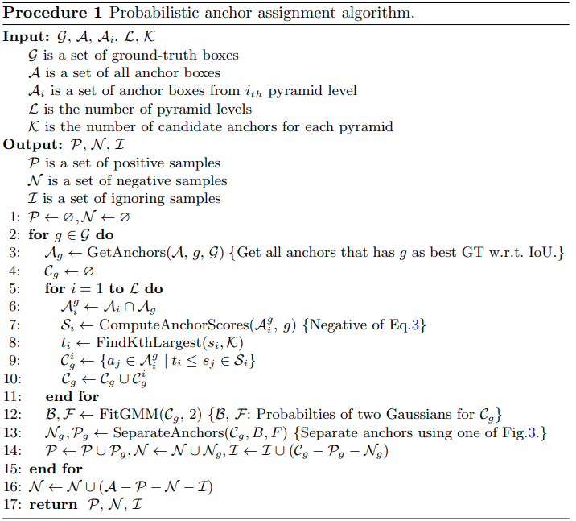

time: 20200719
pdf_source: https://arxiv.org/pdf/2007.08103v1.pdf
code_source: https://github.com/kkhoot/PAA
# Probabilistic Anchor Assignment with IoU Prediction for Object Detection

这篇paper的探索的是anchor分配ground truth的策略,类似的任务本站分析的有[FreeAnchor](../../The_theory/FreeAnchor_Learning_to_Match_Anchors_for_Visual_Object_Detection.md), 以及[ATSS](../Summaries/Summary_of_serveral_cvpr2020.md)

## Method

本文的思路：

1. 用IoU Loss以及分类loss的组合作为 anchor assignment的依据。
2. 对于每一个grount truth，anchors与它的score可以由两个峰值的高斯混合模型进行建模，直观来说一个对应负样本，一个对应正样本。
3. 由于gt assignment以Classification以及IoU作为基础，所有NMS也需要考虑IoU结果。

### Score voting

对NMS后的bbox

$$\begin{array}{c}
p_{i}=e^{-\left(1-\mathrm{IoU}\left(b, b_{i}\right)\right)^{2} / \sigma_{t}} \\
\hat{b}=\frac{\sum_{i} p_{i} s_{i} b_{i}}{\sum_{i} p_{i} s_{i}} \text { subject to } \mathrm{IoU}\left(b, b_{i}\right)>0
\end{array}$$
