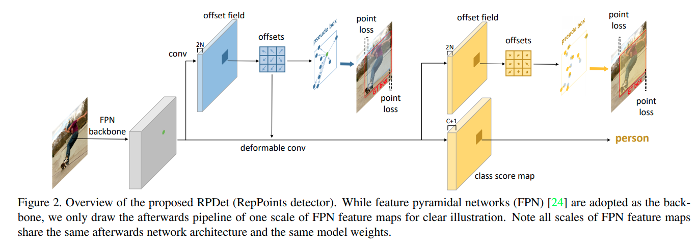
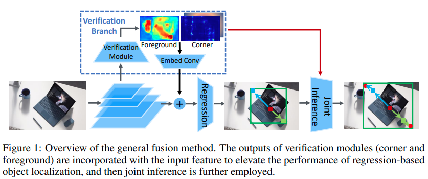

time: 20200721
pdf_source: https://arxiv.org/pdf/1904.11490.pdf
code_source: (https://github.com/open-mmlab/mmdetection/tree/master/configs/reppoints)
short_title: The RepPoints Series

# RepPoints / Dense RepPoints / RepPointsV2
[pdf1](https://arxiv.org/pdf/1904.11490.pdf) [code1](https://github.com/open-mmlab/mmdetection/tree/master/configs/reppoints)

[pdf2](https://arxiv.org/pdf/1912.11473.pdf) [code2](https://github.com/justimyhxu/Dense-RepPoints)

[pdf3](https://arxiv.org/pdf/2007.08508v1.pdf) [code-all](https://github.com/Scalsol/RepPointsV2)

## RepPoints
reppoints论文的核心思路是让网络自适应地学习keypoints,并利用keypoints分析2D框的位置与大小。这里牵涉的难点在于bbox detection任务中是没有keypoint设置的，因为网络需要自己去学keypoint的位置。

### 网络结构



```python
# pts_out_init -> offsets fields from CNN
pts_out_init_grad_mul = (1 - self.gradient_mul) * pts_out_init.detach() + self.gradient_mul * pts_out_init # a trick to wind down the gradient from DCN
dcn_offset = pts_out_init_grad_mul - dcn_base_offset
cls_out = self.reppoints_cls_out(
    self.relu(self.reppoints_cls_conv(cls_feat, dcn_offset))) # conv ( relu (deform_conv))
pts_out_refine = self.reppoints_pts_refine_out(
    self.relu(self.reppoints_pts_refine_conv(pts_feat, dcn_offset))) # conv ( relu (deform_conv))
```

这里实际上有两次Ground Truth Assign的过程，第一次采用的K最近点的分配,首先根据框的大小分配到指定的FPN Scale上，然后寻找中点最近的k(默认正样本)个点给正样本.第二次则是根据第一阶段的预测框作为anchor(这样每一个scale上每一个点都有一个anchor),选择IoU超越threshold的作为正样本。最后分类loss按照在第二次分配的结果来算。

而由点到bounding box的算法作者给了三个方案，最直观的是其中的min-max方案。但是最后default的是自适应的
```python
pts_y_mean = pts_y.mean(dim=1, keepdim=True)
pts_x_mean = pts_x.mean(dim=1, keepdim=True)
pts_y_std = torch.std(pts_y - pts_y_mean, dim=1, keepdim=True)
pts_x_std = torch.std(pts_x - pts_x_mean, dim=1, keepdim=True)
moment_transfer = (self.moment_transfer * self.moment_mul) + (
    self.moment_transfer.detach() * (1 - self.moment_mul))
moment_width_transfer = moment_transfer[0]
moment_height_transfer = moment_transfer[1]
half_width = pts_x_std * torch.exp(moment_width_transfer) # \lambda_x in paper, learnable parameters of the module
half_height = pts_y_std * torch.exp(moment_height_transfer)
bbox = torch.cat([
    pts_x_mean - half_width, pts_y_mean - half_height,
    pts_x_mean + half_width, pts_y_mean + half_height
], dim=1)
```

## Dense RepPoints

这篇paper在2D bounding box detection的基本概念是在RepPoints的基础上预测更多的representation points， 同时提出了

Group Pooling / Shared offset fields / Shared attribute map. (代码实现与上面一样比较混乱, 且Group Pooling与文中图片实现的效果有差异，仅供参考)

## RepPoint2 v2

这篇paper的思路是通过额外预测前景以及角点的预测来提升检测的准确度



