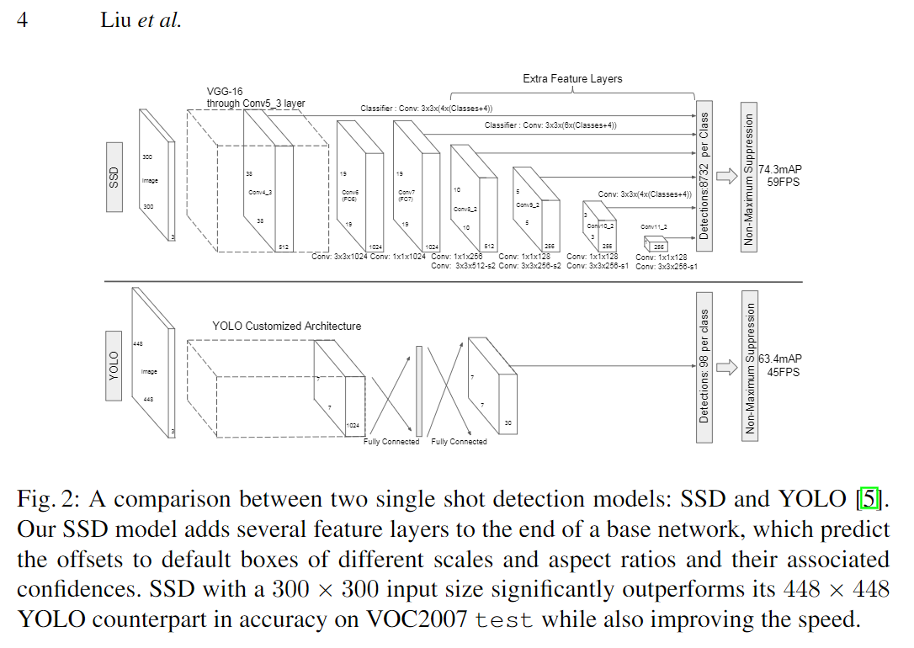

code_source: https://github.com/amdegroot/ssd.pytorch
pdf_source: https://arxiv.org/pdf/1512.02325.pdf
short_title: SSD
# SSD: Single Shot MultiBox Detector

## 训练loss由定位与分类两个部分组成

### 关于定位loss:
分为框的中点的x，y与宽度与高度。
x, y的目标值为(注意不同分辨率中格子的宽度是不同的)
$$\frac{实际中点的位置-格子中点的位置}{格子宽度}$$
而宽度与高度的目标值为
$$log\frac{目标长宽}{格子长宽}$$

