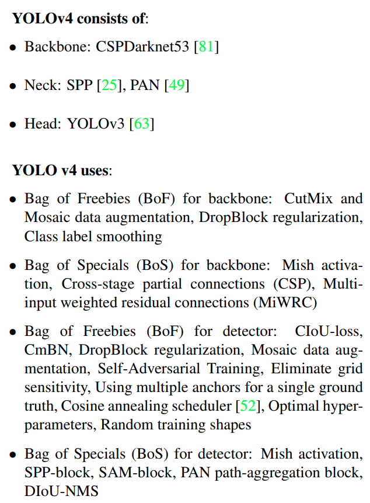

time: 20200425
pdf_source: https://arxiv.org/pdf/2004.10934v1.pdf
code_source: https://github.com/AlexeyAB/darknet
short_title: YOLOv4
# YOLOv4: Optimal Speed and Accuracy of Object Detection

这篇Yolov4是"官方继承者"的官方paper,大规模地集成了各种各样的trick，也调整了很多模型。值得关注的地方在于作者很专注于在GPU上的运算速度以及在GPU上的训练可能性。Paper 对现有Tricks做了相当多的Review跟测试。这篇paper以及这个页面可以算是object detection tricks的一个小Wiki。

## Related Works

### Models

这里提供一些已有的简介:

[Efficient](../../Building_Blocks/EfficientNet:_Rethinking_Model_Scaling_for_Convolutional_Neural_Network.md); [SPP in PSM](../others/PSMNet.md); [RFB](../../Building_Blocks/Songtao_Liu_Receptive_Field_Block_ECCV_2018_paper.md); [SAM in CBAM](../../Building_Blocks/CBAM:Convolutional_Block_Attention_Module.md);[SSD](SSD.md);[CornetNet](CornerNet_Detecting_Objects_as_Paired_Keypoints.md);[CenterNet](CenterNet:_Keypoint_Triplets_for_Object_Detection.md);[FCOS](FCOS.md)

这里补充两个链接,ASPP 来自于[DeepLabv3](https://arxiv.org/pdf/1706.05587.pdf);

#### CSPNet
[pdf](https://arxiv.org/pdf/1911.11929v1.pdf)

CSP网络来自于作者的前一批工作。

### Bag of Freebies

一系列训练trick，称为freebies因为不增加推理成本.

先参考Amazon的paper的[简介](BoFDetection.md)

主要分类为 input augmentation/feature map dropping; label-softing; Loss(IoU Loss).

这里补充结果trick的简介的链接。

[DropBlock](../../The_theory/compondingTechforCNN.md);
[MixUp](BoFDetection.md);
[label-smoothing](BoFDetection.md);
[Focal loss](../../3dDetection/Disentangling_Monocular_3D_Object_Detection.md);
[GIoU](../../3dDetection/GeneralizedIoU.md);
[DIoU and CIoU](DIoULoss.md)

数据增强示例

### Bag of specials

一系列提升网络性能的Module/necks/activation function/post-processing.
作者表示一个魔改后的SPP module对性能的提升很显著且运算差距不大。 RFB原文中性能提升尚可，但是运算时间的提升也是很显著的。

[Squeeze-and-Excitation](../../Building_Blocks/Squeeze-and-Excitation_Networks.md)尽管FLOPs提升不大，但是在GPU推理时间的增加上是相对比较大的，而另外[SAM](../../Building_Blocks/CBAM:Convolutional_Block_Attention_Module.md)性能提升稍微没那么显著，但是GPU运算时间差距不大。

#### Mish
[pdf](https://arxiv.org/pdf/1908.08681.pdf)

启发与Swish
$$
    f(x) = x \cdot sigmoid(x)
$$
Mish的计算
$$\begin{aligned}
&f(x)=x \cdot \tanh (\zeta(x))\\
& \zeta(x)=\ln \left(1+e^{x}\right) \rightarrow \text{softplus}
\end{aligned}$$

Mish作者指出建议使用更低的learning rate.

## System Design

作者给出结论，为了提升性能，需要:
1. 输入图片分辨率应该比较大
2. 网络层数大，感受野大
3. 网络参数要足够多。

neck选择的是PANet

### PANet
[pdf](https://arxiv.org/pdf/1803.01534.pdf)

一个比较好的[简介在CSDN](https://blog.csdn.net/u013010889/article/details/79485296).

### 额外提升trick

#### Mosaic
数据增强trick，镶嵌;

如图:

#### Self-Adversarital Training

新的训练及数据增强方法，一次训练需要两次Forward backward.第一个stage，神经网络会修改原图而不是网络权重（相当于对抗性地修改原图片）.第二个stage，才正常训练神经网络。

#### Cross mini-Batch Normalization

CmBN启发于minibatch-Batchnorm(一个batch分几个mini-batch)以及[Cross iteration BatchNorm](../../Building_Blocks/crossBatchNormalization.md)

#### Modified SAM and PAN

### Over all

补充说明

#### Eliminate grid sensitivity 

在预测2D bounding box中心点时，一个写法是$bx=\sigma(t_x) + cx$,其中$\sigma(t_x)$是预测的中心点与anchor的偏移。当$\sigma(t_x)$接近0/1时，网络输出值会很大，不便于，学习，所以作者在sigmoid前面乘了一个大于1.0的factor。

#### Genetic algorithms for optimal hyperparameters

这个实现细节有待观察，意思是在training前期，使用GA选择最优的超参，比如学习率等。

## 实验对比各个trick

### Bag of Freebies on Classifier

最终发现CutMix, Mosaic, Label Smoothing, Mish有用。

### Bag of Freebies on Detector

个人观察来比较有效果而且特殊的是Mosaic有效，GA有效，GIoU或者CIoU有效。

最终经过选择与处理后，工程度极高的Yolov4在很高的FPS的基础上跑出了比较高的精确度(精度高于Yolov3, 速度快于EfficientDet)

