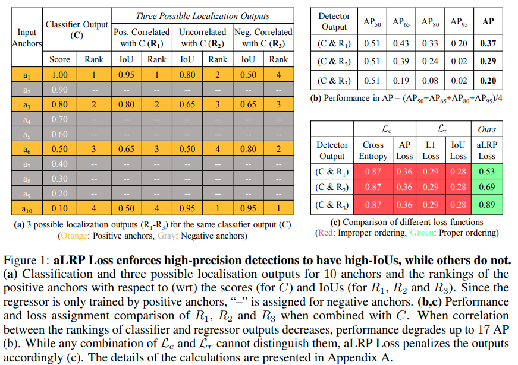

time: 20201009
pdf_source: https://arxiv.org/pdf/2009.13592.pdf
code_source: https://github.com/kemaloksuz/aLRPLoss

# A Ranking-based, Balanced Loss Function Unifying Classification and Localisation in Object Detection

这篇paper在[AP loss]的基础上提出了更广义的优化架构以及 average Localization-Recall-Precision (aLRP) loss. 由名字可知，aLRP loss 的主要motivation在于使用单一一个 rank-based loss 同时优化分类与回归。 [AP loss]是只处理回归问题的。

由这张图可以发现，目前目标检测的目标是希望回归数值更准确的样本置信度更高，这样的话可以提升更高IoU threshold时的AP. 也就能提升平均AP. 作者这里给出的一个特殊案例说明当前的各种loss都没有办法引导网络像 $R_1$ 中的合理排布靠拢。而本文提出的 aLRP loss 是耦合了分类排序与IoU的损失，因而能区分这种情况。

## Review

AP Loss:

$$\begin{array}{l}
\mathcal{L}_{A P}=1-\mathrm{AP}=1-\frac{1}{|\mathcal{P}|} \sum_{i \in \mathcal{P}} \frac{\operatorname{rank}^{+}(i)}{\operatorname{rank}(i)} \\
=1-\frac{1}{|\mathcal{P}|} \sum_{i \in \mathcal{P}} \frac{1+\sum_{j \in \mathcal{P}, j \neq i} H\left(x_{i j}\right)}{1+\sum_{j \in \mathcal{P}, j \neq i} H\left(x_{i j}\right)+\sum_{j \in \mathcal{N}} H\left(x_{i j}\right)} \\
=\frac{1}{|\mathcal{P}|} \sum_{i \in \mathcal{P}} \sum_{j \in \mathcal{N}} L_{i j}
\end{array}$$

Localization-Recall-Precision (LRP) Performance Metric:

$$
\operatorname{LRP}(s)=\frac{1}{N_{F P}+N_{F N}+N_{T P}}\left(N_{F P}+N_{F N}+\sum_{k \in T P} \mathcal{E}_{\operatorname{loc}}(k)\right)
$$

其中 $\mathcal{E}_{loc}(k) =\frac{1 - IoU(k)}{1 - \tau}$, $\tau$一般是正负样本的threshold，一般取$\tau = 0.5$

这个Metric 与 AP Loss 一样，都是越小越好的。如果 IoU 都为 1， 则这个loss与AP loss 的表达式基本一致。

## 更通用的 Error-Driving Optimization

作者指出，将[AP loss]的优化方法扩展到不同的 ranking-based loss上并不简单。

作者这里提出了一个新的定义方案：

- ranking-based loss function $\mathcal{L} = \frac{1}{Z} \sum_{i\in \mathcal{P}}\ell(i)$ 定义为对由一系列正样本对应的loss.
- Primary term 

$$L_{i j}=\left\{\begin{array}{ll}\ell(i) p(j \mid i), & \text { for } i \in \mathcal{P}, j \in \mathcal{N} \\ 0, & \text { otherwise }\end{array}\right.$$

这个定义下，有

- 定理一：$\mathcal{L}=\frac{1}{Z} \sum_{i \in \mathcal{P}} \ell(i)=\frac{1}{Z} \sum_{i \in \mathcal{P}} \sum_{j \in \mathcal{N}} L_{i j}$
- 定理二：$\sum_{i \in \mathcal{P}}\left|\frac{\partial \mathcal{L}}{\partial s_{i}}\right|=\sum_{i \in \mathcal{N}}\left|\frac{\partial \mathcal{L}}{\partial s_{i}}\right|$

AP Loss. $\ell^{AP}(i) = 1 - precision(i) = N_{FP}(i) / rank(i)$, 且 $p(j|i) = H(x_{ij}) / N_{FP}(i)$

## aLRP Loss

$$
\ell^{\mathrm{LRP}}(i)=\frac{1}{\operatorname{rank}(\mathrm{i})}\left(N_{F P}(i)+\mathcal{E}_{\operatorname{loc}}(i)+\sum_{k \in \mathcal{P}, k \neq i} \mathcal{E}_{\operatorname{loc}}(k) H\left(x_{i k}\right)\right)
$$

这可以被分成两项

$$
\mathcal{L}_{c l s}^{\mathrm{aLRP}}=\frac{1}{|\mathcal{P}|} \sum_{i \in \mathcal{P}} \frac{N_{F P}(i)}{\operatorname{rank}(i)}
$$

$$
\mathcal{L}_{l o c}^{\mathrm{aLRP}}=\frac{1}{|\mathcal{P}|} \sum_{i \in \mathcal{P}} \frac{1}{\operatorname{rank}(i)}\left(\mathcal{E}_{l o c}(i)+\sum_{k \in \mathcal{P}, k \neq i} \mathcal{E}_{\text {loc}}(k) H\left(x_{i k}\right)\right)
$$
优化方法:
$$
\Delta x_{i j}=L_{i j}^{\mathrm{aLRP}^{*}}-L_{i j}^{\mathrm{aLRP}}=-\frac{1}{\operatorname{rank}(i)}\left(N_{F P}(i)+\sum_{k \in \mathcal{P}, k \neq i} \mathcal{E}_{\text {loc}}(k) H\left(x_{i k}\right)\right) \frac{H\left(x_{i j}\right)}{N_{F P}(i)}
$$

实验上得到了比所有one-stage detector更高的性能(直接提升4点mAP)。

[AP loss]:AP_loss.md