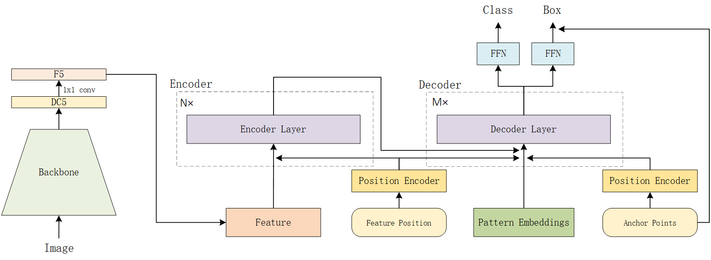

time: 20211223
pdf_source: https://arxiv.org/abs/2109.07107
code_source: https://github.com/megvii-research/AnchorDETR
short_title: Anchor DETR
# Anchor DETR:Query Design for Transformer-Based Detector

这篇paper是一个将Anchor在DETR范式具象化的一篇论文。



这篇paper将DETR的训练速度与稳定性大幅度提高。

## 核心Decoder改进
其核心的更改在于其Decoder的设计。

首先会有一个可学习的，所有scale以及所有图通用的一组可学习reference points。由一组可学习的参数描述。而每一个点会有一组的pattern,便于让一个点输出多个prediction. 最终会输出$\text{num\_position} \times \text{num\_pattern}$个检测输出,每一个position上的anchor点坐标是一样的,而每一个点位置上,同一个通道的pattern的特征也是一样的.所以本文就按照这个逻辑构建网络可学习参数,以及在推理的时候repeat成目标形状.

```python
## During Initialization
self.position = nn.Embedding(self.num_position, 2)
self.pattern = nn.Embedding(self.num_pattern, d_model)

## During Inferencing
reference_points = self.position.weight.unsqueeze(0).repeat(bs, self.num_pattern, 1)
tgt = self.pattern.weight.reshape(1, self.num_pattern, 1, c).repeat(bs, 1, self.num_position, 1).reshape(
            bs, self.num_pattern * self.num_position, c)
```

在每一层decoder网络的输出形式:
```python
# output 与 前文的 tgt经过transformer的连接, 注意:tgt与output有直接的残差连接(也就是网络刚初始化时,接近于 output=tgt).
# output在每一层decoder中会持续优化.但是全部都是残差连接.
reference = inverse_sigmoid(reference_points)
tmp = self.bbox_embed[lid](output) # MLP mapping
tmp += reference # tmp = reference_anchor + network_residual
outputs_coord = tmp.sigmoid()
```

RCDA模式的每一层decoder由自注意力,交叉注意力,残差全连接堆叠而成.
- 自注意力的Q,K为带有anchor点位置embedding的tgt, 而V为tgt. 
- 交叉注意力的Q为 tgt+ X embedding, K为 tgt + Y embedding, V为图片特征

可以理解为借助图片特征持续改进output prediction的embedding.

本文关键有Anchor的帮助,很快的网络就能够越过DETR前期训练时样本分配混乱的问题,极大加速网络的训练地稳定性以及速度.