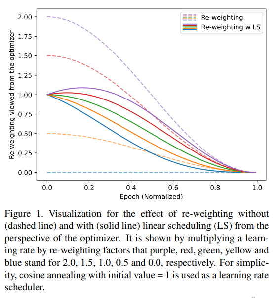

time: 20210101
pdf_source: https://arxiv.org/abs/2012.13763

# Balance-Oriented Focal Loss with Linear Scheduling for Anchor Free Object Detection

这篇paper的关键目标在于让目标检测的分类损失函数同时考虑前景-后景的不平衡以及前景-前景的不平衡。

## Class Balance Focal Loss

Class Balanced Focal loss 是前人提出的一个损失函数，使用focal loss的形式去解决class-imbalance 问题.

其计算公式为

$$
CB_{focal}(y) = -\alpha_y \sum_{i=1}^C (1-p_i^t)^\gamma \log (p_i^t)
$$

其中, $\alpha_y = \frac{1-\beta}{1-\beta^{n_y}}$, 其中$C$为类别数量，$p_i$为预测概率值, $n_y$为$y$类别的样本数量。$N$为样本总数, $N = 1/(1-\beta)$
，与focal loss相比，核心问题的变化就是参数$\alpha_y$对不同正样本进行了reweight.

这个方案直接在detection上使用的问题在于前景与背景的比例太大。

## Balance-Oriented Focal Loss with Linear Scheduling

这篇paper在上文的基础上提出了两个新的操作。

Linear Scheduling,  Batch-Wise Balancing

$$
BO_{focal}(y, k) = -\sum^C_{i=1} \hat w_{i,k} (1-p_i^t)^\gamma \log (p_i^t)
$$

$$
\hat w_{i,k} = \hat \alpha_i \hat\eta^{n_{i,k}}
$$

$$
\hat\alpha_i = 1 + \lambda(\alpha_i - 1)
$$

其中 $\alpha_i$ 为原来的分类reweight, $\lambda$为 normalized epoch. 在训练开始的时候$\alpha_i$为 $1$, 基本都是在区分正负样本，训练后期，$\alpha_i$ 开始关注class之间的reweight.

$n_{i,k}$指的是在第$k$个batch 样本的数量. $\eta$是一个$[0,1]$之间的超参.

实验中 Weight factor 和 Linear Scheduling 提升性能比较多。

