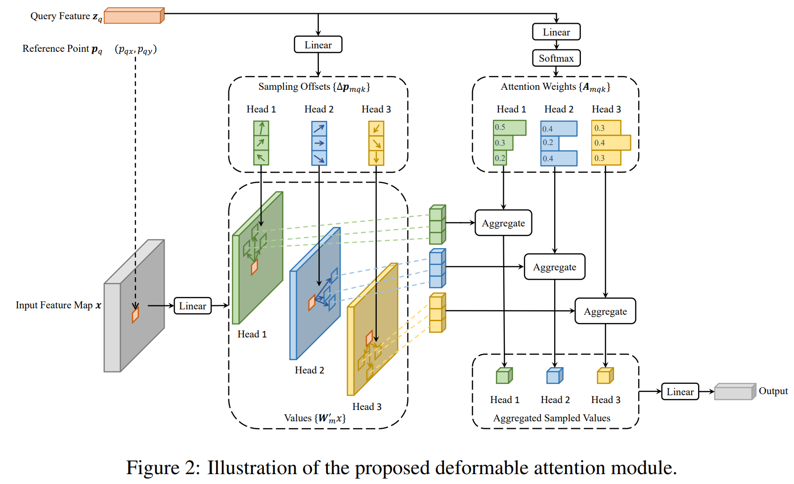
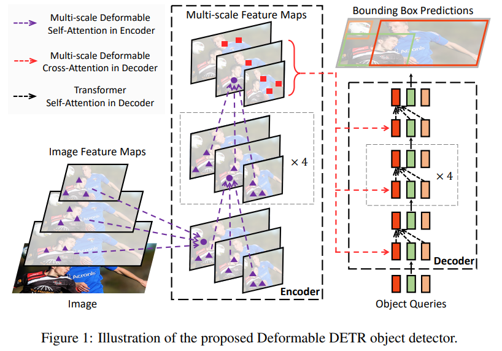

time:20220728
pdf_source: https://arxiv.org/pdf/2010.04159.pdf
code_source: https://github.com/fundamentalvision/Deformable-DETR
short_title: Deformable DETR
# Deformable DETR: Deformable Transformers for End-to-End Object Detection

Deformable DETR这篇paper在[DETR](detr.md)的基础上进行了进一步的思考。

DETR表现出来的问题：

1. 训练周期很长，相比标准的one-stage/two-stage detection在COCO上 12 epochs就能出好的结果，DETR标配200 epochs.
2. 对小目标不友好

作者指出，DETR中Transformer的问题是，在初始化的时候，网络几乎是把权重均等地稠密地分配给全图，但是在训练好的DETR中，网络每一个像素对图像上像素的权重分配又是及其稀疏的，这个从均等、稠密的attention到集中、稀疏的Attention情况的过度过程中，需要大量的训练数据以及大量的训练step. 这就使得整个训练周期很长。

而此前在[attention](../Summaries/SelfAttentionandCNN.md)相关的一些文章就可以发现，Transformer的特点在于理论上的全局感受野，但是实际上训练的收敛结果却是稀疏的attenttion(但是关注点可以遍布图像上不同地方, 而不是像CNN一样局限在周围像素)。

这篇Deformable DETR则在全局的关注范围以及稀疏性取得平衡.

单个Deformable Attention模块如下图
.

输入包括 特征图(coding上flatten, 但是逻辑上spatial)$x$, $[B, \sum_i{H_i\cdot W_i}, C]$特征图往往是前面处理得到的图片多层feature,  Query Feature $z_q$, $[N_{query},C]$ Query往往是Module 存放的一组可学习的embedding, 可以理解为output anchor, 通过一组可学习的映射可以直接映射到输出。参考点Reference Point $[N_{query}, n_{level}, 2]$, 是从output anchor 映射出来的(也可以不是)的基准点,也就是deformable 坐标的基准中心点。

中间变量，sampling offsets 通过$z_q$后接的全连接层获得 $\Delta p_{mqk}$, shape $[N_{query}, n_{heads}, n_{levels}, n_{points}, 2]$, 基准点是不同scale不同heads都同一位置的, sampling offsets则是对每一个scale/每一个heads有一个单独的offset. Attention Weights $A$, 形状 $N_{query}, n_{heads}, n_{levels}, n_{points}$

$$
\operatorname{MSDeformAttn}\left(\boldsymbol{z}_{q}, \hat{\boldsymbol{p}}_{q},\left\{\boldsymbol{x}^{l}\right\}_{l=1}^{L}\right)=\sum_{m=1}^{M} \boldsymbol{W}_{m}\left[\sum_{l=1}^{L} \sum_{k=1}^{K} A_{m l q k} \cdot \boldsymbol{W}_{m}^{\prime} \boldsymbol{x}^{l}\left(\phi_{l}\left(\hat{\boldsymbol{p}}_{q}\right)+\Delta \boldsymbol{p}_{m l q k}\right)\right]
$$

本文还提出了一个iterative bounding box refinement的方案，就是每一层都会更新reference points, 参考的是optical flow的思路。

# MonoDETR
[pdf](https://arxiv.org/pdf/2203.13310.pdf) [code](https://github.com/ZrrSkywalker/MonoDETR)

[本站链接](../../3dDetection/RecentCollectionForMono3D.md)

这篇衍生文章的一大特点就是使用了Deformable DETR作为主要的运算模块。这也可能是MonoDETR能train得出来而基础的DETR不行得一个原因。