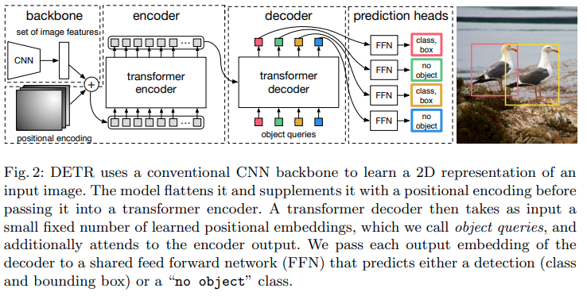

pdf_source: https://arxiv.org/pdf/2005.12872v1.pdf
code_source: https://github.com/facebookresearch/detr
short_title: DE⫶TR 
time: 20200531
# End-to-End Object Detection with Transformers

这篇paper给的思路是一个用新工具进行复古的思路。在Yolo与RCNN统一之前，object detection的一个做法是使用RNN序列地输出bounding boxes，当时有一个需要注意的trick就是loss function在计算的时候需要先将Ground truth与预测框计算一个最优匹配，然后对应计算loss.
本文的新颖之处就是使用transformer替代RNN并行decode.

# 网络结构

一些细节:

1. 匹配的时候使用entropy损失+[giou]+L1loss, 匹配在CPU上实现，使用的是[scipy.optimize.linear_sum_assignment](https://docs.scipy.org/doc/scipy/reference/generated/scipy.optimize.linear_sum_assignment.html)
2. 损失函数使用[giou] + L1 Loss.
3. 训练epoch数比较长，在custom dataset上复现难度挺大

[giou]:../../3dDetection/GeneralizedIoU.md
