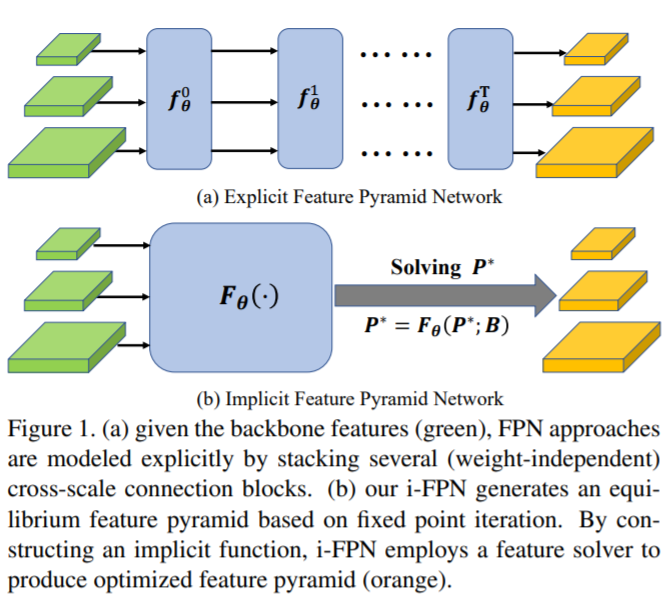

time: 20210101
pdf_source: https://arxiv.org/pdf/2012.13563.pdf

# Implicit Feature Pyramid Network for Object Detection

这篇paper将 [MDEQ] 的层级连接放在了目标检测的neck上面，用implicit neural network实现无限的FPN层级间信息交互.

效果如此图:

计算过程相当于直接计算不动点。

作者让 RetinaNet, Faster-RCNN, FCOS, ATSS等算法全部直接涨点。

## 计算结构

不动点的计算公式为:

$$P^* = G_\theta(P^* + B)$$

其中$B$为backbone给出的输出feature, $G_\theta$为层级间的融合，卷积以及非线性计算。

不同的$G_\theta$运算如下图 (最终的设计是c图)

[MDEQ]:../../Building_Blocks/MDEQ.md