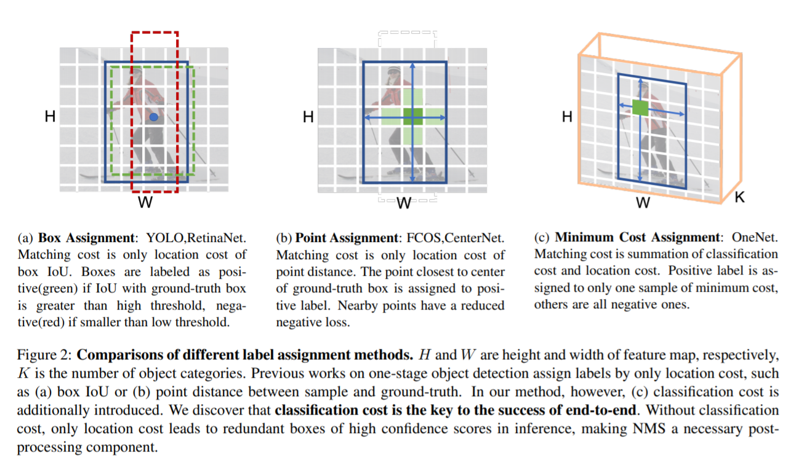
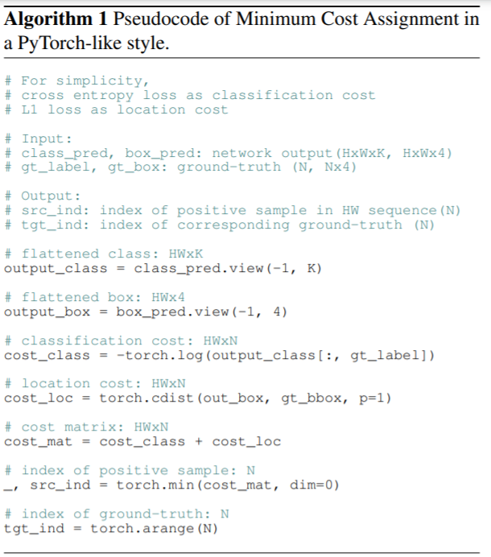
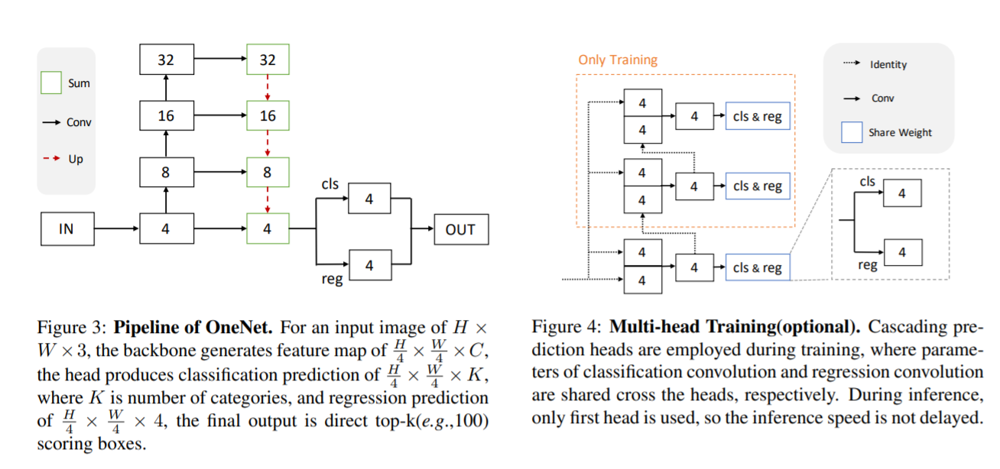

pdf: https://arxiv.org/pdf/2012.05780.pdf
time: 20210101
code: https://github.com/PeizeSun/OneNet
# OneNet: Towards End-to-End One-Stage Object Detection

这篇paper的目的是实现不需要NMS的目标检测，这篇paper的主要做法在于更新 ground truth label assignment的方法。

目前主流算法的assignement方式用下图表示:

如果用一个损失函数来描述各自的Matching标准，则RetinaNet以及FCOS都是基于位置loss的，$C_{loc} = \lambda_{iou} C_{iou} + \lambda_{L1} C_{L1}$, 要么是中心点(FCOS)，要么是IoU(RetinaNet),或者是两者的结合。

本文提出将分类loss也加到 matching cost上

$$
    C = \lambda_{cls} \cdot C_{cls} + C_{loc}
$$

且最终正样本只会分配给损失最小的那个样本 (minimum cost assignment)

结果常规，但是默认是Single head的

得到的网络速度相当快。