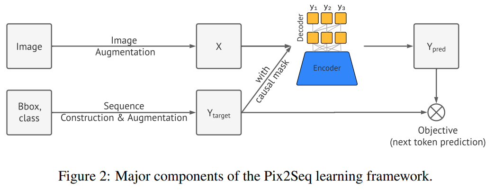
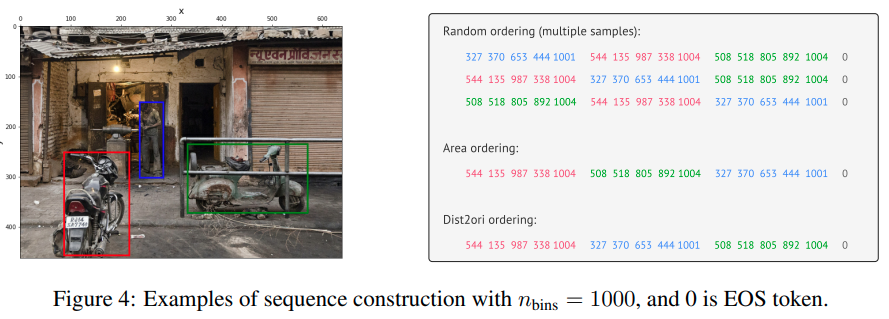

time: 20211007
pdf_source: https://arxiv.org/pdf/2109.10852.pdf

# PIX2SEQ: A Language Modeling Framework for Object Detection

[非官方复现](https://github.com/gaopengcuhk/Stable-Pix2Seq)  [知乎解读](https://zhuanlan.zhihu.com/p/413047000)

这篇paper尝试将2D目标检测转换成一个序列输出的问题.

方法的直觉是说如果网络知道物体的位置，类别和大小，它可以直接把它"读出来".

新的构成主要需要四个部件，分别是数据增强，输入输出构成，encoder-decoder网络结构，损失函数.

## 输入输出构成, 数据加强

2D bounding boxes 由左上与右下两个点的坐标定义。一般来说这是小数而不是整数。这里的选择是把图片的横纵坐标离散化，如果图片是$600 \times 600$， 则只需要x,y各600个bins就可以完全把图片坐标离散化.和语言模型常见的词汇字典大小相比是很小的。最终每个物体由五个离散的tokens $[y_{min}, x_{min}, y_{max}, x_{max}, c]$完全定义. 

由于不同的图片有不同的物体数量，因而网络采取类似RNN的迭代输出，并设计一个EOS token指代目标输出结束.

训练的时候会添加一些noise token拖延end token的位置.避免网络过度学习

