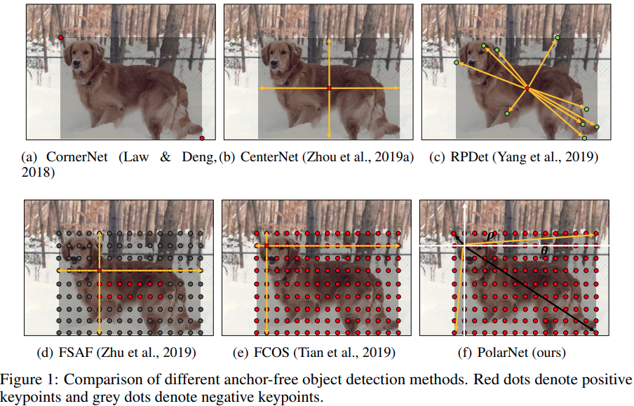
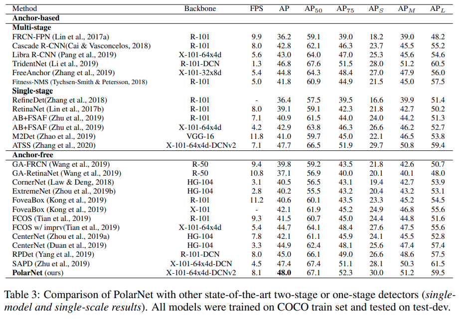

time:20201203
pdf_source: https://openreview.net/pdf?id=TYXs_y84xRj
short_title: PolarNet

# PolarNet: Learning to Optimize Polar Keypoints for Keypoint Based Object Detection

这篇文章是ICLR 2021 under-review的一篇文章，这篇文章的主要故事是要解决[FCOS]回归过程中的scale的问题.

从[FCOS]的代码以及定义可以发现，在网络的回归分支需要回归的范围以及variance很大，为 $(0, L)$ 其中$L$为当前层级中bounding box的最长边的大小, 这直接影响了FCOS的回归精度.

这篇文章引入了polar coordinate-based的回归系统，巧妙地解决了[FCOS]的数值问题.

## Recent and Proposed Works

从图中可以看出，[FCOS]回归的是中心点到边缘的四个距离，在最坏的情况下，回归的目标值会在$(0, L)$的范围内;PolarNet 会在 (左上 $\nwarrow$,右下 $\searrow$) 以及 (左下$\swarrow$，右上$\nearrow$) 两对中选择 variance 小的那一对; training 以及 inference的时候都是如此。

为了在inference的时候提供一个自动化的"选择"项，每一个点需要一个额外的分类输出，这个分类器会学习去判断究竟每一个点是以哪一对点的输出为准

损失函数由三个部分组成.

$$L_{overall} = L_{cls} + L_{loc} + L_{corner} + L_{sel}$$

其中分类损失 $L_{cls}$是通用的 [Focal loss]. $L_{loc}$是新近常用的 [GIoU] Loss.

$L_{corner}$与具体"选择"的角点有关，只训练被选择的角点。
$$
L_{\mathrm{corner}}\left(\mathbf{B}_{\mathbf{x}, \mathbf{y}}, \mathbf{B}_{\mathbf{x}, \mathbf{y}}^{*}\right)=\left|\rho_{\mathrm{br}}-\rho_{\mathrm{br}}^{*}\right|+\left|\rho_{\mathrm{tl}}-\rho_{\mathrm{t}}^{*}\right|+\tan \left|\theta_{\mathrm{br}}-\theta_{\mathrm{br}}^{*}\right|+\tan \left|\theta_{\mathrm{tl}}-\theta_{\mathrm{tl}}^{*}\right|
$$

有reviewer指出使用$\tan$作为损失函数需要避免不连续点上的梯度爆炸; 在rebuttal的时候作者补充: 角度$\theta$是被限制在$[0, \pi/2]$的.

[FCOS]:FCOS.md
[Focal Loss]:GFocalLoss.md
[GIoU]:../../3dDetection/GeneralizedIoU.md