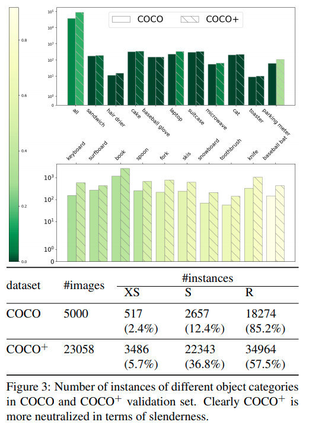

time: 20210301
pdf_source: https://arxiv.org/pdf/2011.08529.pdf
code_source: https://github.com/wanzysky/SlenderObjDet

# Slender Object Detection: Diagnoses and Improvements

这篇paper分析诊断了目前目标检测方法对细长物体的检测性能以及背后的机制原理，然后提出自己的方法提高目标检测算法对细长物体的检测能力。

## 细长物体的定义

直觉来说似乎我们可以直接计算标准2D检测框的长宽比， 直接得到$r_b = w_b / h_b$. 但是作者指出这会漏计算图片中旋转了的细长物体， 如图

本文定义了指标 slenderness $s$. 首先利用Instance Segmentation的结果取pixel-wise annotation. 然后计算一个最小面积的矩形计算，slenderness $s = \text{min}(w,h) \text{max} (w, h)$

*最小包围矩形计算*:
1. 计算最小凸包，如Graham Scan算法, [CSDN Reference](https://blog.csdn.net/u013279723/article/details/104198688)
2. 最小面积外接矩形的一条边肯定与点集的凸包的一条边重合，所以思路为遍历凸包的每条边，构造外接矩形，计算面积，找出面积最小的那个外接矩形即可. [Reference](https://www.giserdqy.com/database/postgresql/25654/)

## COCO数据集上的分布

与直觉一致，COCO数据集上普通大小的物体比较多，而形状细长的物体比较少。

## 现有模型的分析

作者将现有的目标检测模型的结构抽象为四个成分:
- Feature Extraction (FE): 特征提取
- Intermediate Prediction (IP):: 中间预测
- Feature Adaption (FA):: 特征重整
- Detection Formation (DF):: 最终结果

Feature Adaption(FA)是multi-stage或者[RepPoints](Reppoints.md)以及[VarifocalNet](MMDetection.md)里面的优化思路。

除了以上的几个部分之后，还有几个关键的步骤:
- Loss Function (LF) 损失函数
- Label Assignment (LA) 标签分配

几个典型网络如下图:

作者尝试对RetinaNet, FCOS 以及RepPoints的各个模块进行实验，目的是找出什么模块因为什么机制对细长物体检测有效果。

实验结果文字化总结:

- RetinaNet的基线模型比FCOS的基线模型更强，尽管在COCO上的总mAP不如，其在细长物体上的效果是更好的。
- RetinaNet模仿FCOS，框内所有点都给正样本后所有点数都会变差,直到增加centerness才缓和，但是在细长物体上还是不如FCOS的基线。这里的结论是同样的settings下FCOS会更强，但是RetinaNet通过IoU Matching晒除低质量ground truth anchor的机制远远胜于FCOS的标签分配机制。
- RepPoints的标签分配机制(只选择最近的中心点为ground truth)，以RetinaNet做baseline来比较，效果比FCOS的好。
- RepPoints的Deformable Conv机制对RetinaNet的提升最显著。

## 基于Reppoints的提升

实验结果发现是三个元素提升比较明显
- RepPoints的采样位移带上一个base offsets
- 采样位移完全由学习而来，而不是来自于直接监督。
- Slenderness prior, 在FCOS原来的centerness的基础上，减少对一般物体的正样本抑制，增加对细长物体的正样本抑制。$
\text { centerness }^{*}=\left(\frac{\min (l, r)}{\max (l, r)} \times \frac{\min (t, b)}{\max (t, b)}\right)^{s}$