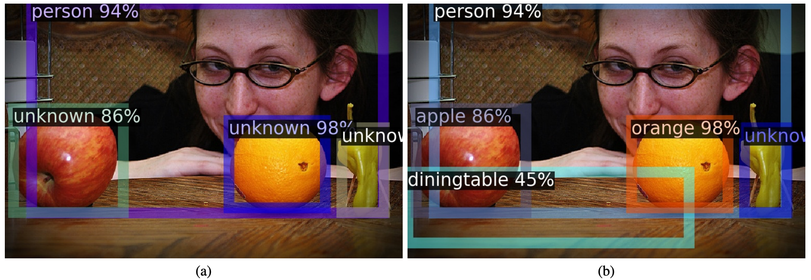
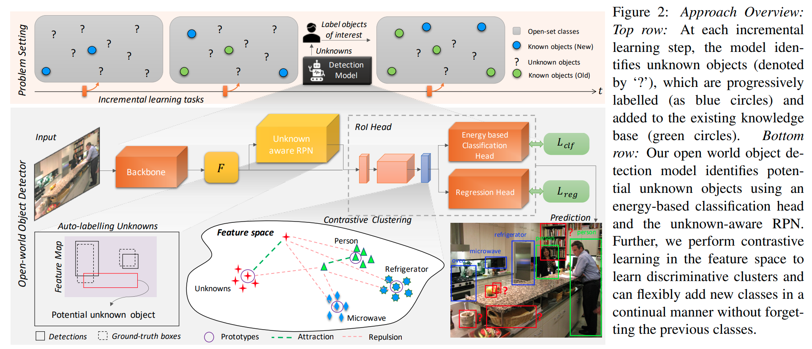

time: 20210309
pdf_source: https://arxiv.org/pdf/2103.02603.pdf
code_source: https://github.com/JosephKJ/OWOD
short_title: Towards Open World Object Detection

# Towards Open World Object Detection (OWOD)

这篇paper尝试解决一个很大的问题，它们想要训练一个网络:

- 实现2D目标检测，且对于还没被引入的物体标注为"未知"，并尝试框出来.
- 增量地学习新的label，同时不能忘掉之前学会的类别.

## Architecture and Pipeline

### Auto-labelling Unknowns with RPN

这个部分听起来比较玄学，实际操作上即是从背景proposals (first stage detection)里面选择top-k最高objectness scores的candidates即为未知物体的candidate.

### Energy Based Unknown Identifier

这一段在论文中本文并不能理解地很透彻，但是从代码中可以先理解实际进行的事情:

1. 在训练的过程中，让RPN输出一系列的proposals (nms, top_k, gt), roi_head再输出最终的分类logits.
2. 从中选取不是省略的(IoU matching在临界之间)。如果为background, 则理解为unknown. 如果为在训练的类，则理解为known.存储 logits矢量和分类的结果到文件中.
3. 在训练结束的时候，分析能量，
   1. 使用文章的公式计算能量 $lse = T\log\sum_j\exp{(g_l(\mathbf{f})/T)}$.文中描述，从直觉上可以理解的是known classes的不确定度比较小，能量的绝对值更大，unknown的不确定度比较大，能量的绝对值比较小。
   2. 根据两类的数据分布，拟合两个[Weibull](https://www.wikiwand.com/en/Weibull_distribution)分布，使用的库是[reliability.Fitters.Fit_Weibull_3P](https://reliability.readthedocs.io/en/latest/Fitting%20a%20specific%20distribution%20to%20data.html).
   3. 存下两个模型
4. 在推理/可视化的时候，需要先设定一个threshold(0.61)并输出一系列的bounding boxes, 根据每个输出bounding boxes 的logit在两个weibull分布上的概率密度(实际操作是附近一个小范围的积分)比较，判断这个object究竟是已知还是未知.

实质上就是根据是输出网络自适应的学习一个分类器判断现在的分类是确定的还是不确定的。

## GDumb: A Simple Approach that Questions Our Progress in Continual Learning

[pdf](https://www.ecva.net/papers/eccv_2020/papers_ECCV/papers/123470511.pdf) [code](https://github.com/drimpossible/GDumb)

OWOD的第四部分在于抵制遗忘，这引自于 GDumb这篇文章的一个简单做法。

GDumb一文对[Continuous Learning](../../The_theory/Continuous_learning.md)社区提出了很强的质疑。

GDumb的算法就是在训练的过程中贪婪地维护一个额定大小的数据记忆池(python deque，每个step训练都将数据存起来). 在incremental learning的时候将原来的数据拿出来重新训练一下即可，这个做法做出了很高的性能。

OWOD本文则基于这个做法，维护一个 class-balanced 的数据池,每次incremental learning的时候就把模型在这些数据上fine-tune一下。
