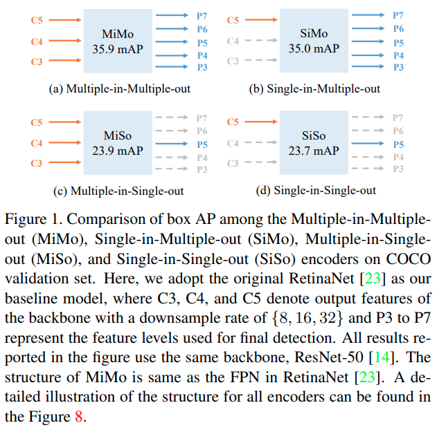
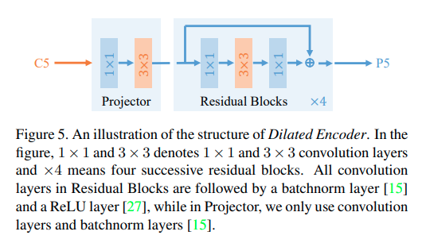
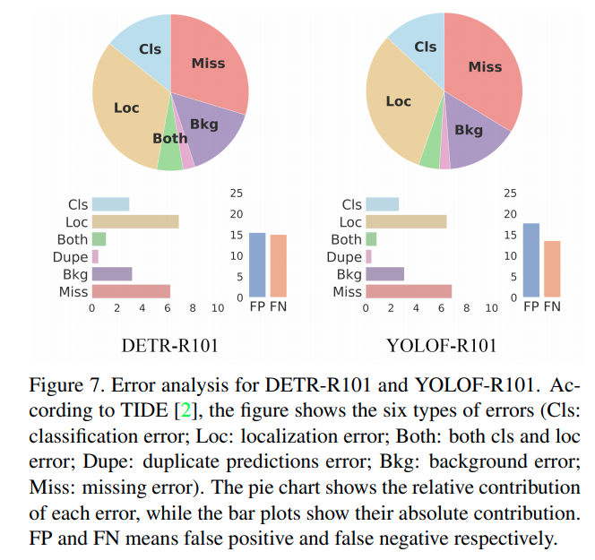

time: 20210319
pdf_source: https://arxiv.org/pdf/2103.09460.pdf
code_source: https://github.com/megvii-model/YOLOF

# You Only Look One-level Feature

这篇paper质疑了object detection里面FPN的真实作用。本文指出，FPN里面，实际上多尺度的输入是没有必要的，真正让性能提升的是对不同尺度的输出用不同的feature map这样的分而治之思路。

这篇paper起步使用一个实验得到一个比较出乎意料的结论.

通过分析RetinaNet的推理速度，发现高分辨率的特征花费的运算更加多。

## YOLOF

如果单尺度输出，有几个问题:

- 感受野: 使用dilated encoder 提供更多感受野

- Ground truth matching: 使用Max-IoU matching会使得物体倾向于预测面积大的框，采用 Uniform Matching的思路 (K Nearest anchor).

这篇paper也是本人看到第一个使用[TIDE](../Summaries/Summary_of_serveral_eccv2020.md)对网络的预测进行分析的paper.

