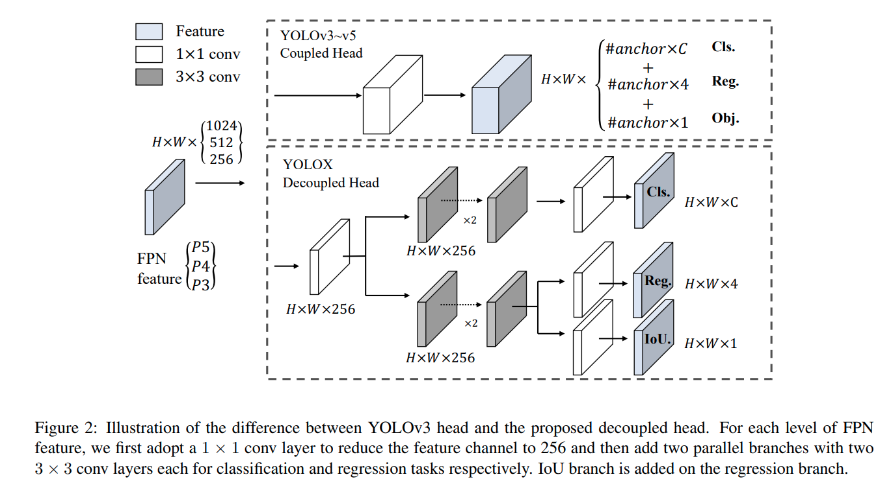

time: 20210720
pdf_source: https://arxiv.org/pdf/2107.08430.pdf
code_source: https://github.com/Megvii-BaseDetection/YOLOX

# YOLOX: Exceeding YOLO Series in 2021

这篇paper 是旷视做的。 这篇paper将anchor-free与decoupled head引入了YOLO系列。 代码上提供了完整的ONNX, TensorRT, NCNN等支持。性能上有了不错的提升.

核心新的内容:

- Anchor Free
- Decoupled Head
- label assignment with SimOTA

## Anchor Free

这篇paper采用的方案与[FCOS](FCOS.md)的相似但是有一定不同，四个输出值分别为到左上角的距离，以及框的宽和高；正样本分配方案也如下面的讨论，有所不同

## Decoupled Head

## label assignment with SimOTA

这个方法基于 [OTA](../Summaries/Summary_CVPR_2021.md)的做法。但是没有采用sinkhorn迭代来优化分配方案，只是计算了cost matrix之后，对每一个ground truth选取cost最小的前k个值. k采用动态估计方法，算法与OTA一致.

