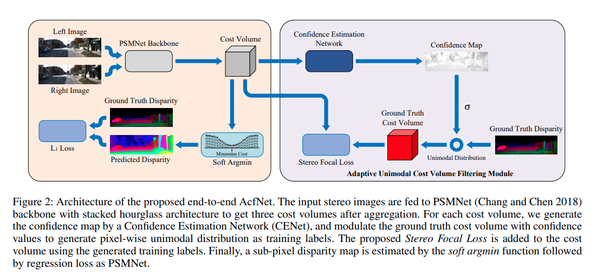

short_title: AcfNet
time: 20200320
pdf_source: https://arxiv.org/pdf/1909.03751.pdf
code_source: https://github.com/youmi-zym/AcfNet
# Adaptive Unimodal Cost Volume Filtering for Deep Stereo Matching

这篇paper解决了双目匹配->Cost Volume->Disparity输出这个流程中最后一步上的痛点问题。

在[PSMNet]中，计算得到Cost Volume后，作者采用Soft-min的方式得到各个点对各个disparity的置信度，加权求平均后再与ground truth作差求loss。

这个loss的形成问题在于不同位置的梯度并不均匀，取决于对应的坐标值。简单的实验可以证明这个loss是不能收敛到最优解的(TO DO).

本文提供了更好的disparity encoding 方式， 提出stereo focal loss。

## Pipeline

这图说明了本文与基础的[PSMNet]的区别。

## Loss Formulation

### Probabilistic Encoding

首先根据confidence map，以及各个dispairty channel位与ground truth dispairty的数值差，求出期望得到的概率分布:

$$
\begin{aligned}
P(d) &=\operatorname{softmax}\left(-\frac{\left|d-d^{g t}\right|}{\sigma}\right) \\
&=\frac{\exp \left(-c_{d}^{g t}\right)}{\sum_{d^{\prime}=0}^{D-1} \exp \left(-c_{d^{\prime}}^{g t}\right)}
\end{aligned}
$$

Encoding这部分的代码主要在[这里](https://github.com/youmi-zym/AcfNet/blob/master/modeling/loss/utils/disp2prob.py)

### Stereo Focal Loss

接着需要一个loss来描述两个概率分布之间的差距，这里采用的公式如下

$$
\mathcal{L}_{S F}=\frac{1}{|\mathcal{P}|} \sum_{p \in \mathcal{P}}\left(\sum_{d=0}^{D-1}\left(1-P_{p}(d)\right)^{-\alpha} \cdot\left(-P_{p}(d) \cdot \log \hat{P}_{p}(d)\right)\right)
$$

实质上是 Cross Entropy的形态。

Multi-level Stereo Cost的代码主要在[这里](https://github.com/youmi-zym/AcfNet/blob/master/modeling/loss/stereo_focal_loss.py)

[PSMNet]:PSMNet.md