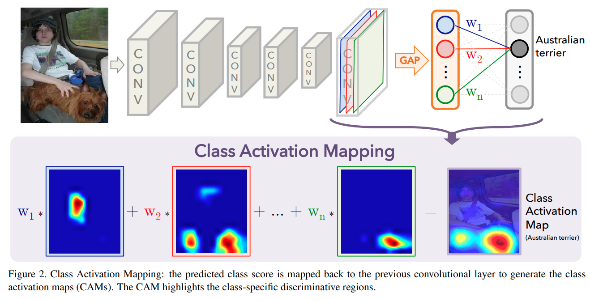
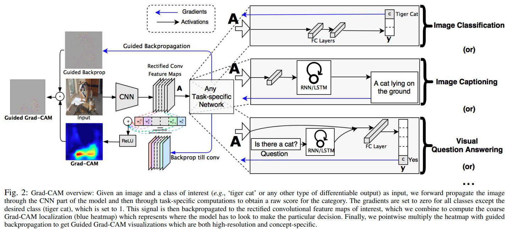

time: 20201118
pdf_source: https://arxiv.org/pdf/1512.04150.pdf
short_title: CAM: Class Activation Map

# CAM: Class Activation Map

本文收集与 CAM 可视化/弱监督学习相关的paper, 

一个解释得比较清楚地[知乎文章](https://zhuanlan.zhihu.com/p/105373864)

## Learning Deep Features for Discriminative Localization

[pdf](https://arxiv.org/pdf/1512.04150.pdf) [code](https://github.com/jazzsaxmafia/Weakly_detector)

这篇paper提出的可解释性分类方法需要对模型进行改造，让CNN的最后一层输出做一个global average pooling, 然后一个全连接得到最后的输出。这样的设计下
CNN最后一层的特征就有很明确的意义了

网络输出有以下公式:

$$
\begin{aligned}
    S_c &= \sum_k w_k^c F_k \\
        &= \sum_k w_k^c \sum_{x,y} f_k(x, y)\\
    P_c &= \frac{\exp{(S_c)}}{\sum_c \exp{(S_c)}}
\end{aligned}
$$

其中$c$指类别, $k$指GAP后的特征层.

Classification map $M_c$为

$$
M_c(x,y) = \sum_kw_k^cf_k(x,y)
$$

实质上就是将一个位置的特征用对应类别的权重加和.

## Grad-CAM: Visual Explanations from Deep Networks via Gradient-based Localization

[pdf](https://arxiv.org/pdf/1610.02391.pdf) [code](https://github.com/utkuozbulak/pytorch-cnn-visualizations)

由于这篇paper的使用已经太大了，因而有一个[Keras官方的code](https://keras.io/examples/vision/grad_cam/)

这篇paper的主要目的是要处理CAM对网络结构有要求这个问题.

定义特征图$k$对分类$c$的重要性 为对应分类值输出对第$k$特征图的梯度的全局和.

$$
\alpha_k^c = \frac{1}{Z} \sum_i \sum_j \frac{\partial y^c}{\partial A_{ij}^k}
$$

定义activation map为 (只关注正向效果的)

$$
L_{Grad-CAM}^c = ReLU(\sum_k \alpha_k^c A^k)
$$
数值上可以证明在CAM的模型下,与CAM的计算是一致的.
