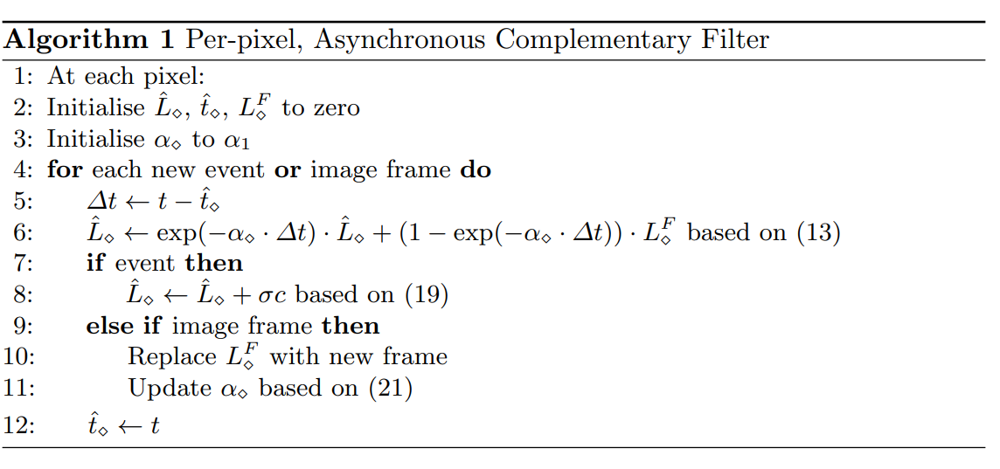
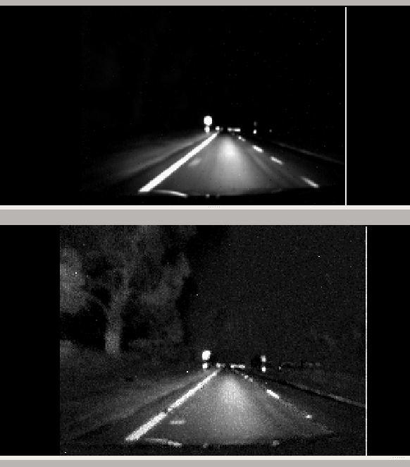

time: 20191021
pdf_source: https://arxiv.org/pdf/1811.00386.pdf
code_source: https://github.com/cedric-scheerlinck/dvs_image_reconstruction
short_title: Intensity Estimation With Event Cameras
# Continuous-time Intensity Estimation Using Event Cameras

这篇文章给出了一个使用event camera增强普通camera的算法。

## Event Camera 与数学基础

设$p, t$为坐标与时间,$Y(p,t_j)$代表原照片对应坐标、时间上的光强度。

event camera,每一个像素会存储光强的变化，超过一个阈值$c$后会发出一个对应的冲激，会在各个时刻在各个相机像素stream,给出$e_i(p,t)=\sigma^p_i c \delta(t-t^p_i)$,其中$\delta$为冲激函数。$\sigma$指正负极性

$E(\boldsymbol{p}, t):=\sum_{i=1}^{\infty} e_{i}(\boldsymbol{p}, t)=\sum_{i=1}^{\infty} \sigma_{i}^{p} c \delta\left(t-t_{i}^{p}\right)$

取log为:
$$
L^{E}(\boldsymbol{p}, t):=\int_{0}^{t} E(\boldsymbol{p}, \tau) d \tau=\int_{0}^{t} \sum_{i=1}^{\infty} \sigma_{i}^{\boldsymbol{p}} c \delta\left(\tau-t_{i}^{\boldsymbol{p}}\right) d \tau
$$

## 互补滤波器

公式ODE：
$$
\frac{\partial}{\partial t} \hat{L}(\boldsymbol{p}, t)=E(\boldsymbol{p}, t)-\alpha\left(\hat{L}(\boldsymbol{p}, t)-L^{F}(\boldsymbol{p}, t)\right)
$$

(个人理解其传递函数为 $\hat L = \frac{s}{s+\alpha}L^E + \frac{\alpha}{s+\alpha}L^F$)

本文提到，用低通滤波器处理相机原数据，用高通滤波器处理event camera的数据.

具体算法:

第六行：指的是时间间隔内，相当于前文提到的ODE右边只有第二项，求解这个常微分方程。

第八行：

$$
\hat{L}\left(\boldsymbol{p}, \hat{t}_{k+1}^{p}\right)=\hat{L}\left(\boldsymbol{p},\left(\hat{t}_{k+1}^{p}\right)^{-}\right)+\sigma_{k+1}^{\boldsymbol{p}} c
$$

是将冲激值直接加到对应的坐标中

第十行，注意不直接改变输出的$\hat L$，但是会改变后面循环的第13行

第十一行，描述的是根据过曝光或者低曝光的可能(每个坐标点有对应的$\alpha_p$值,与当前相机对应坐标的光强$L^F$有关).直觉上来说$\alpha$越小，越信任event camera,在光强接近最大最小值的时候信任event camera,光强中间值的时候相对更信任基础相机，其公式如下:
$$
\alpha(\boldsymbol{p}, t)=\left\{\begin{array}{ll}{\lambda \alpha_{1}+(1-\lambda) \alpha_{1} \frac{\left(L^{F}(\boldsymbol{p}, t)-L_{\min }\right)}{\left(L_{1}-L_{\min }\right)}} & {L_{\min } \leq L^{F}(\boldsymbol{p}, t)<L_{1}} \\ {\alpha_{1}} & {L_{1} \leq L^{F}(\boldsymbol{p}, t) \leq L_{2}} \\ {\lambda \alpha_{1}+(1-\lambda) \alpha_{1} \frac{\left(L^{F}(\boldsymbol{p}, t)-L_{\max }\right)}{\left(L_{2}-L_{\max }\right)}} & {L_{2}<L^{F}(\boldsymbol{p}, t) \leq L_{\max }}\end{array}\right.
$$

本文$\alpha_1 = 2 \pi, \lambda=0.1$

$$[L_1, L_2] = [L_{min} +k, L_{max} -k], k = 0.05*(L_{max}-L_{min})$$

## 在本人(Owen Liu)电脑里面运行得到的结果

上半图为原图，下半图为增强后的图.