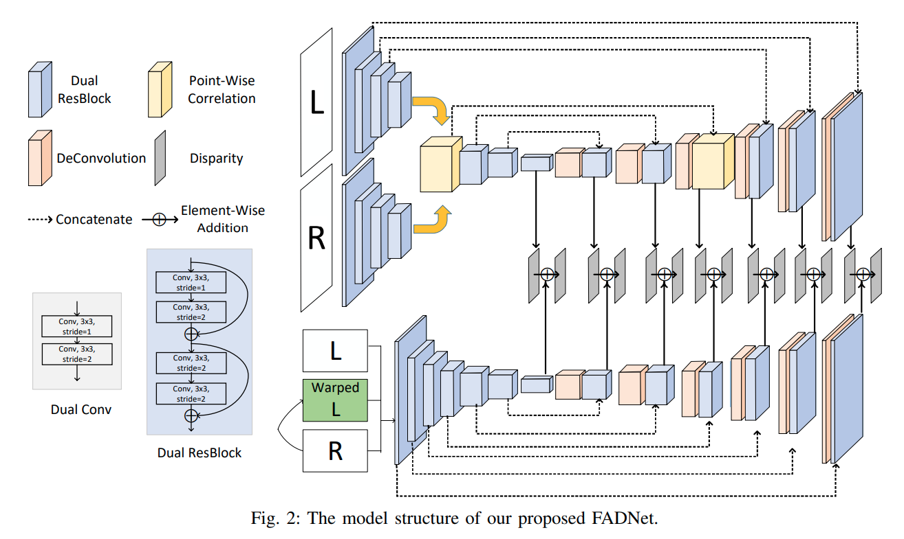

time: 20200503
pdf_source: https://arxiv.org/pdf/2003.10758.pdf
code_source: https://github.com/HKBU-HPML/FADNet
short_title: FADNet
# FADNet: A Fast and Accurate Network for Disparity Estimation

这篇paper介绍了一个实时的快速的disparity estimation网络，与[PSMNet]对比，显存消耗显著减小，同时一帧双目速度达到18.7ms，略微惊人。

## architecture



模仿了DispNet的结构，dispnet则基于[FlowNet](flownet.md).其中使用了correlation 层，对右图水平方向上平移D个位置，以每一个左右图对应像素为中心附近patch各自求点乘的累加

$$c\left(\mathbf{x}_{1}, \mathbf{x}_{2}\right)=\sum_{\mathbf{o} \in[-k, k] \times[-k, k]}\left\langle\mathbf{f}_{1}\left(\mathbf{x}_{1}+\mathbf{o}\right), \mathbf{f}_{2}\left(\mathbf{x}_{2}+\mathbf{o}\right)\right\rangle$$

作者指出这里暗示了一个patch里面不同位置的权重一致，而这并不一定正确，因而选择先分别做一个$3\times3$的卷积再运行点乘
$$c\left(\mathbf{x}_{1}, \mathbf{x}_{2}\right)=\sum\left\langle\mathbf{f}_{1}\left(\mathbf{x}_{1}\right), \mathbf{f}_{2}\left(\mathbf{x}_{2}\right)\right\rangle$$


```python
def build_corr(img_left, img_right, max_disp=40):
    B, C, H, W = img_left.shape
    volume = img_left.new_zeros([B, max_disp, H, W])
    for i in range(max_disp):
        if i > 0:
            volume[:, i, :, i:] = (img_left[:, :, :, i:] * img_right[:, :, :, :-i]).mean(dim=1)
        else:
            volume[:, i, :, :] = (img_left[:, :, :, :] * img_right[:, :, :, :]).mean(dim=1)

    volume = volume.contiguous()
    return volume
```

第二部分采用的是与[FlowNetV2](flownet.md)一致的思路，将右图重采样到左图. 
```python
inputs_net2 = torch.cat((inputs, resampled_img1, dispnetc_final_flow, norm_diff_img0), dim = 1)
```


[PSMNet]:PSMNet.md