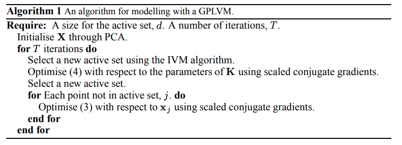

time: 20201123
pdf_source: https://papers.nips.cc/paper/2003/file/9657c1fffd38824e5ab0472e022e577e-Paper.pdf
short_title: GPLVM

# Gaussian Process Latent Variable Models for Visualisation of High Dimensional Data (GPLVM)

GPLVM 是一个对高维数据降维的方法.根据作者的talks，应该被命名为 probablistic dimentional reduction.

数据降维最为基础的思路就是找出数据中方差最大的主线性轴, 也就是 PCA算法的结果. 

本文首先尝试从概率角度对PCA进行重新描述,并提出更通用的GPLVM.

[waterloo的一个paper summary](https://wiki.math.uwaterloo.ca/statwiki/index.php?title=probabilistic_PCA_with_GPLVM)

[作者的一个talk.pdf](http://inverseprobability.com/talks/slides//gplvm_brown17.pdf)

## Linear Probabilistic PCA (PPCA)

- 数据与 latent variables之间有线性高斯关系, 
- 已知latent variables $X$ 满足高斯分布
- Marginalize w.r.t. $X$

$$
\begin{array}{c}
p(\mathbf{Y} \mid \mathbf{X}, \mathbf{W})=\prod_{i=1}^{n} \mathcal{N}\left(\mathbf{y}_{i_{i}} \mid \mathbf{W} \mathbf{x}_{i, i}, \sigma^{2} \mathbf{I}\right) \\
p(\mathbf{X})=\prod_{i=1}^{n} \mathcal{N}\left(\mathbf{x}_{i, i} \mid \mathbf{0}, \mathbf{I}\right) \\
p(\mathbf{Y} \mid \mathbf{W})=\prod_{i=1}^{n} \mathcal{N}\left(\mathbf{y}_{i, j} \mid \mathbf{0}, \mathbf{W} \mathbf{W}^{\top}+\sigma^{2} \mathbf{I}\right)
\end{array}
$$

前人分析发现这个PPCA的$W$的解与PCA的一致.

## Dual Probabilistic PCA (Dual PCA)

- 数据与 latent variables之间有线性高斯关系
- 已知 参数$W$满足高斯分布
- Marginalize w.r.t. $W$

$$
\begin{array}{c}
p(\mathbf{Y} \mid \mathbf{X}, \mathbf{W})=\prod_{i=1}^{n} \mathcal{N}\left(\mathbf{y}_{i,} \mid \mathbf{W} \mathbf{x}_{i, \prime}, \sigma^{2} \mathbf{I}\right) \\
p(\mathbf{W})=\prod_{i=1}^{p} \mathcal{N}\left(\mathbf{w}_{i, j} \mid \mathbf{0}, \mathbf{I}\right) \\
p(\mathbf{Y} \mid \mathbf{X})=\prod_{j=1}^{p} \mathcal{N}\left(\mathbf{y}_{\mathbf{i}, j} \mid \mathbf{0}, \mathbf{X} \mathbf{X}^{\top}+\sigma^{2} \mathbf{I}\right)
\end{array}
$$

对应的 log-likelihood 是
$$
\begin{aligned}
    L &= -\frac{DN}{2}\ln{(2\pi)} - \frac{D}{2} \ln |K| - \frac{1}{2} \text{tr} (K^{-1} Y Y^T) \\
    K &= \alpha XX^T + \beta^{-1}I
\end{aligned}
$$

使$L$关于$X$的导数为零，可以求得$X$满足以下方程
$$
    \frac{1}{D}YY^TK^{-1}X = X
$$

观察前面的式子可以发现， 数据的分布变为了以零为期望，由latent variable组成的协方差矩阵. 一个自然的延伸就是假设这个协方差矩阵是由通用的可能非线性的核函数$K$替代。

## GPLVM

如将核函数设定为 RBF 指数核:

$$
    k_{n,m} = \alpha \exp (-\frac{\gamma}{2}(x_n-  x_m)^T (x_n - x_m)) + \delta_{nm}\beta^{-1}
$$

损失函数$L$关于核函数的导数仍然没有变化，可以通过一阶优化方法迭代得到local minima解.

### 实际执行

实际执行GPLVM的时候可以采取一些技巧减少运算量:

- 稀疏化: 仅用部分数据(active set)计算协方差矩阵拟合高斯过程模型. 选择方法依据: [作者的另一篇关于sparcity & GP的文章](https://papers.nips.cc/paper/2002/file/d4dd111a4fd973394238aca5c05bebe3-Paper.pdf)
- latent variable优化:从 active set 得到协方差之后，用高斯过程推理的方法得到每一个数据的forward pass, 其梯度仅与自己以及其他active set中的数据有关，因而所有 inactive set中的数据可以并行求解得到自己对应的latent variable.

## Extension: Unified Objective Function

[参考](https://wiki.math.uwaterloo.ca/statwiki/index.php?title=probabilistic_PCA_with_GPLVM#Unifying_Objective_Function)

这里指出可以用一个 KL divergence来统一 PCA, kernel PCA, PPCA, GP-LVM, 它们分别对应对$S, K$的不同设置.

$$
\mathrm{KL}(N(\mathbf{z|0,S)} || N(\mathbf{z|0,K})) = -\int N(\mathbf{z|0,S)}\;ln\frac{N(\mathbf{z|0,K})}{N(\mathbf{z|0,S)}}\;d\mathbf{z} = \frac{1}{2} ln |\mathbf{K}| - \frac{1}{2} ln |\mathbf{S}| + \frac{1}{2} tr(\mathbf{SK^{-1}}) - \frac{N}{2}
$$

