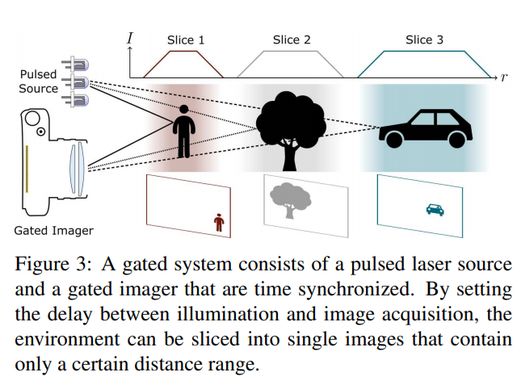
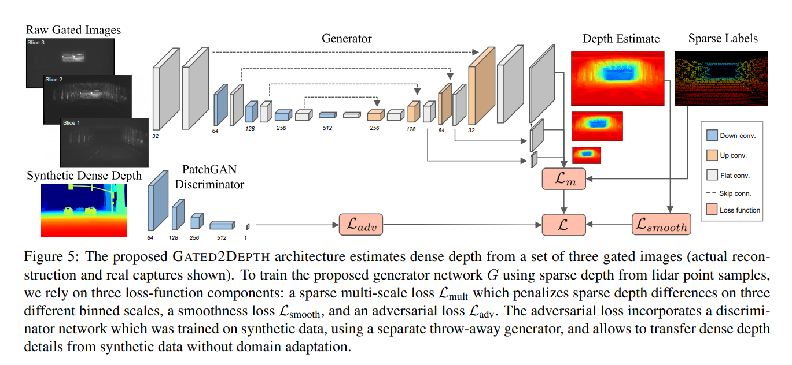

time: 20191031
pdf_source: http://openaccess.thecvf.com/content_ICCV_2019/papers/Gruber_Gated2Depth_Real-Time_Dense_Lidar_From_Gated_Images_ICCV_2019_paper.pdf
code_source: https://github.com/gruberto/Gated2Depth
short_title: Gated2Depth
# Gated2Depth: Real-Time Dense Lidar From Gated Images

这篇论文使用Gated Image估计稠密的深度图。亮点有几个，首先是对Gate Imaging的原理认识以及使用，其次是其用稀疏点云作为监督来源，进行半监督的学习.

## Gated Imaging基本原理

Gated camera本质上是一个主动的TOF相机，与激光源时间同步，系统可以控制相机的快门接受光照的时间，如上图，每一张图里面只会显示一个距离区间内的物体，而每一张图中每一个像素的数值代表对应像素的反射的激光强度。

更多信息可以看[NIT的产品pdf](https://new-imaging-technologies.com/wp-content/uploads/2019/07/Gated-imaging-application-note.pdf)以及[wiki页面](https://www.wikiwand.com/en/Time-of-flight_camera#/Range_gated_imagers)

## Depth Learning Pipeline

输入到网络的输入是3层的原始gated image.使用生成网络$G$输出多尺寸的深度估计图，结构采用的是经典的[Unet(pdf)](https://arxiv.org/pdf/1505.04597.pdf)，有三个loss函数。其中第一个损失是$\mathcal{L}_{mult}$是稀疏的，用稀疏的激光雷达点云图进行监督。后两个loss在后文描述

图中有一个分类器D,类似于PathchGAN.

在第一个训练阶段，本文用仿真合成的数据用类似Least-square GAN的方式，让这个分类器网络判断一张深度图是来自于合成的正确图还是来自于Generator的输出。

第二个阶段，本文用真实gated image,然后保持分类器固定，同时用激光雷达点云进行监督训练,

## 损失函数

$$
\mathcal{L} = \mathcal{L}_{mult}  + \lambda_s \mathcal{L}_{smooth}  + \lambda_a \mathcal{L}_{adv}
$$

### 直接监督
$$
\mathcal{L}_{\mathrm{mult}}(d, \tilde{d})=\sum_{i=1}^{M} \lambda_{m_{i}} \mathcal{L}_{\mathrm{Ll}}\left(d^{(i)}, \tilde{d}^{(i)}\right)
$$
其中$d^{(i)}$还有$\tilde{d}^{(i)}$指代在$scale (i), \mathcal{L}_{L1}$指在对应尺度上的损失。每一个尺度都是使用$L_1$损失

在使用合成训练集训练时，所有像素都有对应的误差值。在使用实际的损失函数时，只有部分像素有监督，如下
$$
\mathcal{L}_{\mathrm{LI}}\left(d^{(i)}, \tilde{d}^{(i)}\right)=\frac{1}{N} \sum_{j, k}\left|d_{j k}^{(i)}-\tilde{d}_{j k}^{(i)}\right| m_{j k}^{(i)}
$$

###　光滑损失

$$
\mathcal{L}_{\text {smooth }}=\frac{1}{N} \sum_{i, j}\left|\partial_{x} d_{i, j}\right| \epsilon^{-\left|\partial_{x} z_{i, j}\right|}+\left|\partial_{y} d_{i, j}\right| \epsilon^{-\left|\partial_{y} z_{i, j}\right|}
$$

其中$z$为输入图片的强度值，$d$是深度值，

### 对抗损失

$$
\begin{aligned} \mathcal{L}_{\mathrm{adv}}=& \frac{1}{2} \mathbb{E}_{y \sim p_{\mathrm{depth}}(y)}\left[(D(y)-1)^{2}\right]+\\ & \frac{1}{2} \mathbb{E}_{x \sim p_{\mathrm{gated}}(x)}\left[(D(G(x)))^{2}\right] \end{aligned}
$$

