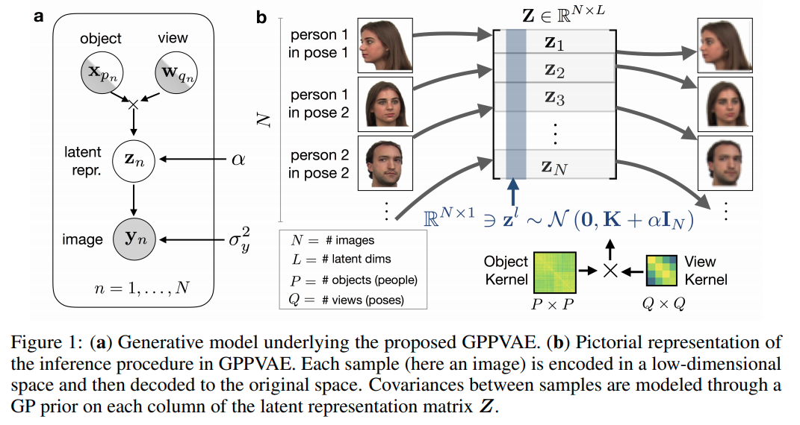

time: 20201121
pdf_source: https://arxiv.org/pdf/1810.11738.pdf

# Gaussian Process and Variantional Autoencoder

## Gaussian Process Prior Variational Autoencoders

[pdf](https://arxiv.org/pdf/1810.11738.pdf) [code](https://github.com/fpcasale/GPPVAE)

基础的 Variantional Autoencoder 假设不同sample $X$的latent variables $Z$是独立同分布的.

这篇 NIPS paper 指出这个假设并不合理， 对于比如时序图片，不同sample显然不是独立同分布的，需要考虑sample data之间的 covariance.

本文提出的理论直觉就是通过高斯过程来建模不同数据样本$X$的latent variables $Z$的协方差分布.

### Formulation

设: $N$为样本数, $P$为unique 物体的数量, $Q$是各个物体不同视角的数量, $\{y_n\}^N_{n=1}$是每一个每一个样本的 representation. $\{x_p\}^{P}_{p=1}$指 各个物体的 feature. $\{w_q\}_{q=1}^Q$指每一个视角的特征. 最终$z_n$指的是每一个样本的latent representation.

latent representation $z_n$设为 由视角特征以及物体特征 加噪声映射而得

$$
    z_n = f(x_{p_n}, w_{q_n}) + \eta_n \quad \eta_n \sim \mathcal{N}(0, \alpha I_L)
$$

图片$y_n$由laten representation $z_n$通过一个generator得到:

$$
    y_n = g(z_n) + \epsilon_n \quad \epsilon_n \sim \mathcal{N}(0, \sigma_y^2 I_k)
$$

作者用一个高斯过程来对$f$进行建模, 关键是要建模不同样本的covatiance. 使用CNN作为 $g$ generator.

$$
    p(Y|X, W, \phi, \sigma_y^2, \theta, \alpha) = \int{p(Y|Z, \phi, \sigma_y^2) p(Z | X, W, \theta, \alpha) dZ}
$$

在高斯过程模型中, 输出$z$的概率分布满足:

- 均值为 0
- 与其他所有样本的协方差为 $K_\theta(X, W)$, 其中$X$为特征, $K_\theta$为核函数. 

因而有:

$$
    p(Z | X, W, \theta, \alpha) = \Pi_{l=1}^L \mathcal{N}(z^l | 0, K_\theta(X, W) + \alpha I_N)
$$

根据本文的假设对这个核函数进行拆解，视角矢量仅与其他样本的视角矢量的特征有相关性, 物体类别矢量同理,

$$
\boldsymbol{K}_{\boldsymbol{\theta}}(\boldsymbol{X}, \boldsymbol{W})_{n m}=\mathcal{K}_{\boldsymbol{\theta}}^{(\mathrm{view})}\left(\boldsymbol{w}_{q_{n}}, \boldsymbol{w}_{q_{m}}\right) \mathcal{K}_{\boldsymbol{\theta}}^{(\mathrm{object})}\left(\boldsymbol{x}_{p_{n}}, \boldsymbol{x}_{p_{m}}\right)
$$

将前文的全概率公式进行拆解, 写成期望:

$$
\begin{aligned}
\log p\left(\boldsymbol{Y} \mid \boldsymbol{X}, \boldsymbol{W}, \boldsymbol{\phi}, \sigma_{y}^{2}, \boldsymbol{\theta}\right) \geq & \mathbb{E}_{\boldsymbol{Z} \sim q_{\psi}}\left[\sum_{n} \log \mathcal{N}\left(\boldsymbol{y}_{n} \mid g_{\boldsymbol{\phi}}\left(\boldsymbol{z}_{n}\right), \sigma_{y}^{2} \boldsymbol{I}_{K}\right)+\log p(\boldsymbol{Z} \mid \boldsymbol{X}, \boldsymbol{W}, \boldsymbol{\theta}, \alpha)\right]+\\
&+\frac{1}{2} \sum_{n l} \log \left(\boldsymbol{\sigma}_{\psi}^{z 2}\left(\boldsymbol{y}_{n}\right)_{l}\right)+\mathrm{const.}
\end{aligned}
$$

在loss中, 拆解各项，损失函数为

$$
\begin{array}{l}
l\left(\phi, \boldsymbol{\psi}, \boldsymbol{\theta}, \alpha, \sigma_{y}^{2}\right)= \\
=N K \log \sigma_{y}^{2}+\underbrace{\sum_{n} \frac{\left\|\boldsymbol{y}_{n}-g_{\phi}\left(\boldsymbol{z}_{\psi_{n}}\right)\right\|^{2}}{2 \sigma_{y}^{2}}}_{\text {图像重建项 }}-\underbrace{\log p\left(\boldsymbol{Z}_{\psi} \mid \boldsymbol{X}, \boldsymbol{W}, \boldsymbol{\theta}, \alpha\right)}_{\text {高斯过程项}}+\underbrace{\left.\frac{1}{2} \sum_{n l} \log \left(\boldsymbol{\sigma}_{\psi}^{z}\right)_{\boldsymbol{j}}\left(\boldsymbol{y}_{n}\right)_{l}\right)}_{\text {regularization 项}},
\end{array}
$$

### Efficient GP

设计使得高斯的核函数矩阵是低维(low-rank)的，设$K = VV^T + \alpha I$. 其中$V \in \mathbb{R}^{N\times H}$.

会有

$$
\begin{aligned}
\boldsymbol{K}^{-1} \boldsymbol{M} &=\frac{1}{\alpha} \boldsymbol{I}-\frac{1}{\alpha} \boldsymbol{V}\left(\alpha \boldsymbol{I}+\boldsymbol{V}^{T} \boldsymbol{V}\right)^{-1} \boldsymbol{V}^{T} \boldsymbol{M} \\
\log |\boldsymbol{K}| &=N L \log \alpha+\log \left|\boldsymbol{I}+\frac{1}{\alpha} \boldsymbol{V}^{T} \boldsymbol{V}\right|
\end{aligned}
$$
