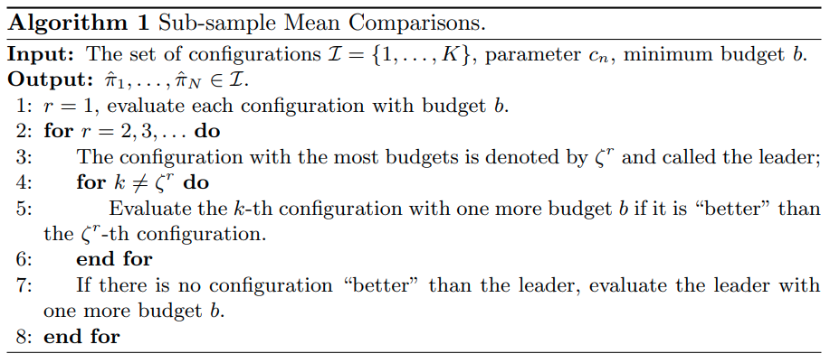

time: 20200904
pdf_source: https://arxiv.org/pdf/2007.09336.pdf

# Hyperparameter Tuning

这篇paper是阅读[AABO]以及其前置paper的阅读归纳.这其中的问题是如何进行自动化的超参数的调参。

由于超参数无法通过机器学习本身的优化算法优化，generally speaking是一个无法获得梯度的优化问题。因而可以理解为是一个黑盒优化问题。

传统优化理论来说，黑盒优化常见的求解方法是搜索:

- grid search
- random search
- simulated annealing
- genetic algorithms ...

在深度学习阶段，深度强化学习也被用于黑盒优化。

但是对于基于神经网络的超参数优化来说，特点在于每一组超参的evaluation所需要的算力比较大。因而需要data efficient的超参搜索算法。

## Surrogate Function 

[pdf](https://papers.nips.cc/paper/4443-algorithms-for-hyper-parameter-optimization.pdf) [code](https://optunity.readthedocs.io/en/latest/)

这一类的算法的 motivation 在于根据现有的超参、性能数据组拟合一个 "value function"，然后根据这个价值函数引导后续的搜索。

### Gaussian Process
在数据点数量较少的情况下，一个常见的拟合算法就是GP. 下图引自 [medium](https://medium.com/criteo-labs/hyper-parameter-optimization-algorithms-2fe447525903#6353).

### Tree-structured Parzen estimators (TPE)

由于很多超参的设置是呈树状结构(存在层级结构)，且是离散值。这时候比较采用的是 TPE算法。

算法的框架是将现有的数据点根据performance的排序，分为"好"的点以及"不好"的点;然后用核函数(如混合高斯模型)来拟合好的点的概率分布以及不好的点的概率分布:

$$p(x \mid y)=\left\{\begin{array}{ll}
\ell(x) & \text { if } y<y^{*} \\
g(x) & \text { if } y \geq y^{*}
\end{array}\right.$$

当前估计的最优点则是 $EI = \frac{l(x)}{g(x)}$ 取最大值的点。

## Hyperband

[pdf](https://arxiv.org/pdf/1603.06560.pdf)

Hyperband属于随机搜索算法.

首先通过直观例子介绍successive halfing algorithm:

- 随机在搜索空间中寻找64个超参组
- 100 iterations之后评价各自的 validation loss
- 丢弃性能最差的一半
- 剩余超参组再训练多100 iterations
- 再丢弃性能最差的一半
- 剩余超参组再训练多200 iterations
- 重复直到只剩下一个model

由于每次丢弃的比例是一个可以调节的重要的超参。Hyperband可以理解为对$n$进行Grid Search.

## BOHB: ROBUST AND EFFICIENT HYPERPARAMETER OPTIMIZATION AT SCALE
[pdf](https://arxiv.org/pdf/1807.01774.pdf) [blog](https://www.automl.org/blog_bohb/)

BOHB融合了 surrogate model 与hyperband的思路。

使用 [TPE]对超参数组的性能进行预估，并选择需要分析的超参组。使用[Hyperband]降低分析所需要的时间。

## AABO: Adaptive Anchor Box Optimization for Object Detection via Bayesian Sub-sampling

[pdf](https://arxiv.org/pdf/2007.09336.pdf)

这篇paper首先是一篇针对提升目标检测性能的文章。作者通过一些简单的实验得到两个结论: 

- 目前预设的anchors在COCO数据集上也还不是最优的。
- 通过搜索anchors configuration得到的提升可能会高于对RPN head的搜索得到的结果。

然后提出了

- 不同feature map需要不同的 predefined anchor.
- SMC 采样

[Hyperband]:#hyperband
[TPE]:#tree-structured-parzen-estimators-tpe
[AABO]:#aabo-adaptive-anchor-box-optimization-for-object-detection-via-bayesian-sub-sampling