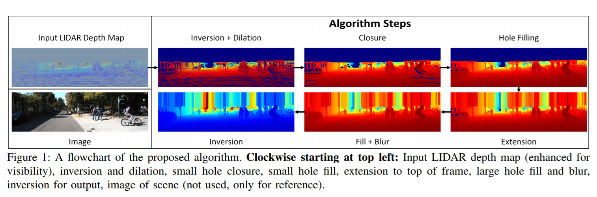
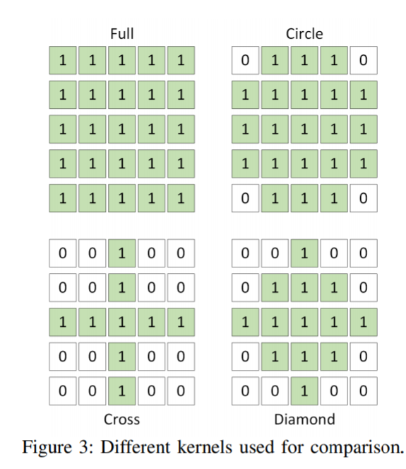

time: 20191116
pdf_source: https://arxiv.org/pdf/1802.00036.pdf
code_source: https://github.com/kujason/ip_basic
short_title: Depth Completion on CPU
# In Defense of Classical Image Processing: Fast Depth Completion on the CPU

这篇文章解决的问题是从CPU实现深度补全，这篇是AVOD(暂未有简介)以及[Syn-Multi-view](../../3dDetection/Improving&#32;3D&#32;Object&#32;Detection&#32;for&#32;Pedestrians&#32;with&#32;Virtual&#32;Multi-View&#32;Synthesis&#32;Orientation&#32;Estimation.md)的前置.

并不是最好的算法，不过是一个代码使用难度不高(基本只有基本的numpy 与 opencv运算)，速度快(90HZ)且精确度尚可的算法.更关键是完全没有使用图像数据

## 总体流程

此图总览了整个算法的完整流程，下面从问题的数学定义以及算法步骤进行介绍。

## 问题数学定义

对于一张图片$I$,一个稀疏的深度图$D_{sparse}$,找到一个$\hat f$, 其中$f(I,D_{sparse}) = D_{dense}$,问题可以描述为:
$$
    \min .\left\|\hat{f}\left(I, D_{s p a r s e}\right)-f\left(I, D_{s p a r s e}\right)\right\|_{F}^{2}=0
$$

## 流程介绍

### Depth Inversion

从数据特性上，kitti中的点的距离从0到80m，不过，空像素同样为0，这不利于基础OpenCV的计算。因此进行一个操作，对非空像素计算$D_{inverted} = 100.0 - D_{input}$，会形成20m的缓冲区。方便形成一个valid or not 的mask.

### 自定义Dilation

首先尝试让空像素被附近的有效像素覆盖(dilation),最终采用的是diamand kernel

### 小洞填补
先计算一个non-empty mask,使用$7\times 7$ full 核进行dilation,non-empth的点不改变。

### Extension
为了补充比较高的物体，比如树和天空，将每列最高的有效点直接连接到最外部。

### 大洞补充
最后一步填补前文完全没有补充的点,由于没有图片数据，使用一个$31 \times 31$的核，寻找最靠近的未填补点。

### Blur

连续使用一个$5\times 5$中位数模糊,以及一个$5\times 5$高斯模糊。

### Depth Inversion
将第一步的深度转回来。