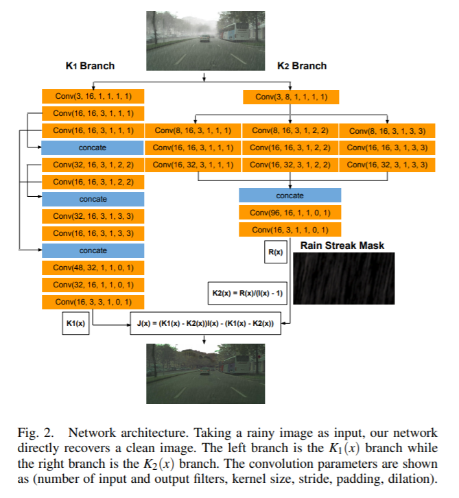

time: 20191122
short_title: Joint Deraining and Dehazing
# A Convolutional Network for Joint Deraining and Dehazing from A Single Image for Autonomous Driving in Rain

这篇论文是iros2019的论文，在实验室的NAS上有PDF版本。这篇论文在人工合成的city-scape数据集上对单个图片进行derain与dehaze。将这两个问题一起研究的motivation是雨滴本身会使得场景中带有光的散射，形成雾等扭曲的光效果，所以在雨天自动驾驶场景中应该对两个部分同时进行矫正。本文提出的模型速度很快，对$1024\times 512$的图片处理时间仅仅只有0.05s.

## 数学模型

经典的模型中雨天图像的形成可以用下式的模型描述：

$$
I(x) = (J(x) + R(x))t(x) + A(1 - t(x))
$$
其中$I(x)$为下雨图片,$J(x)$为目标还原图片,$R(x)$为相机附近的雨滴,$t(x) = e^{-\beta d(x)}$为与图片中物体与相机距离$d(x)$有关的不被干扰的光的比例,A是表达雾的模糊亮度的一个全局值，很多模型尝试对$R(x), t(x)$建模，把$A$设置为一个固定值，但是我们会发现$A$与$t(x)$还是有相关性的。这里对原来的公式进行重新表达。
$$
\begin{aligned}
    J(x) &= \frac{1}{t(x)} I(x) - A\frac{1}{t(x)} + A - R(x) \\
    J(x) &= (K_1(x) - K_2(x)) I(x) - (K_1(x) - K_2(x))
\end{aligned}
$$
其中$K_1(x) = \frac{\frac{1}{t(x)}(I(x)-A) + A}{I(x) - 1}, K_2{x} = \frac{R(x)}{I(x)-1}$
如此我们对每一个像素点直接估计$K_1(x), K_2(x)$本质上就是完成了一式的，这里的经验是对$K_2(x)$学习的时候直接学习$R(x)$

## 网络模型

## 数据的产生
事实上我们很难得到下雨、不下雨的数据对(几乎不可能，只能依靠定点拍摄，这种采集方式使得场景比较少)，这里最后选择的是使用合成数据集。首先有CityScapes数据集，然后有foggy-Cityscapes合成数据集(这个数据集其实很有意思，其生成方式可以一读)，这个数据集基于CityScapes并加上了雾化的效果。然后作者以此为基础，对每一张图根据一个[教程](https://www.photoshopessentials.com/photo-effects/rain/)加上了不同方向不同强度的雨水效果，形成新的数据集。

## 实验
这里谈及实验的原因，主要是因为本文在验证自己的重建性能的时候，除了在网络中验证重建误差，还进行了高阶任务的实验，也就是让物体检测以及语义分割预训练网络在原图、合成图、还原图上分别运行测试，实验发现在还原图上得到的性能点数一般都比合成图上的高。值得注意的是本文并没有进行fine-tune。