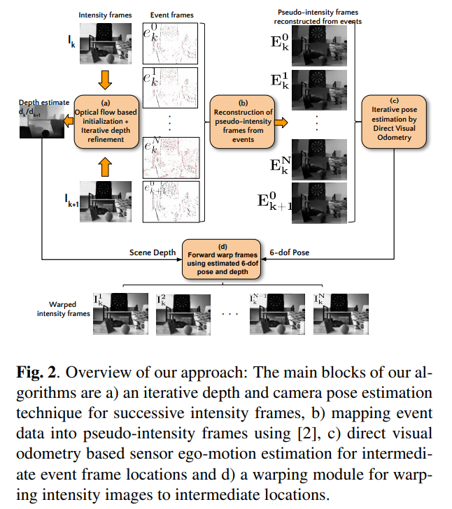
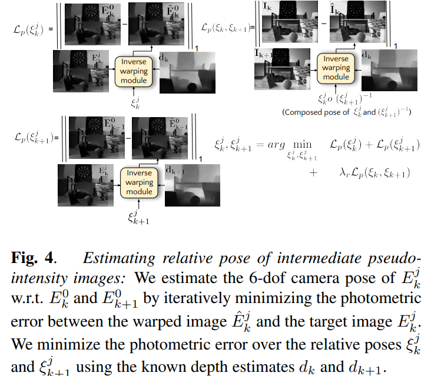

time: 20191023
pdf_source: https://arxiv.org/pdf/1805.06140.pdf
short_title: Image Reconstruction with Event Camera
# Photorealistic Image Reconstruction From Hybrid Intensity and Event Based Sensor

这篇论文解决的任务如下，输入连续的普通图片以及一系列密集的event camera信息，还原出更加真实的原始图片,关于event camera的基础原理以及对图片的增强，这里可参考[这篇论文](Continuous-time_Intensity_Estimation_Using_Event_Cameras.md)

## 工作流程

这里分为四个步骤，第一步是通过两张基础图片得到深度估计。第二步是使用event frames实现对中间帧的插值，第三步是对插值结果使用VO得到一个位姿估计，第四步是根据深度与姿态得到转换后的强度图。

## 深度估计

通过光流初始化深度估计$d_k, d_{k+1}$，将相对位移与旋转初始化为0,根据深度以及位移，可以让两张图相互转换，这里定义重构损失
$$
\mathcal{L}_{p h}\left(d_{k}, d_{k+1}, \xi\right)=\left\|\left(\hat{I}_{k}-I_{k}\right)\right\|_{1}+\left\|\left(\hat{I}_{k+1}-I_{k+1}\right)\right\|_{1}
$$
进一步定义一个与edge有关的损失
$$
\mathcal{L}_{s m}(d)=\sum\left\|\nabla_{x} d\right\| e^{-\beta\left\|\nabla_{x} I\right\|}+\left\|\nabla_{y} d\right\| e^{-\beta\left\|\nabla_{y} I\right\|}
$$

其中$d$为深度图$\nabla_x, \nabla_y$指的是x,y方向的运算符,

优化以上两个损失函数的加权求和是一个非凸问题，我们需要一个好的局部解作为初始解。这里使用[PWC-Net](../SLAM/PWC-Net_CNNs_for_Optical_Flow_Using_Pyramid_Warping_and_Cost_Volume.md)生成初始光流，这里使用光流的inverse直接得到深度初始值。

## 相对位移估计

这里使用event camera对两帧之间的图像进行插值，生成一系列的中间图像。

$$
\begin{aligned} \mathcal{L}_{p}\left(\xi_{k}^{j}\right) &=\left\|E_{k}^{0}-\hat{E}_{k}^{0}\right\|_{1} \\ \mathcal{L}_{p}\left(\xi_{k+1}^{j}\right) &=\left\|E_{k+1}^{0}-\hat{E}_{k+1}^{0}\right\|_{1} \end{aligned}
$$

$$
\xi_{k}^{j}, \xi_{k+1}^{j}=\underset{\xi_{k}^{j}, \xi_{k+1}^{j}}{\arg \min } \mathcal{L}_{p}\left(\xi_{k}^{j}\right)+\mathcal{L}_{p}\left(\xi_{k+1}^{j}\right)+\lambda_{r} \mathcal{L}_{p}\left(\xi_{k}^{j}, \xi_{k+1}^{j}\right)
$$

其中$\xi^j_k,\xi^j_{k+1}$分别指代第$j$张中间图相对于第一帧、下一帧之间的相对位姿变化，

## 融合

根据深度、多个中间值的位姿，将第一帧与第二帧分别向后、向前warp，alpha-blend两次的结果，得到一系列更精确的首尾与中间图。