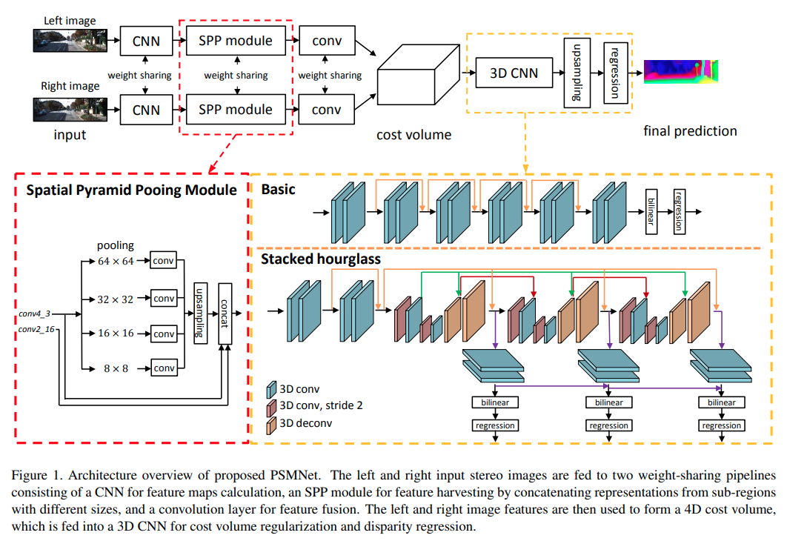

pdf_source: https://arxiv.org/pdf/1803.08669.pdf
code_source: https://github.com/JiaRenChang/PSMNet
short_title: PSMNet
time: 20200222
# Pyramid Stereo Matching Network

PSM 网络是目前非常常用的一个双目深度学习网络，在双目深度估计，双目检测，双目光流等任务中都有广泛应用

## PSM总体结构

图中SPP模块，本质上就是一个大感受野的CNN模块，这个backbone在很多网络中都被重复使用。

图中的Cost volume
来自于[另一篇文章.pdf](https://arxiv.org/pdf/1703.04309.pdf)，
与[PSV](../../3dDetection/DSGN.md)不同的地方在于，与其是在实际的距离单位上均匀取Z轴再调用较为耗费资源的grid_sample函数，这里选择的是将深度轴直接理解为离散的disparity，使得grid_sample可以用轻便的indexing代替，速度更快，效果差距不算大,只不过是根据图片本身的大小disparity值的影响会直接影响到模型的大小或者说速度。

如果使用 stacked-hourglass作为 inference的时候，就会在同一大小的输出层上多次做出prediction。

核心在于实现以及训练细节，这些都在代码中有交代。Cost volume的实现已经在尝试迁移使用。

