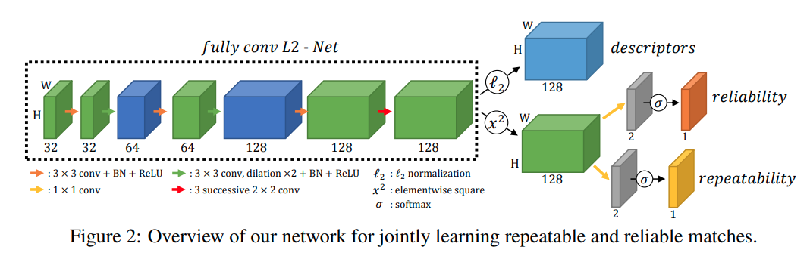
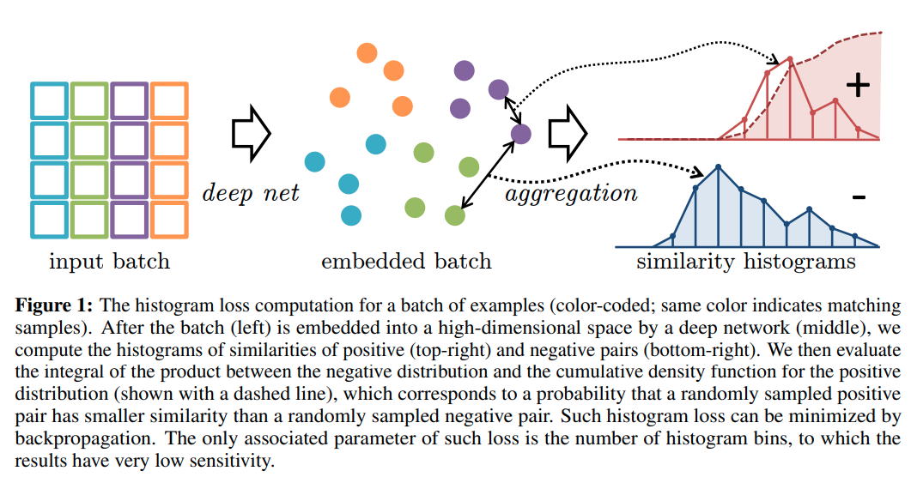

time: 20200508
pdf_source: https://papers.nips.cc/paper/9407-r2d2-reliable-and-repeatable-detector-and-descriptor.pdf
code_source: https://github.com/naver/r2d2
short_title: R2D2
# R2D2: Repeatable and Reliable Detector and Descriptor

这篇paper在输出keypoints的时候输出两个分支预测其重复性以及可靠性。paper的主要贡献有两点，第一在于判断认为有必要将可靠性与可重复性分成两个单独的metrics进行预测，且使用不同的训练方式。第二在于使用metric learning训练可靠性与准确度(不算独创但是属于有效的融合)

## 网络结构

### 可重复性

可重复性这里与其他做法相似，选择的是自监督学习的方法。

对于两张已知correspondence的图，损失的目的是让两张图对应的部分有较高的相似度(cosine similarity)，

$$\mathcal{L}_{\operatorname{cosim}}\left(I, I^{\prime}, U\right)=1-\frac{1}{|\mathcal{P}|} \sum_{p \in \mathcal{P}} \operatorname{cosim}\left(\boldsymbol{S}[p], \boldsymbol{S}_{U}^{\prime}[p]\right)$$

这会有一个trivial的解就是所有值为常数，所以给出一个补充的损失函数要求提升区域内最大值与均值的差

$$\mathcal{L}_{\text {peaky}}(I)=1-\frac{1}{|\mathcal{P}|} \sum_{p \in \mathcal{P}}\left(\max _{(i, j) \in p} \boldsymbol{S}_{i j}-\operatorname{mean}_{(i, j) \in p} \boldsymbol{S}_{i j}\right)$$

### 可靠性

即要求匹配的准确度提升，这里引用了 [Local Descriptors Optimized for Average Precision.pdf](http://openaccess.thecvf.com/content_cvpr_2018/papers/He_Local_Descriptors_Optimized_CVPR_2018_paper.pdf)的做法。其中两个histogram之间的loss来自于[Learning Deep Embeddings with Histogram Loss.pdf](https://arxiv.org/pdf/1611.00822.pdf)

code in [here](https://github.com/naver/r2d2/blob/master/nets/ap_loss.py)