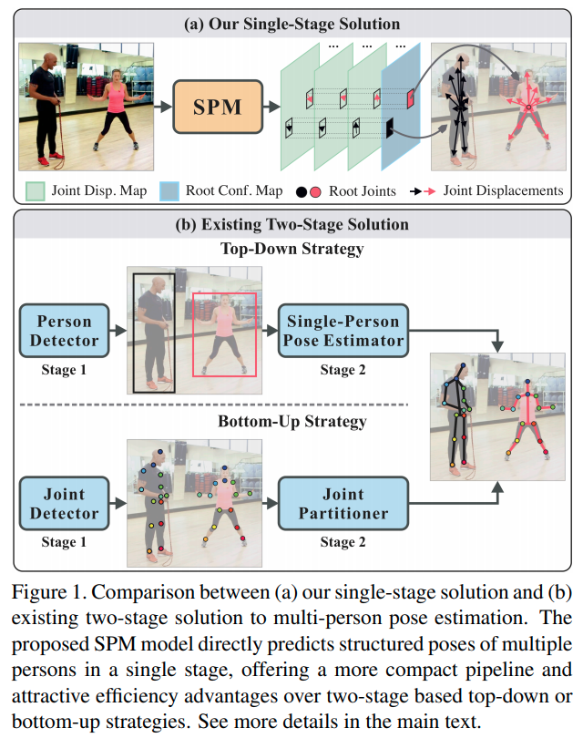
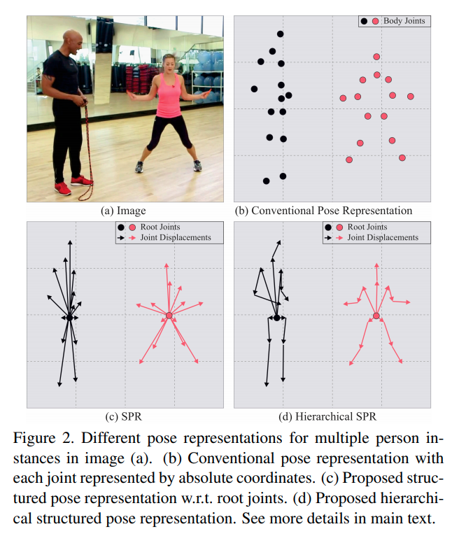

time: 20191225
pdf_source: https://arxiv.org/pdf/1908.09220v1.pdf
code_source: https://github.com/murdockhou/Single-Stage-Multi-person-Pose-Machines
short_title: SPM - SPR
# Single-Stage Multi-Person Pose Machines

上面给出的开源代码是非官方，作者给出了解读这篇paper的[csdn blog],

核心思路就是将肢体关节的回归分成两部分，一个是root，也就是中心点的估计，这个用heat-map regression实现。另一个是树状的，各个肢体关节点与其相邻父关节点的相对位移。作者总共分为5个树，

* root->neck->head
* root->left/right shoulder->left/right elbow->left/right wrist
* root->left/right hip->left/right knee->left/right ankle

推断的时候仅需要预测root，并通过相对位移处理即可。最终网络是单阶段的推理。

[csdn blog]:https://blog.csdn.net/Murdock_C/article/details/100545377