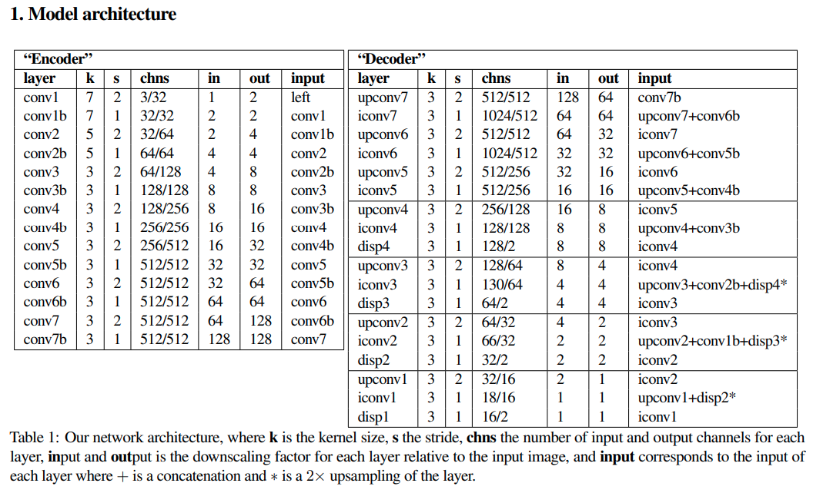
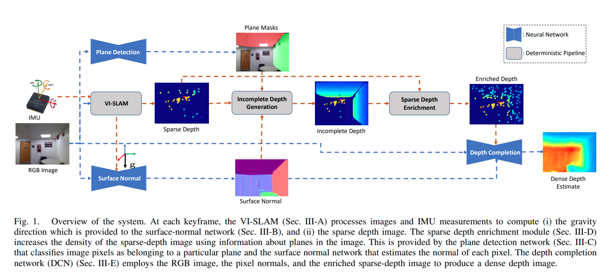
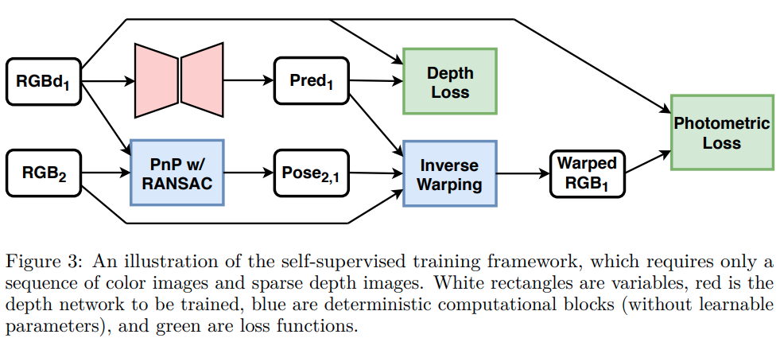

time: 20191209
pdf_source: https://arxiv.org/pdf/1609.03677.pdf
code_source: https://github.com/mrharicot/monodepth
short_title: Unsupervised Mono Depth from stereo
# Unsupervised Monocular Depth Estimation with Left-Right Consistency

这篇论文解决的问题是无监督条件下，仅使用单个相机单次的拍摄图，得到对深度的估计。在训练过程中需要第二个相机同时拍摄的结果来构造损失函数用于训练。可以理解为是使用第二个相机作为监督输入，但是这也节省了数据标定的难度。本文同时有非官方的[pytorch实现]

## inference结构



本文神经网络的输入是单张RGB图片，输出是multi-scale的disparity,并且在每个scale是同时输出左图->右图的disparity以及右图->左图的disparity.作者的思路是在多个scale上同时对两个disparity检测的正确性、统一性进行检验。

## Loss结构

定义在scale $s$上的损失值为$C_s$,

损失函数为

$$
C_{s}=\alpha_{a p}\left(C_{a p}^{l}+C_{a p}^{r}\right)+\alpha_{d s}\left(C_{d s}^{l}+C_{d s}^{r}\right)+\alpha_{l r}\left(C_{l r}^{l}+C_{l r}^{r}\right)
$$

### 重构损失

$C_{ap}$指的是左右图相互重构时的误差损失，本文同时采用naive的$L1$距离以及[SSIM距离]的加权求和，代码中可以清楚地留意到作者是如何使用Pytorch原生层以及基本操作实现SSIM的计算，并且允许反传。

$$
C_{a p}^{l}=\frac{1}{N} \sum_{i, j} \alpha \frac{1-\operatorname{SSIM}\left(I_{i j}^{l}, \tilde{I}_{i j}^{l}\right)}{2}+(1-\alpha)\left\|I_{i j}^{l}-\tilde{I}_{i j}^{l}\right\|
$$

```python
def SSIM(self, x, y):
    C1 = 0.01 ** 2
    C2 = 0.03 ** 2

    mu_x = nn.AvgPool2d(3, 1)(x)
    mu_y = nn.AvgPool2d(3, 1)(y)
    mu_x_mu_y = mu_x * mu_y
    mu_x_sq = mu_x.pow(2)
    mu_y_sq = mu_y.pow(2)

    sigma_x = nn.AvgPool2d(3, 1)(x * x) - mu_x_sq
    sigma_y = nn.AvgPool2d(3, 1)(y * y) - mu_y_sq
    sigma_xy = nn.AvgPool2d(3, 1)(x * y) - mu_x_mu_y

    SSIM_n = (2 * mu_x_mu_y + C1) * (2 * sigma_xy + C2)
    SSIM_d = (mu_x_sq + mu_y_sq + C1) * (sigma_x + sigma_y + C2)
    SSIM = SSIM_n / SSIM_d

    return torch.clamp((1 - SSIM) / 2, 0, 1)
```

### 光滑损失

$C_{ds}$代表的是disparity-smoothness loss，这里的做法是对disparity map的梯度进行惩罚.
$$
C_{d s}^{l}=\frac{1}{N} \sum_{i, j}\left|\partial_{x} d_{i j}^{l}\right| e^{-\left\|\partial_{x} I_{i j}^{l}\right\|}+\left|\partial_{y} d_{i j}^{l}\right| e^{-\left\|\partial_{y} I_{i j}^{l}\right\|}
$$

### 左右差值损失

$C_{lr}$用来表征两个disparity map的自洽性。根据左图的disparity，将左图的点投到右图，这两个对应点的disparity应该是一致的。

$$
C_{l r}^{l}=\frac{1}{N} \sum_{i, j}\left|d_{i j}^{l}-d_{i j+d_{i j}^{l}}^{r}\right|
$$


[pytorch实现]:https://github.com/OniroAI/MonoDepth-PyTorch
[SSIM距离]:https://www.wikiwand.com/en/Structural_similarity#/Algorithm


## Deep Depth Estimation from Visual-Inertial SLAM
[pdf](https://arxiv.org/pdf/2008.00092.pdf)



这篇文章是监督学习的，使用平面假设去增强SLAM的深度密度.

## Self-Supervised Sparse-to-Dense: Self-Supervised Depth Completion from LiDAR and Monocular Camera
[pdf](https://arxiv.org/pdf/1807.00275.pdf) [code](https://github.com/fangchangma/self-supervised-depth-completion)




补全是基于sparse lidar进行补全.
