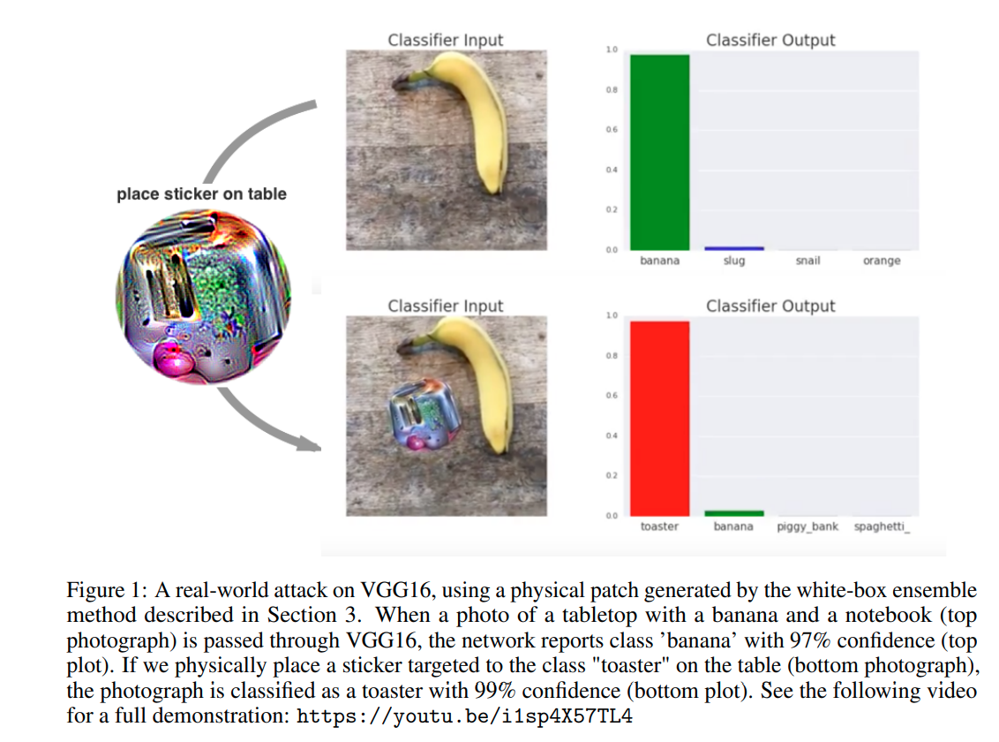
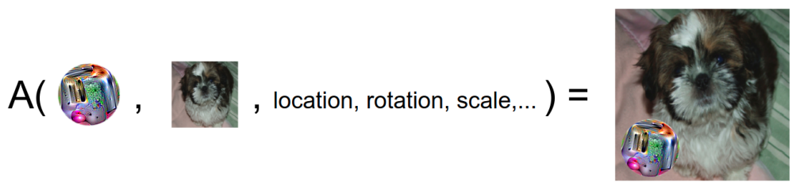
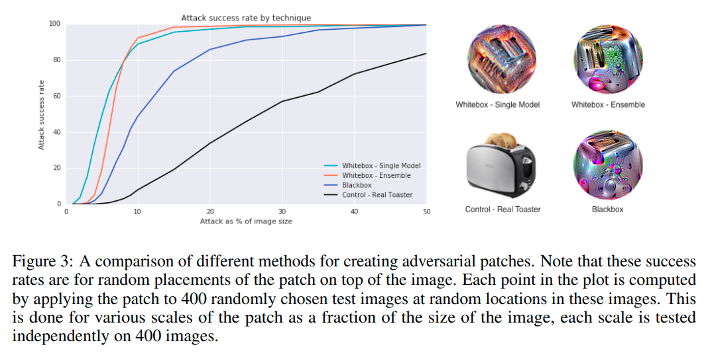

time:20200510
pdf_source: https://arxiv.org/pdf/1712.09665.pdf

# Adversarial Patch

这篇paper做工作如图.

其与一般的对抗性攻击不同的地方在于：
1. 理论上来说可以对抗在ImageNet上训练的不同model的所有image。
2. 可以打印出来在真实环境中放置。形成实时攻击

## Approach

方法需求, 一个image patch(比如本文的一小个 toaster), 一个或多个已经训练好的分类网络，一个分类数据集(不需要target)，一个目标类别(要求被攻击的网络输出的结果)。

每一个循环中，随机地将当前的image patch替换图片的一个部分，位置旋转以及scale有一定随机性，然后使用梯度优化，update输入的image patch，使得网络对目标类别预测的概率值最大化。

$$\widehat{p}=\arg \max _{p} \mathbb{E}_{x \sim X, t \sim T, l \sim L}[\log \operatorname{Pr}(\widehat{y} | A(p, x, l, t)]$$

## 结果

如果网是已知的，使用white box (训练时网络与测试网络一致)，这个patch只需要占据图片的10%不到的大小就可以大概率迷惑网络。

如果网络是未知的，使用 black box(本文的实验是使用4个不同的网络train这个batch，使用另外一个网络进行测试)，这个patch只要占据原图片的10%-20%就可以大概率迷惑这个未知的网络。

