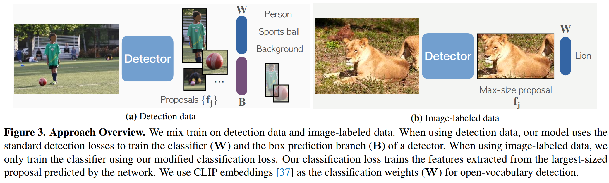

time:20220115
pdf_source: https://arxiv.org/abs/2201.02605
code_source: https://github.com/facebookresearch/Detic

# Detecting Twenty-thousand Classes using Image-level Supervision

这篇paper解决的问题是使用图片分类的数据集帮助检测数据集学习足够的多的类别。针对的是二阶段目标检测。

思路上与此前的弱监督完全不一样。此前的弱监督的思路往往是想办法把图片的分类label 分配给局部小图。难点就在于label assignment上。

本文采取了可能能想到的最简单的label assignment方法，如上图。

检测器同时接受Detection数据的训练以及image-label数据的训练，对于detection数据，训练方案与传统检测一样，同时训练两阶段的检测器，注意第一阶段RPN的检测器是一个二分类任务，只代表有无。对于image-label数据，从第一阶段RPN输出大量的proposal框，从中选择最大的框分配本图label的GT，运行并训练第二阶段的分类器。

用这个方法作者实现了在Image22K数据集级别分类数的目标检测。

作者点出这个方法的一个关键在于分类的训练不应该受制于第二阶段分类器的结果；以前的弱监督网络在二阶段训练时，需要好的分类预测器来做好分配，又需要好的分配来做分类预测，这个鸡与蛋的问题无法冷启动使得性能徘徊不前。本文的关键在于提供了全新的范式，直接绕过了这个问题，依赖一阶段的网络直接实现了超越此前很多论文的性能。
