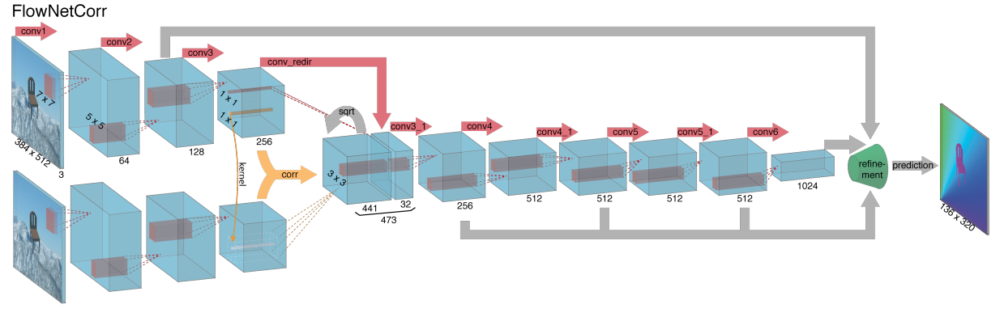

time: 20200502
pdf_source: https://arxiv.org/pdf/1504.06852.pdf
code_source: https://github.com/NVIDIA/flownet2-pytorch
short_title: FlowNet & More

# FlowNet and Variants

这里综合记录FlowNet以及它的一些变体

# FlowNet Base

[pdf](https://arxiv.org/pdf/1504.06852.pdf)

这篇paper是flownet的第一篇。提出使用sliding disparity 以及correlation.

$$c\left(\mathbf{x}_{1}, \mathbf{x}_{2}\right)=\sum_{\mathbf{o} \in[-k, k] \times[-k, k]}\left\langle\mathbf{f}_{1}\left(\mathbf{x}_{1}+\mathbf{o}\right), \mathbf{f}_{2}\left(\mathbf{x}_{2}+\mathbf{o}\right)\right\rangle$$

# FlowNet 2
[pdf](https://arxiv.org/pdf/1612.01925.pdf)

FlowNetC与第一paper的一致。而FlowNetS则为直接的encoder-decoder.
[本文代码](https://github.com/NVIDIA/flownet2-pytorch/tree/master/networks)有 channelnorm, correlation, resample_2d的cuda实现。