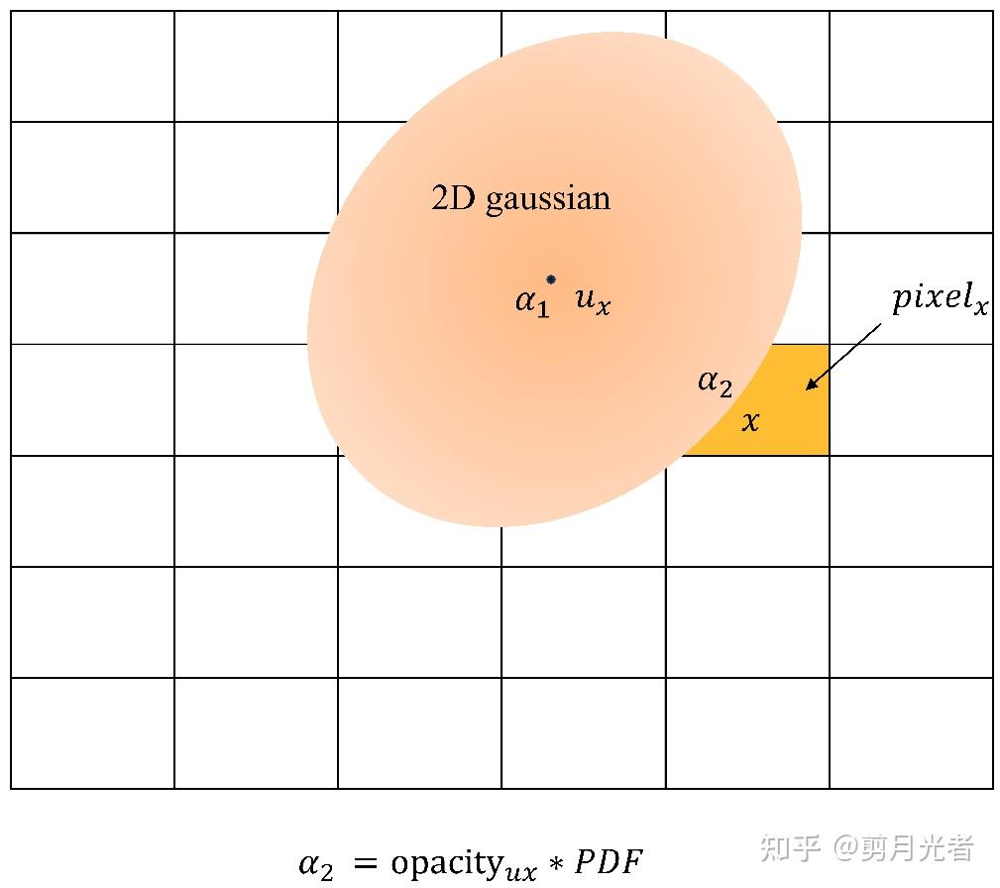
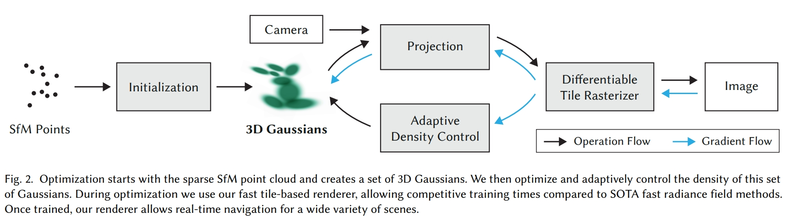
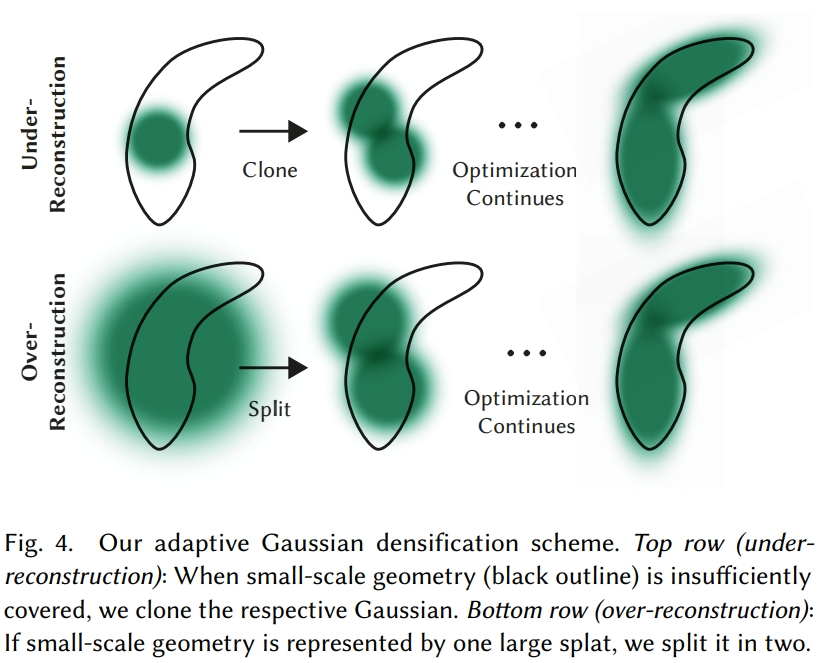

time: 20231122
pdf_source: https://repo-sam.inria.fr/fungraph/3d-gaussian-splatting/3d_gaussian_splatting_high.pdf
code_source: https://github.com/graphdeco-inria/gaussian-splatting
short_title: Gaussian Splatting

# 3D Gaussian Splatting for Real-Time Radiance Field Rendering

这篇论文是近期比较重要的三维重建文章。后续有大量的工作会基于它进行开发。这里会整理它的原理以及相关的重要知识。

[论文解析](https://zhuanlan.zhihu.com/p/661363274)

## Modeling the Environment as set of 3D Gaussian

对场景的建模，本文在review相关工作的时候提到，曾经有Mesh/面元 这些都是常见的地图描述元素。NERF是把场景建模成了一个连续函数$f(x,y,z)->(\text{color}, \text{occupancy})$,而这个连续函数用训练出来的神经网络的权重来表达。与此不同的，突出利用场景离散性以节省资源的方案，有基于 面元（点+法向+椭圆平面大小）或者点的方案。

### Supplementary: An Example of point based neural rendering

[pdf](https://arxiv.org/abs/1906.08240v3) [code](https://github.com/alievk/npbg) [解读](https://zhuanlan.zhihu.com/p/158945862)

这篇paper NPDG的motivation就是要解决点云投影实现novel view synthesis的时候点的遮挡与空洞问题。如果图片分辨率很高，每个像素很小，投影产生的图片就会有很多空洞；如果图片分辨率很低，每个像素很大，每个像素就会对应多个点产生大量遮挡，这篇paper采用一个学习的方式，融合多尺度的投影结果输出最终图像。

### Describing 3D Gaussian

[数学介绍](https://zhuanlan.zhihu.com/p/664725693)

回到这篇paper Gaussian Splatting，文章指出，如果我们采用SFM的点云作为输入，由于SFM点云相对还是比较稀疏的，如果从中提取法向作为输入或者是先验，这个结果的准确度是比较有限的，所以本文选择直接提取SFM的点的位置作为先验，并且把一个面元/单位体，建模为一个三维高斯（沿空间xyz轴分布的有偏高斯，初始化时设定为无偏高斯，方差为相邻三个点的距离的均值）。

例子：把一个投影到图片域的2D高斯可视化出来如图, 其中一个像素的渲染可以计算为$C_{\text {pixel }}=c_1 \alpha_1+c_2 \alpha_2+\ldots$, 其中$c_1, \alpha_1$分别为颜色以及概率密度:

这里面牵涉到数个技术细节:

1. 相机投影是一个非线性变换，三维中的高斯分布投影到相机坐标系中并不是一个高斯分布。本文在这里与前人相近，采用EKF的方式进行高斯投影的近似$\Sigma' = JW\Sigma W^TJ^T$ 其中$W$是世界坐标到相机坐标的转换，$J$是相机投影的雅克比矩阵。以此实现高斯块的可导投影.
2. 高斯块的颜色，如果我们假设每个3D高斯是一个固定的颜色，那么渲染效果可能会非常糟糕。本文这里把高斯块上面的点的颜色建模成了一个球谐函数。这个问题本质上是寻找一个单位球面(高斯就是一个椭球面，拉伸过的球面)上的点与标量（颜色）的映射函数，与实数域中的多项式分解/傅立叶分解类似，球谐函数是一组球面上的基函数，它保证了球面上函数的连续性，同时可以根据选择的系数以较低的误差率拟合低频的颜色函数，本文拟合到三阶系数，这个也是游戏渲染中应对光照常用参数选择。
3. 如何训练协方差矩阵保证半正定性？本文的选择是定义非负的三维尺度矢量$S$(从指数激活得到),以及四元数$q$,形象上的理解，就是从一个单位圆开始，沿三轴倍率放缩拉伸，再旋转这个椭球。得到一个任意姿态的椭球。数学上$\Sigma = RSS^TR^T$其中R就是四元数计算得到的旋转矩阵。

## Training Structure

Gaussian Splatting提出的计算方案如图。初始化, 动态密度控制在后面详细展开。除此外就是3D Gaussian的可微分投影与重建损失求导。

### Initialization

[Code Line](https://github.com/graphdeco-inria/gaussian-splatting/blob/2eee0e26d2d5fd00ec462df47752223952f6bf4e/scene/gaussian_model.py#L124)

输入SFM得到的点云，初始3D Gaussian的点的数量以及点的位置与SFM结果相同。其颜色数据就是SFM的颜色转换到SH(Sphere Harmonic) 球谐系数,初始化为没有高阶项的常数函数。方差的初始化里，其中$S=[r, r, r]$ r定为最近距离的三个点的均值, 旋转$q=[1,0,0,0]$也就是没有旋转.

透过率opacities定为0.1 (用sigmoid后为0.1)

### Adaptive Density Control

动态密度控制，这是gaussian splatting本文的一大魔法。

利用简单元素做场景重建时，常见的问题有以下几个：

1. under-reconstruction, 对于一个实际上很大的物体，只有一个很小的gaussian去覆盖它
2. over-reconstruction, 对于一个实际上很小又复杂的物体，有一个很大的gaussian去覆盖它。
3. 相机前方在很近处有floating objects阻碍了训练。

对于under-reconstruction的情况，[code line](https://github.com/graphdeco-inria/gaussian-splatting/blob/2eee0e26d2d5fd00ec462df47752223952f6bf4e/scene/gaussian_model.py#L374)的操作和实际有一定区别,实际操作是进行了点的复制，而并没有偏移。

对于over-reconstruction的情况, [code line](https://github.com/graphdeco-inria/gaussian-splatting/blob/2eee0e26d2d5fd00ec462df47752223952f6bf4e/scene/gaussian_model.py#L349)正是文中的操作，在原来的大分布下面，采样两个点，取新方差缩小为为原来的 1/1.6倍。

对于第三个问题，[code line](https://github.com/graphdeco-inria/gaussian-splatting/blob/2eee0e26d2d5fd00ec462df47752223952f6bf4e/train.py#L123C31-L123C44), [code line2](https://github.com/graphdeco-inria/gaussian-splatting/blob/2eee0e26d2d5fd00ec462df47752223952f6bf4e/scene/gaussian_model.py#L210)，文中的操作是每隔一段iteration, 把所有的gaussians的opacity重置为0.01.

由于对第一二个问题的修正，gaussian数量会越来越多,本文会在每次densification后把opacity 小于0.005的gaussian去除。

### Optimized GPU Rendering

1. 将屏幕分为16*16的tiles，保留99%在视锥里的Gaussians，
2. 给每个Gaussian一个key=depth+ID，然后将Gaussians进行GPU Radix Sort，得到了每个tile里根据depth排序的Gaussian列表，
3. 每个tile分配thread block，每个block先load到shared memory，对于每个pixel，累积color和alpha，达到饱和时停止。