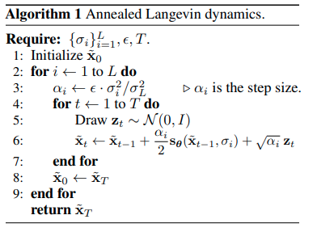

time: 20200814
pdf_source: https://arxiv.org/pdf/1907.05600.pdf
code_source: https://github.com/ermongroup/ncsn

# Generative Modeling by Estimating Gradients of the Data Distribution

这篇paper讨论的是score-based generative model 的新改进。

## 背景知识

### Score-Based Generative Model

基于GAN或者VAE的generative model 往往通过某些feature(random noise)直接生成generated image, generation/decoder 网络直接拟合的是 $p(\bold{x}|z)$.

score-based generative model 则会预测 当前数据为真的概率相对于每一个像素值的梯度$\nabla_\bold{x} log p(\bold{x})$.优化目标为

$$\frac{1}{2} \mathbb{E}_{p_{\text {data }}}\left[\left\|\mathbf{s}_{\boldsymbol{\theta}}(\mathbf{x})-\nabla_{\mathbf{x}} \log p_{\text {data }}(\mathbf{x})\right\|_{2}^{2}\right]$$

推理的时候使用郎之万动力学迭代，逐步更新更好的生成结果。

$$\tilde{\mathbf{x}}_{t}=\tilde{\mathbf{x}}_{t-1}+\frac{\epsilon}{2} \nabla_{\mathbf{x}} \log p\left(\tilde{\mathbf{x}}_{t-1}\right)+\sqrt{\epsilon} \mathbf{z}_{t}$$

其中$z_t$从标准正态采样，$\epsilon$为步长.

### Sliced score matching

这个优化的主要难点在于Ground Truth$p_{data}(x)$难以求出，本文作者在另一篇paper中通过一系列的推导给出了一种近似求解方法

[pdf](https://arxiv.org/pdf/1905.07088.pdf)

### Denoising score matching

这个求解方式的特点在于用高斯扰动的data sample来近似数据集中的$p_{data}(x)$, 有一篇[paper](http://www.iro.umontreal.ca/~vincentp/Publications/smdae_techreport.pdf)表明了在这个setting下,学习高斯扰动下的概率梯度，计算方法等同于数据的denoising。

## 主要思路

使用Denoising score matching的时候，第一个问题在于大部分的数据空间都是无意义的，只有少部分的数据空间有意义。且还可以将数据建模为多模态的概率分布。

因而作者提出了两个点，第一个是noise conditioned network,另一个是 annealed Langevin dynamics




## Code

代码不算复杂。

**数据扰动与Target生成**:
```python
def anneal_dsm_score_estimation(scorenet, samples, labels, sigmas, anneal_power=2.):
    used_sigmas = sigmas[labels].view(samples.shape[0], *([1] * len(samples.shape[1:])))
    perturbed_samples = samples + torch.randn_like(samples) * used_sigmas
    target = - 1 / (used_sigmas ** 2) * (perturbed_samples - samples)
    scores = scorenet(perturbed_samples, labels) #[B, 3, H, W]
    target = target.view(target.shape[0], -1)
    scores = scores.view(scores.shape[0], -1)
    loss = 1 / 2. * ((scores - target) ** 2).sum(dim=-1) * used_sigmas.squeeze() ** anneal_power

    return loss.mean(dim=0)
```